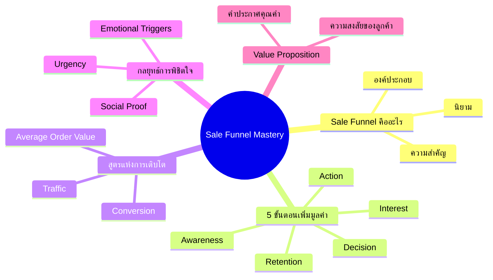

# Mind Map Template

> **Format:** Mind Map (แผนผังความคิด)
> **Tool:** NotebookLM + Mermaid/Canva
> **Output:** Visual concept map
> **Type:** Static image or interactive

---

## Purpose

Create a visual representation of concepts and their relationships from source content, helping learners understand structure and connections.

---

## Template Structure

### Center Node
```
[Main Topic]
└── The core subject of the content
```

### Primary Branches (3-7)
```
[Main Topic]
├── Branch 1: [Key Concept]
├── Branch 2: [Key Concept]
├── Branch 3: [Key Concept]
├── Branch 4: [Key Concept]
└── Branch 5: [Key Concept]
```

### Secondary Branches (2-4 per primary)
```
Branch 1: [Key Concept]
├── Sub-point A
├── Sub-point B
└── Sub-point C
```

### Tertiary Details (Optional)
```
Sub-point A
├── Detail 1
└── Detail 2
```

---

## NotebookLM Prompt

```
Create a mind map structure from this content that:
1. Has a clear central topic
2. Identifies 3-7 main branches (key concepts)
3. Has 2-4 sub-points per branch
4. Shows relationships between concepts
5. Uses concise labels (2-5 words max)
6. Output in Mermaid.js mindmap format
```

---

## Example Output

**Source:** บทที่ 4.0: Sale Funnel Mastery

### Text Structure
```
Sale Funnel Mastery
├── Sale Funnel คืออะไร
│   ├── นิยาม
│   ├── องค์ประกอบ
│   └── ความสำคัญ
├── 5 ขั้นตอนเพิ่มมูลค่า
│   ├── Awareness
│   ├── Interest
│   ├── Decision
│   ├── Action
│   └── Retention
├── สูตรแห่งการเติบโต
│   ├── Traffic
│   ├── Conversion
│   └── Average Order Value
├── กลยุทธ์การพิชิตใจ
│   ├── Emotional Triggers
│   ├── Social Proof
│   └── Urgency
└── Value Proposition
    ├── คำประกาศคุณค่า
    └── ความสงสัยของลูกค้า
```

### Mermaid Format


---

## Visual Guidelines

### Colors by Level
| Level | Color | Purpose |
|-------|-------|---------|
| Center | Pink (#FF69B4) | Main topic |
| Primary | Blue (#4A90D9) | Key concepts |
| Secondary | Green (#4CAF50) | Sub-points |
| Tertiary | Gray (#9E9E9E) | Details |

### Layout Options
1. **Radial**: Center with branches radiating out
2. **Hierarchical**: Top-down tree structure
3. **Organic**: Natural, flowing layout

### Typography
- Center: Bold, largest font
- Primary: Semi-bold, medium font
- Secondary: Regular, smaller font
- Tertiary: Light, smallest font

---

## Quality Checklist

### Content Quality
- [ ] Central topic is clear
- [ ] All main concepts covered
- [ ] Relationships are logical
- [ ] Information is accurate

### Visual Quality
- [ ] Easy to read at a glance
- [ ] Colors are consistent
- [ ] Layout is balanced
- [ ] Not too crowded

### Structure
- [ ] 3-7 primary branches
- [ ] 2-4 sub-points per branch
- [ ] Labels are concise (2-5 words)
- [ ] Hierarchy is clear

### Usability
- [ ] Can be printed/exported
- [ ] Readable on mobile
- [ ] Self-explanatory
- [ ] Useful for review

---

## QC Scoring (ปลัดซัน)

| Criteria | Weight | Score (1-5) | Notes |
|----------|--------|-------------|-------|
| Content Completeness | 30% | | |
| Visual Clarity | 25% | | |
| Logical Structure | 25% | | |
| Usefulness | 20% | | |
| **Total** | 100% | | |

**Pass Threshold:** 70% (3.5/5 average)

---

## Export Formats

- PNG (static image)
- SVG (scalable)
- PDF (printable)
- Mermaid code (editable)

---

## Tags

`#mindmap` `#visual` `#notebooklm` `#concept-map` `#learning`

---

> *Pink Castle Foundation Kit v1.0*
