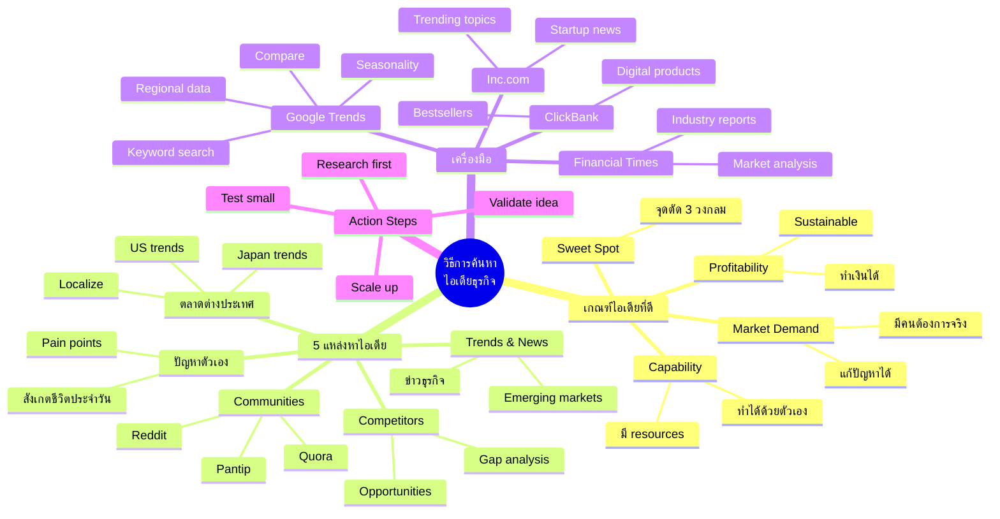

# Mind Map: วิธีการค้นหาไอเดียธุรกิจ

> **Format:** Mind Map (Mermaid)
> **Source:** SWP3 Chapter 9
> **Pilot ID:** PILOT-CH09-001-MINDMAP

---

## Mermaid Mind Map



---

## Alternative Format: Hierarchical List

```
วิธีการค้นหาไอเดียธุรกิจ
├── 1. เกณฑ์ไอเดียที่ดี
│   ├── 1.1 Market Demand
│   │   ├── มีคนต้องการจริง
│   │   └── แก้ปัญหาได้
│   ├── 1.2 Capability
│   │   ├── ทำได้ด้วยตัวเอง
│   │   └── มี resources
│   ├── 1.3 Profitability
│   │   ├── ทำเงินได้
│   │   └── Sustainable model
│   └── 1.4 Sweet Spot = จุดตัด 3 วงกลม
│
├── 2. 5 แหล่งหาไอเดีย
│   ├── 2.1 ปัญหาของตัวเอง
│   ├── 2.2 Trends & News
│   ├── 2.3 ตลาดต่างประเทศ
│   ├── 2.4 Communities & Forums
│   └── 2.5 Competitor Analysis
│
├── 3. เครื่องมือ
│   ├── 3.1 Google Trends (ฟรี)
│   ├── 3.2 Inc.com (Startup trends)
│   ├── 3.3 Financial Times (Market analysis)
│   └── 3.4 ClickBank (Digital products)
│
└── 4. Action Steps
    ├── 4.1 Research first
    ├── 4.2 Validate idea
    ├── 4.3 Test small
    └── 4.4 Scale up
```

---

## Visual Export Suggestions

### For Canva/Figma:
- Central node: Pink (#FF69B4)
- Main branches: Purple (#9B59B6)
- Sub-branches: Blue (#3498DB)
- Leaves: Gray (#7F8C8D)

### Color Coding by Theme:
| Theme | Color | Hex |
|-------|-------|-----|
| เกณฑ์ | Orange | #E67E22 |
| แหล่งข้อมูล | Green | #27AE60 |
| เครื่องมือ | Blue | #3498DB |
| Actions | Purple | #9B59B6 |

---

## Production Notes

| Field | Value |
|-------|-------|
| Created | 2026-01-28 |
| Producer | จูล่ง |
| Format | Mermaid mindmap |
| Branches | 4 main, 16 sub |
| QC Status | Pending |

---

## QC Checklist

- [x] Central node clear
- [x] 4-6 main branches
- [x] Sub-branches ≤3 levels
- [x] Mermaid syntax valid
- [x] Thai + English terms
- [x] Logical hierarchy
- [x] Complete coverage

---

> *Pink Castle Foundation Kit v1.0*
> *Pilot Test - Mind Map*
