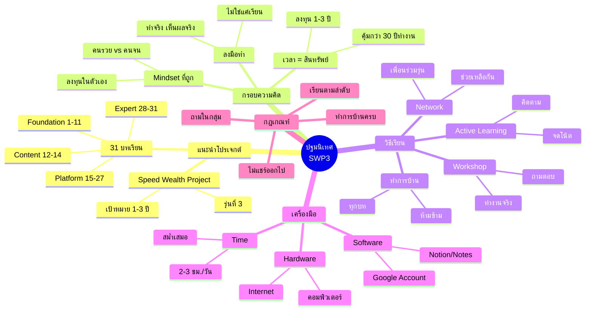

# Mind Map: ปฐมนิเทศ SWP3

> **Format:** Mind Map (Mermaid)
> **Source:** SWP3 Chapter 1
> **Production ID:** SWP3-Ch01-001-MIND

---

## Mermaid Mind Map



---

## Hierarchical List

```
ปฐมนิเทศ SWP3
├── 1. แนะนำโปรเจกต์
│   ├── 1.1 Speed Wealth Project รุ่น 3
│   │   └── เป้าหมาย: สร้างความมั่งคั่งใน 1-3 ปี
│   └── 1.2 โครงสร้าง 31 บท
│       ├── Foundation (1-11)
│       ├── Content Mastery (12-14)
│       ├── Platform Mastery (15-27)
│       └── Expert (28-31)
│
├── 2. กรอบความคิด
│   ├── 2.1 เวลาคือสินทรัพย์ที่มีค่าที่สุด
│   ├── 2.2 ความแตกต่าง Mindset คนรวย vs คนจน
│   └── 2.3 ความมั่งคั่งเกิดจากการลงมือทำ
│
├── 3. วิธีเรียนให้ได้ผล
│   ├── 3.1 Active Learning
│   ├── 3.2 ทำการบ้านทุกบท
│   ├── 3.3 เข้าร่วม Workshop
│   └── 3.4 สร้าง Network
│
├── 4. เครื่องมือที่ต้องใช้
│   ├── 4.1 คอมพิวเตอร์/โน้ตบุ๊ก
│   ├── 4.2 Internet connection
│   ├── 4.3 Google Account
│   ├── 4.4 Notion/Notes
│   └── 4.5 เวลา 2-3 ชม./วัน
│
└── 5. กฎและข้อตกลง
    ├── 5.1 เรียนตามลำดับ
    ├── 5.2 ทำการบ้านก่อนไปบทถัดไป
    ├── 5.3 ถามคำถามในกลุ่ม
    └── 5.4 ไม่แชร์คอนเทนต์ออกไป
```

---

## Production Notes

| Field | Value |
|-------|-------|
| Created | 2026-01-28 |
| Producer | จูล่ง |
| Main Branches | 5 |
| Sub-branches | 18 |
| QC Status | Pending |

---

> *Pink Castle Foundation Kit v1.0*
