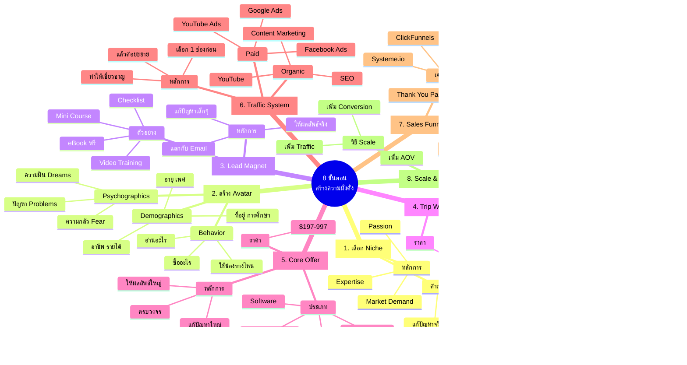

# Mind Map: 8 ขั้นตอนสร้างความมั่งคั่ง

> **Format:** Mermaid Mind Map
> **Source:** SWP3 Chapter 2
> **Nodes:** 40+
> **Production ID:** SWP3-Ch02-001-MIND

---

## Mind Map Diagram

---

## Linear Flow Diagram

---

## Wealth Formula

---

## Product Ladder

---

## Usage Instructions

1. **View Online:** Copy mermaid code to [mermaid.live](https://mermaid.live)
2. **Export:** PNG สำหรับ presentation, PDF สำหรับ print
3. **Customize:** แก้ไขสี, ขนาด ตามต้องการ

---

## Production Notes

| Field | Value |
|-------|-------|
| Created | 2026-01-28 |
| Producer | จูล่ง |
| Main Nodes | 8 Steps |
| Total Nodes | 45+ |
| QC Status | Pending |

---

> *Pink Castle Foundation Kit v1.0*
