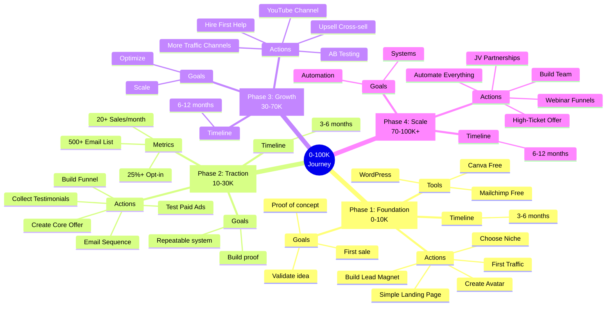
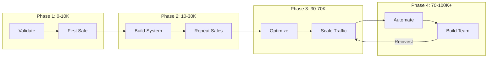
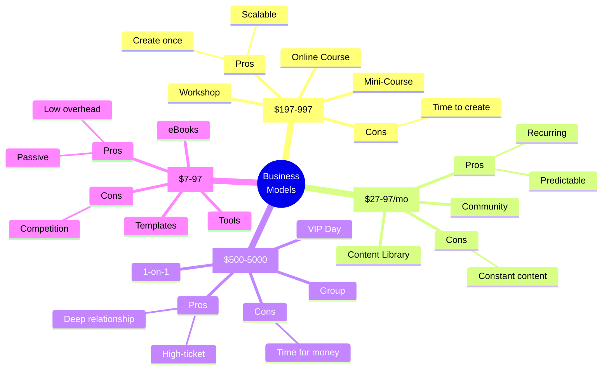
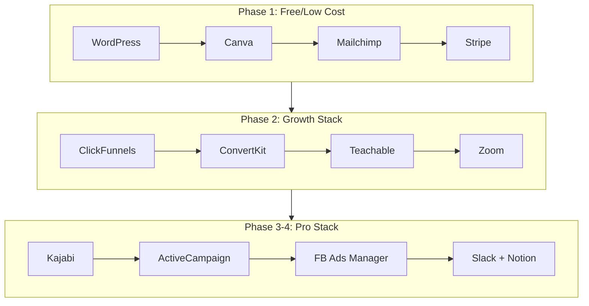
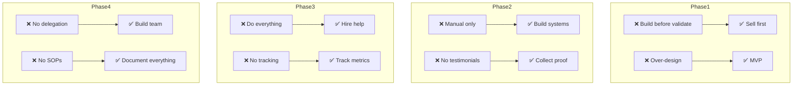
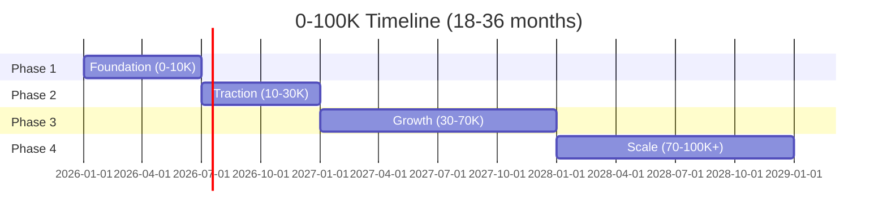

# Mind Map: วิธีสร้างธุรกิจออนไลน์ 0-100K

> **Format:** Mermaid Mind Map
> **Source:** SWP3 Chapter 5
> **Nodes:** 60+
> **Production ID:** SWP3-Ch05-001-MIND

---

## Mind Map Diagram

---

## Revenue Journey Flow

---

## Business Models

---

## Tools Stack by Phase

---

## Common Mistakes Flow

---

## Timeline Overview

---

## Usage Instructions

1. **View Online:** Copy mermaid code to [mermaid.live](https://mermaid.live)
2. **Export:** PNG สำหรับ presentation, PDF สำหรับ print
3. **Customize:** แก้ไขสี, ขนาด ตามต้องการ

---

## Production Notes

| Field | Value |
|-------|-------|
| Created | 2026-01-28 |
| Producer | จูล่ง |
| Main Phases | 4 |
| Total Nodes | 65+ |
| QC Status | Pending |

---

> *Pink Castle Foundation Kit v1.0*
