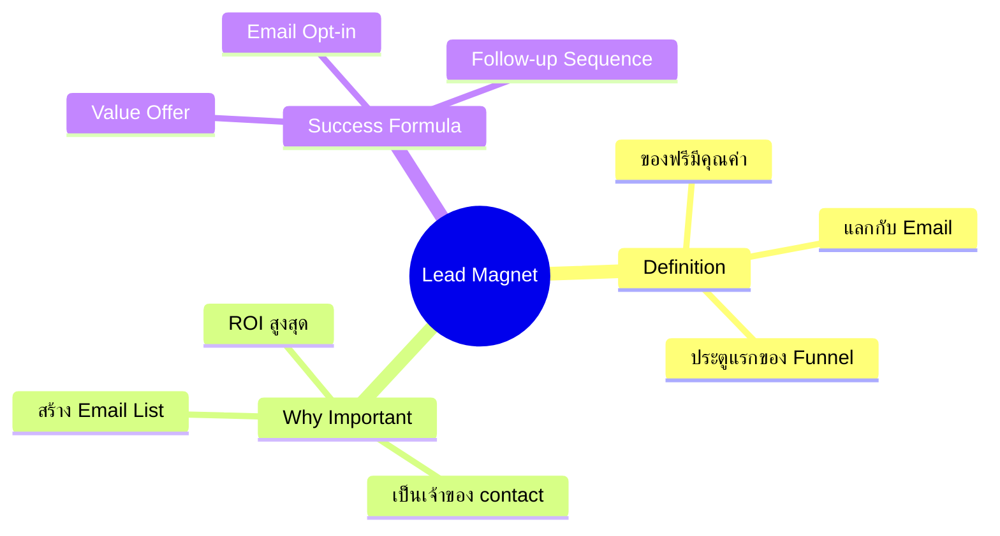
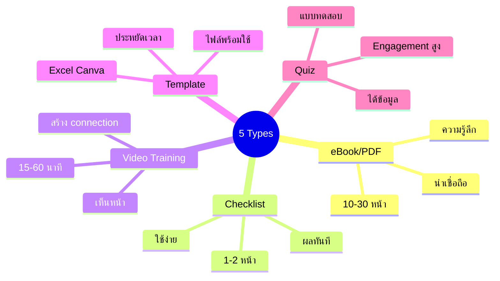
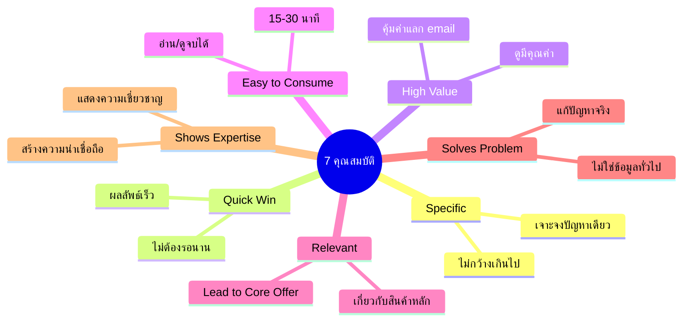
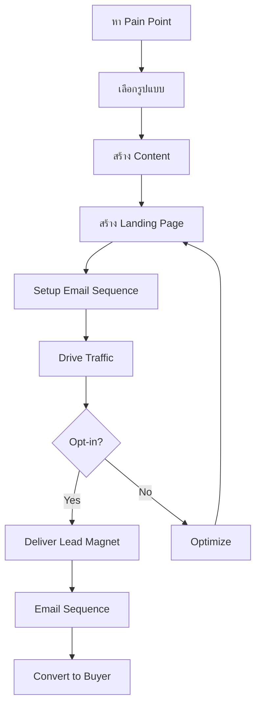
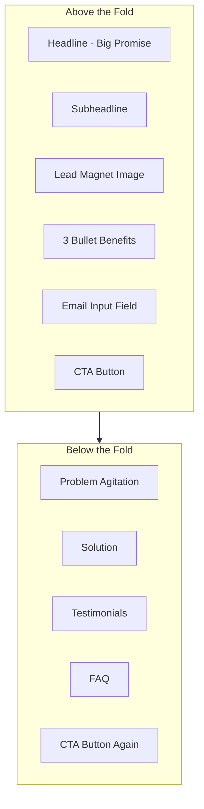

# Mind Map: Lead Magnet

> **Format:** Mind Map (Mermaid)
> **Source:** SWP3 Chapter 7
> **Diagrams:** 3
> **Production ID:** SWP3-Ch07-001-MIND

---

## Mind Map 1: Lead Magnet Overview

---

## Mind Map 2: 5 ประเภท Lead Magnet

---

## Mind Map 3: 7 คุณสมบัติ Lead Magnet ที่ดี

---

## Flow Diagram: Lead Magnet Process

---

## Landing Page Structure

---

## Production Notes

| Field | Value |
|-------|-------|
| Created | 2026-01-28 |
| Producer | จูล่ง |
| Total Diagrams | 5 |
| Format | Mermaid |
| QC Status | Pending |

---

> *Pink Castle Foundation Kit v1.0*
