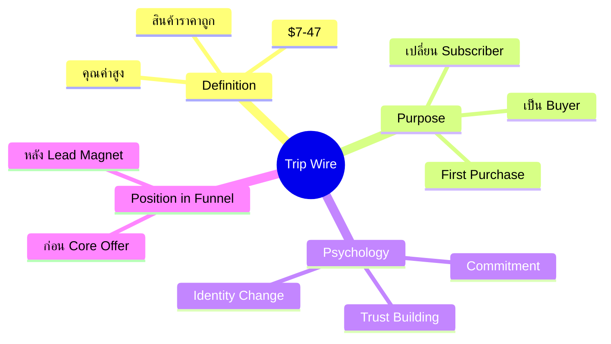
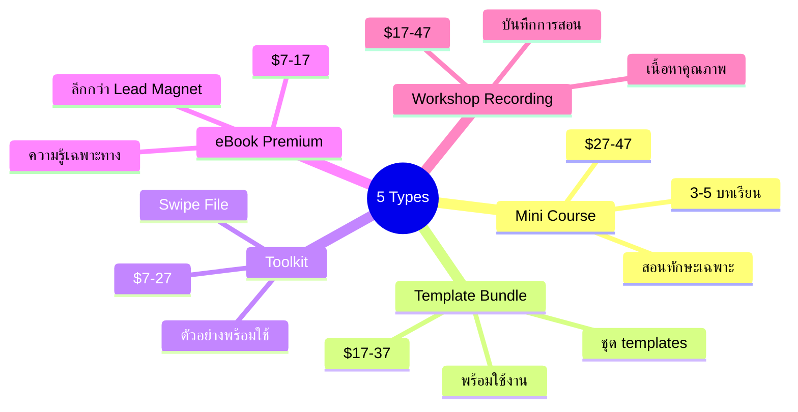
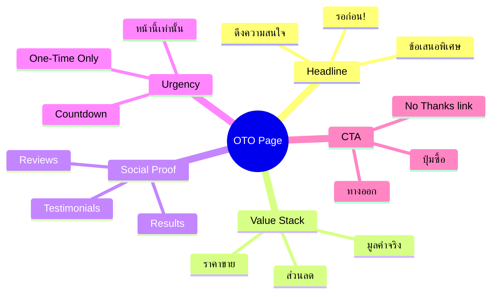
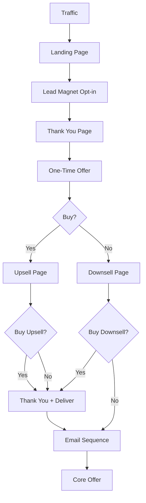
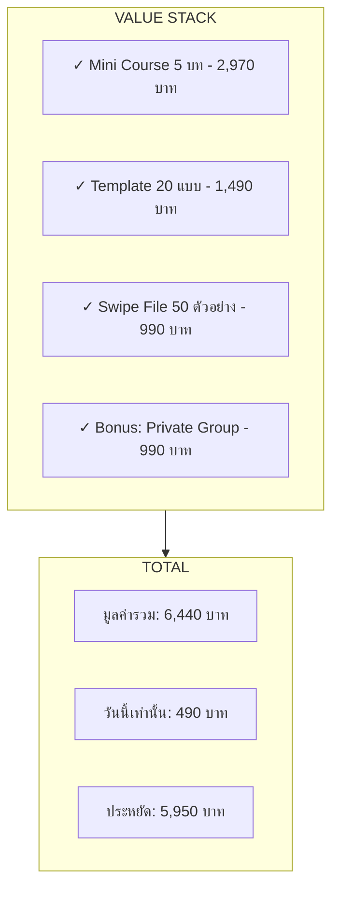

# Mind Map: Trip Wire

> **Format:** Mind Map (Mermaid)
> **Source:** SWP3 Chapter 8
> **Diagrams:** 4
> **Production ID:** SWP3-Ch08-001-MIND

---

## Mind Map 1: Trip Wire Overview

---

## Mind Map 2: 5 ประเภท Trip Wire

---

## Mind Map 3: One-Time Offer (OTO)

---

## Flow Diagram: Trip Wire Funnel

---

## Value Stack Diagram

---

## Production Notes

| Field | Value |
|-------|-------|
| Created | 2026-01-28 |
| Producer | จูล่ง |
| Total Diagrams | 5 |
| Format | Mermaid |
| QC Status | Pending |

---

> *Pink Castle Foundation Kit v1.0*
