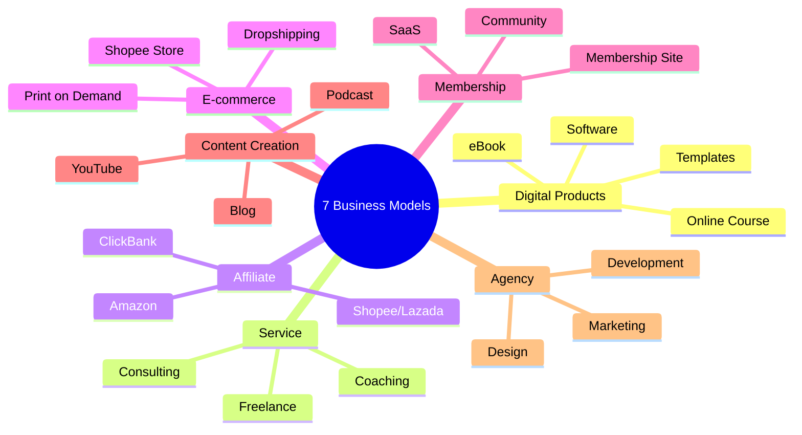
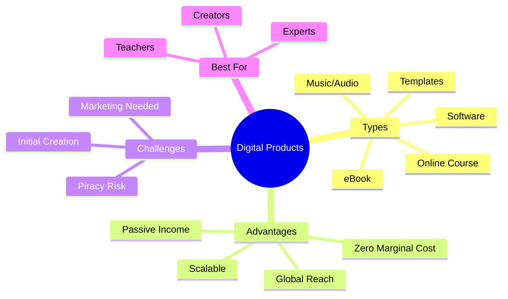
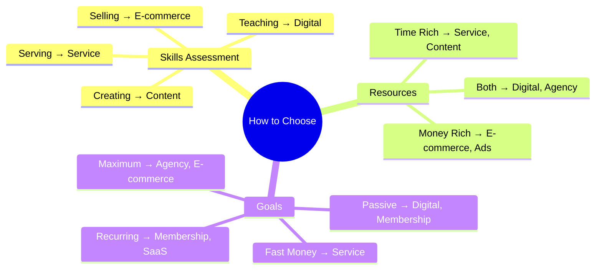
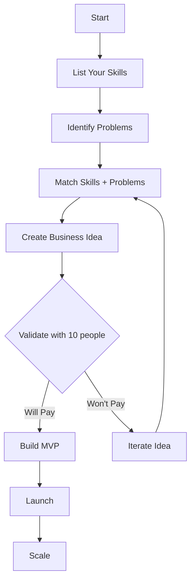
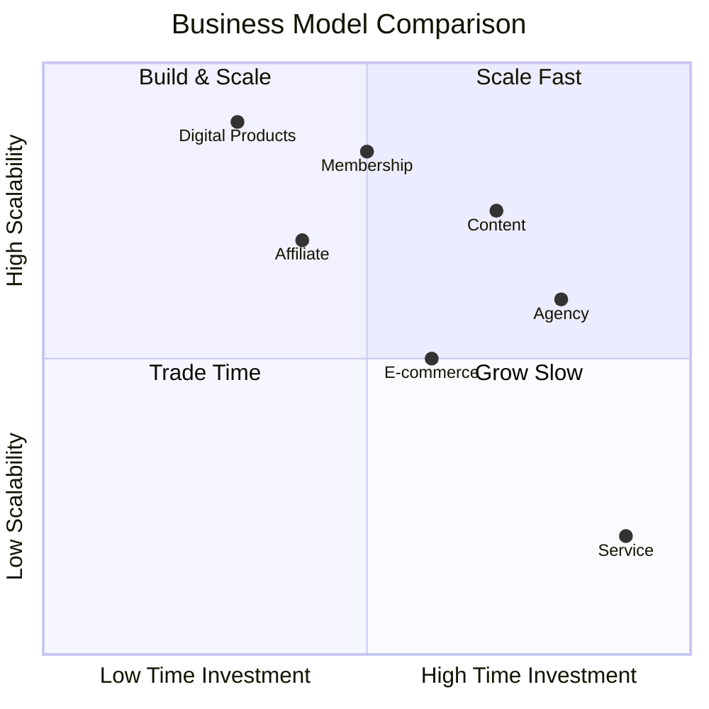
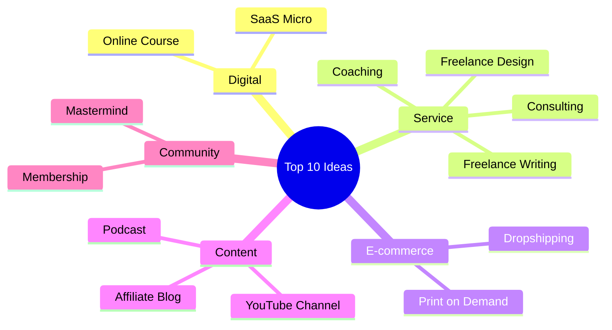

# Mind Map: Business Ideas

> **Format:** Mind Map (Mermaid)
> **Source:** SWP3 Chapter 9
> **Diagrams:** 5
> **Production ID:** SWP3-Ch09-001-MIND

---

## Mind Map 1: 7 Business Models Overview

---

## Mind Map 2: Digital Products Deep Dive

---

## Mind Map 3: Business Model Selection

---

## Flow Diagram: Finding Your Business Idea

---

## Comparison Diagram: Model Characteristics

---

## Mind Map 4: 10 Popular Ideas 2026

---

## Production Notes

| Field | Value |
|-------|-------|
| Created | 2026-01-28 |
| Producer | จูล่ง |
| Total Diagrams | 5 |
| Format | Mermaid |
| QC Status | Pending |

---

> *Pink Castle Foundation Kit v1.0*
