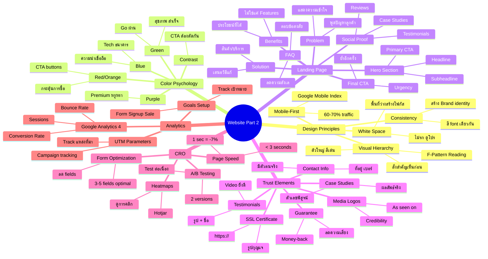
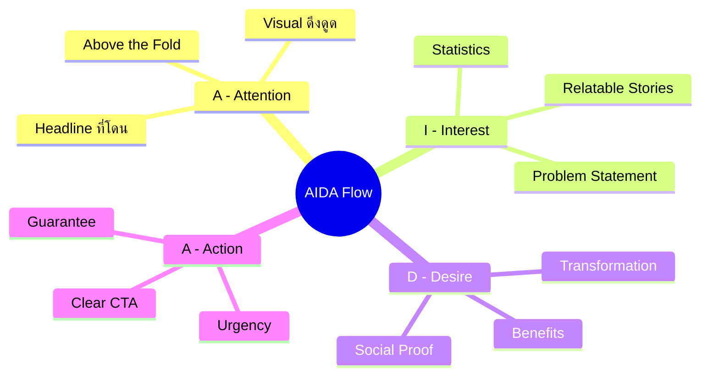
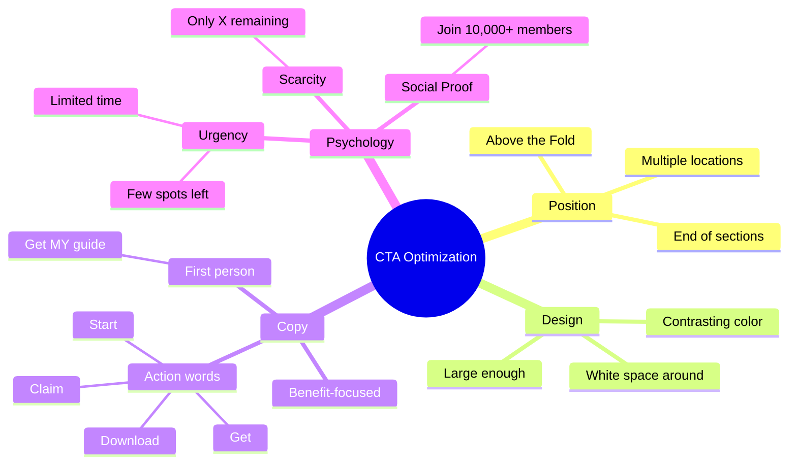
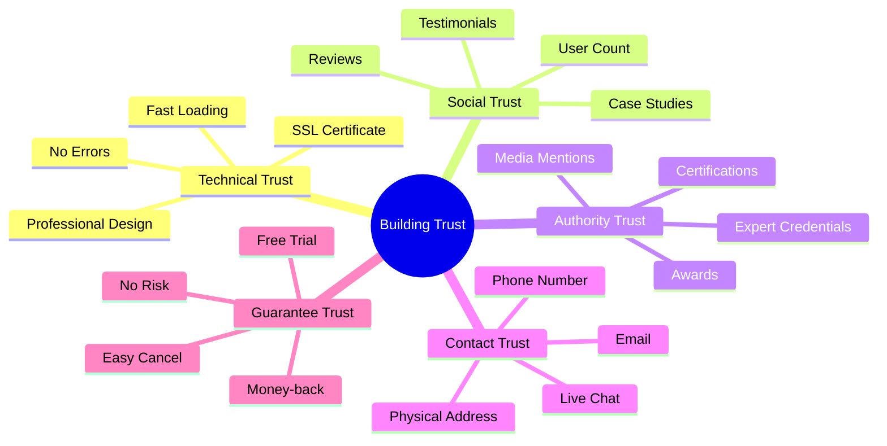
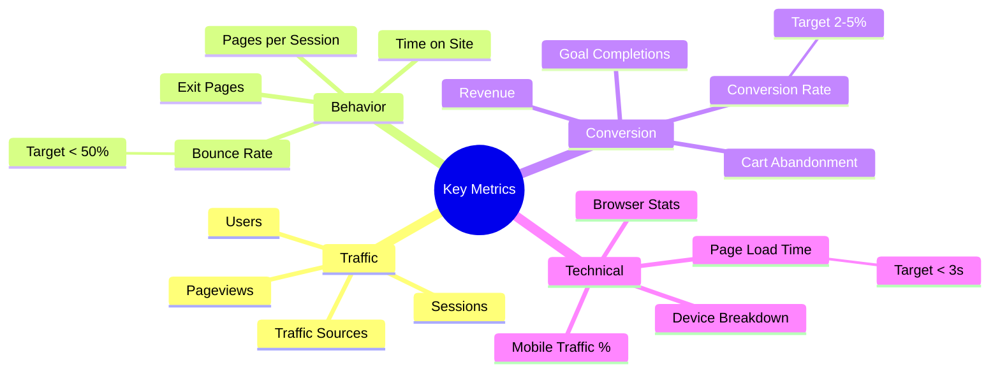
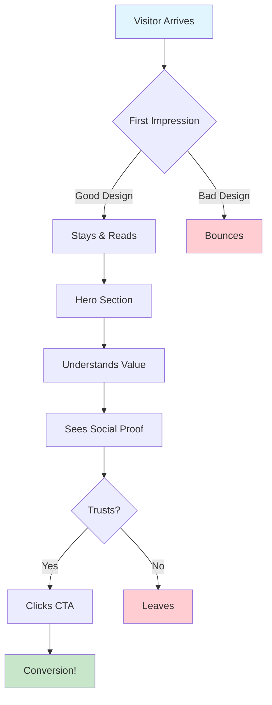
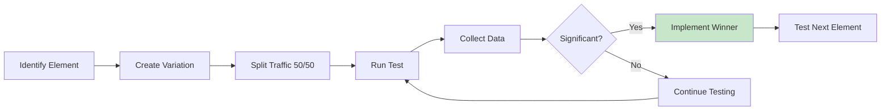

# Mind Map: Website Part 2

> **Format:** Mind Map (Mermaid)
> **Source:** SWP3 Chapter 11
> **Nodes:** 45+
> **Production ID:** SWP3-Ch11-001-MIND

---

## Main Mind Map: Website Design & Conversion

---

## Sub Mind Map 1: Landing Page AIDA Flow

---

## Sub Mind Map 2: CTA Best Practices

---

## Sub Mind Map 3: Trust Building

---

## Sub Mind Map 4: Analytics Metrics

---

## Concept Map: Design to Conversion Flow

---

## Process Flow: A/B Testing

---

## Production Notes

| Field | Value |
|-------|-------|
| Created | 2026-01-28 |
| Producer | จูล่ง |
| Total Nodes | 45+ |
| Diagrams | 7 |
| QC Status | Pending |

---

> *Pink Castle Foundation Kit v1.0*
