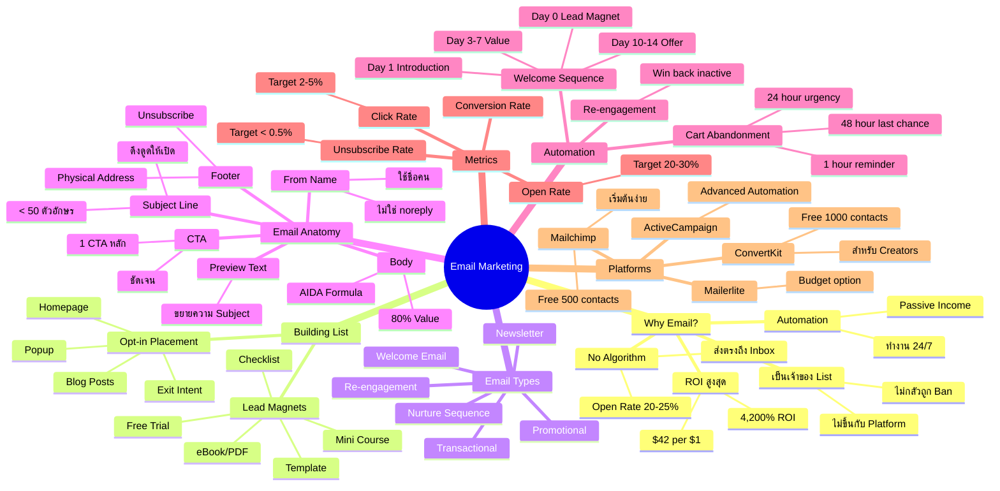
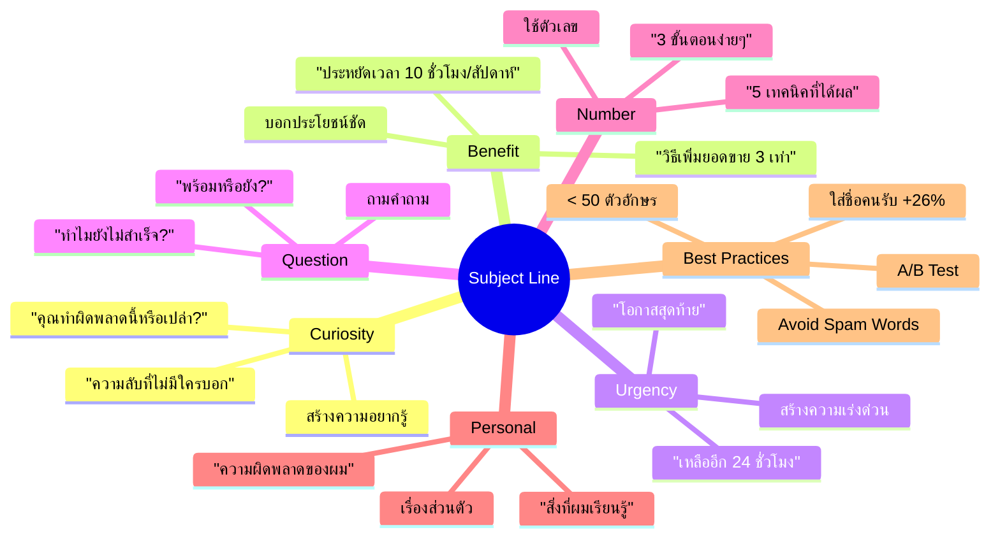
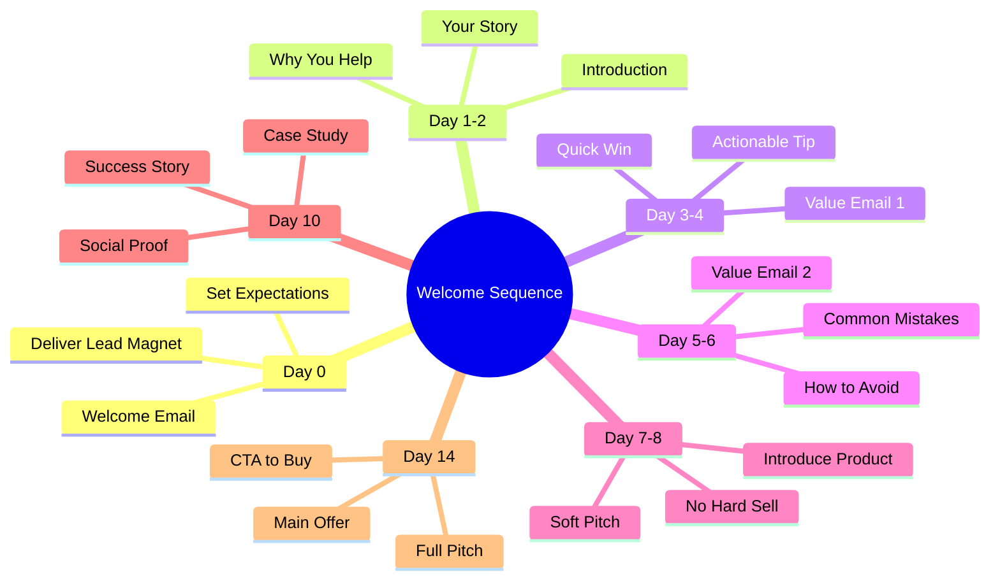
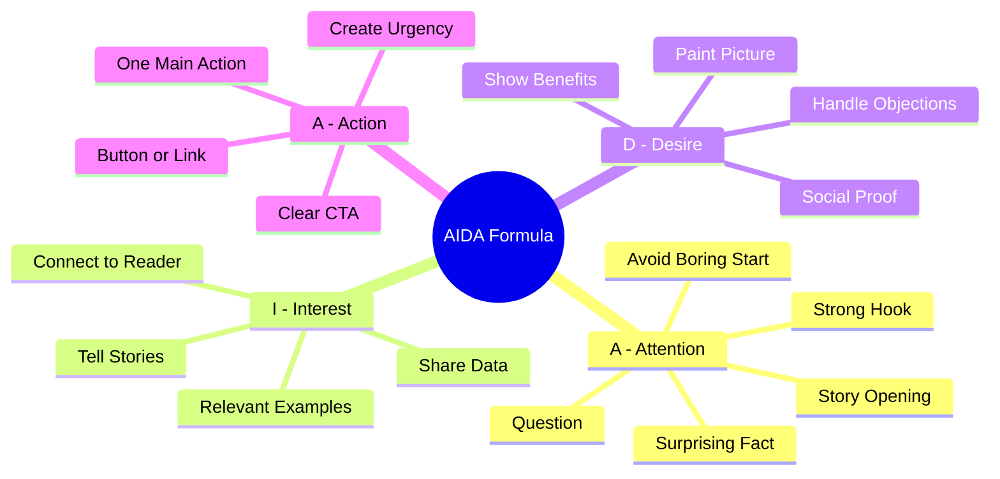
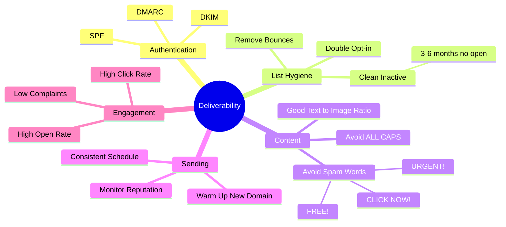
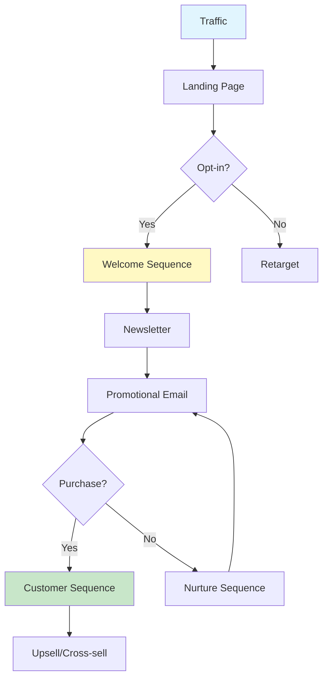
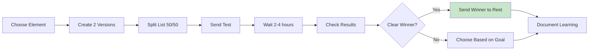
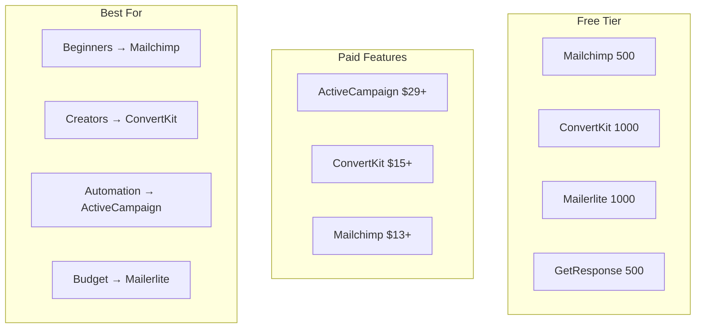

# Mind Map: Email Marketing

> **Format:** Mind Map (Mermaid)
> **Source:** SWP3 Chapter 12
> **Nodes:** 50+
> **Production ID:** SWP3-Ch12-001-MIND

---

## Main Mind Map: Email Marketing Overview

---

## Sub Mind Map 1: Subject Line Formulas

---

## Sub Mind Map 2: Welcome Sequence

---

## Sub Mind Map 3: Email Copywriting AIDA

---

## Sub Mind Map 4: Deliverability

---

## Process Flow: Email Marketing Funnel

---

## Process Flow: A/B Testing

---

## Comparison: ESP Platforms

---

## Production Notes

| Field | Value |
|-------|-------|
| Created | 2026-01-28 |
| Producer | จูล่ง |
| Total Nodes | 50+ |
| Diagrams | 7 |
| QC Status | Pending |

---

> *Pink Castle Foundation Kit v1.0*
