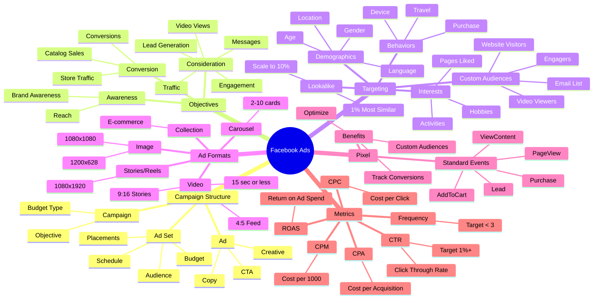
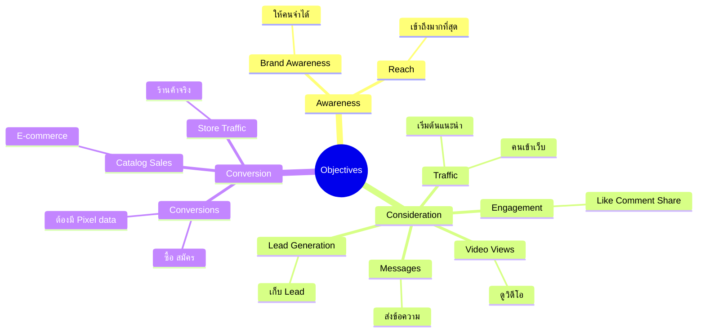
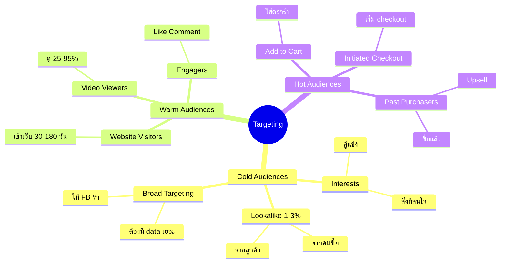
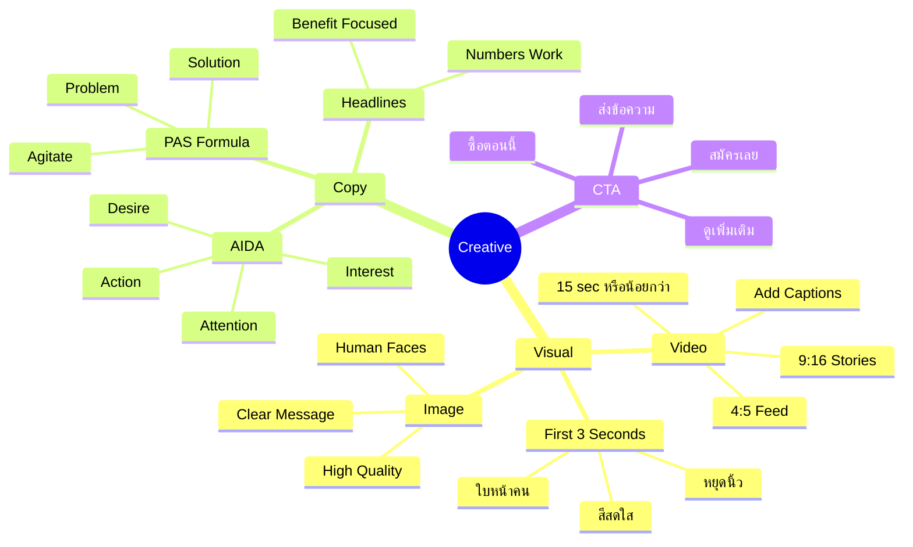
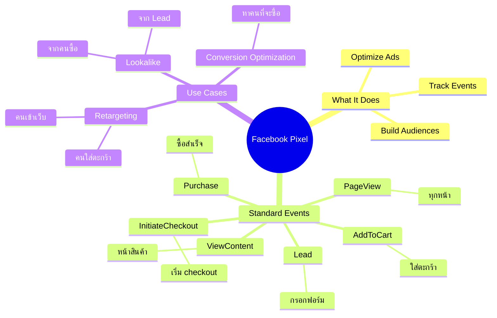
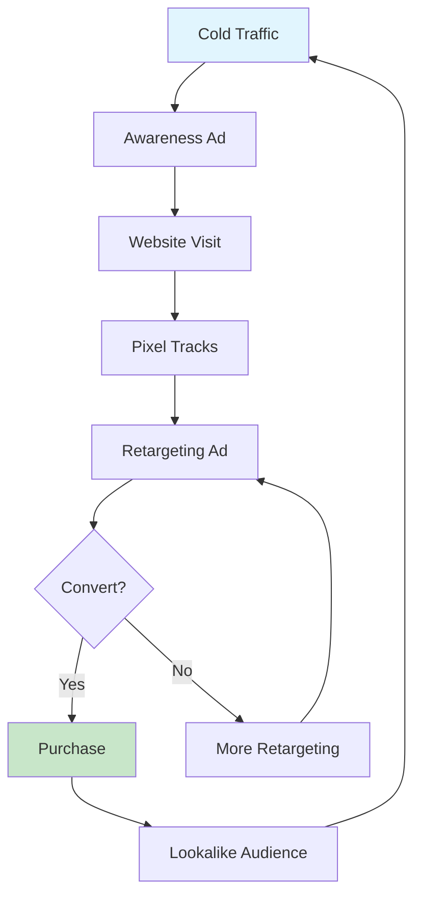
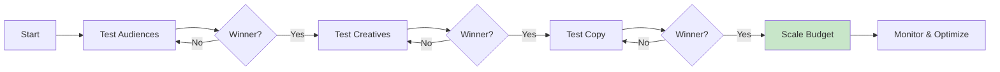
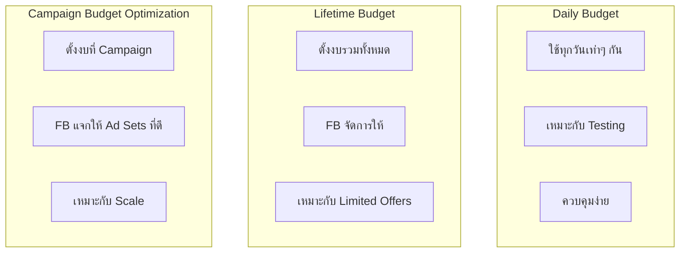

# Mind Map: Facebook Ads

> **Format:** Mind Map (Mermaid)
> **Source:** SWP3 Chapter 13
> **Nodes:** 55+
> **Production ID:** SWP3-Ch13-001-MIND

---

## Main Mind Map: Facebook Ads Overview

---

## Sub Mind Map 1: Campaign Objectives

---

## Sub Mind Map 2: Targeting Strategy

---

## Sub Mind Map 3: Ad Creative Best Practices

---

## Sub Mind Map 4: Facebook Pixel

---

## Process Flow: Facebook Ads Funnel

---

## Process Flow: Testing Framework

---

## Comparison: Budget Strategies

---

## Production Notes

| Field | Value |
|-------|-------|
| Created | 2026-01-28 |
| Producer | จูล่ง |
| Total Nodes | 55+ |
| Diagrams | 7 |
| QC Status | Pending |

---

> *Pink Castle Foundation Kit v1.0*
