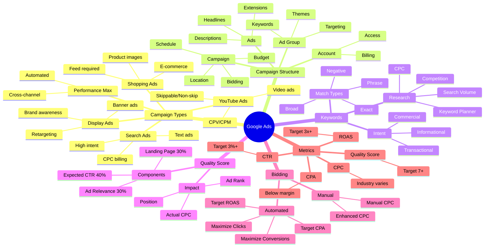
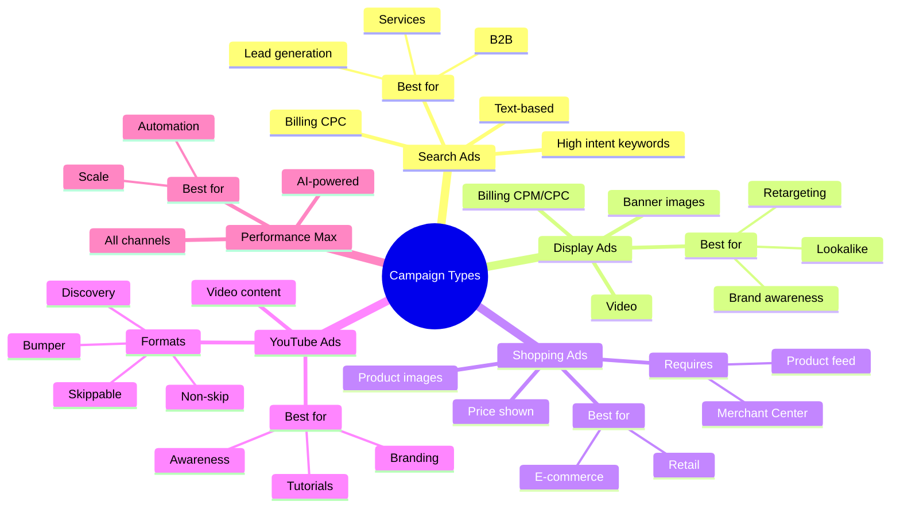
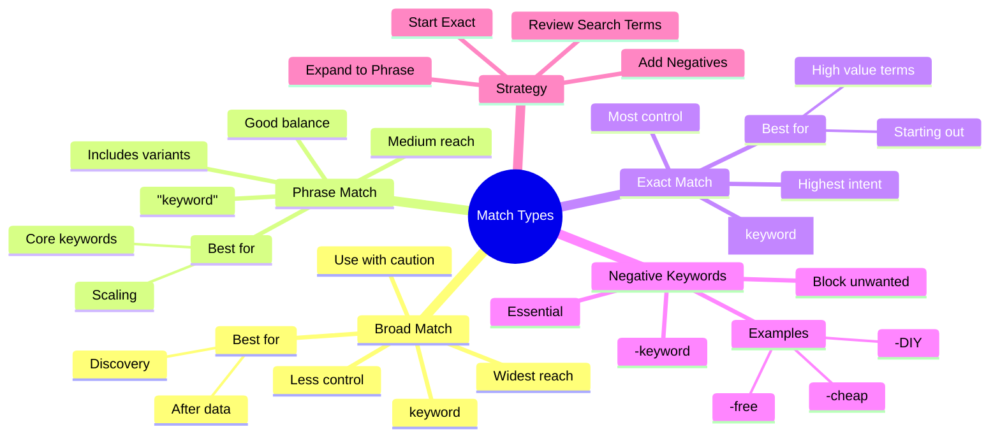
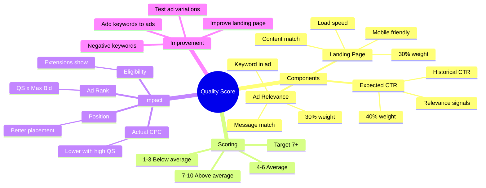
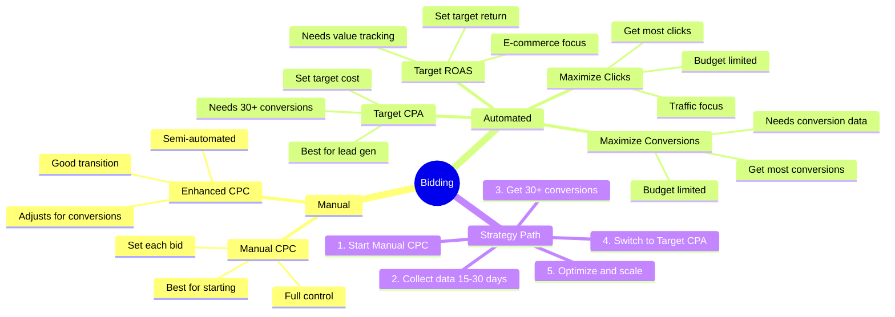
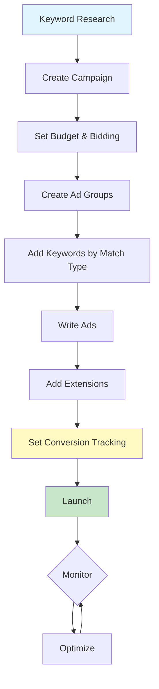
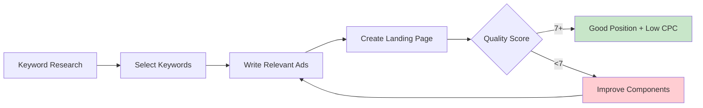
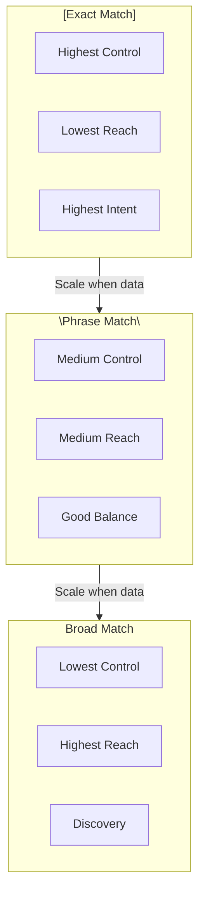
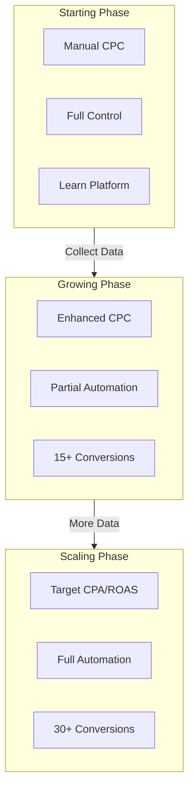

# Mind Map: Google Ads

> **Format:** Mind Map (Mermaid)
> **Source:** SWP3 Chapter 14
> **Nodes:** 60+
> **Production ID:** SWP3-Ch14-001-MIND

---

## Main Mind Map: Google Ads Overview

---

## Sub Mind Map 1: Campaign Types

---

## Sub Mind Map 2: Keyword Match Types

---

## Sub Mind Map 3: Quality Score Deep Dive

---

## Sub Mind Map 4: Bidding Strategies

---

## Process Flow: Google Ads Campaign Setup

---

## Process Flow: Keyword Research to Quality Score

---

## Comparison: Match Types Control vs Reach

---

## Comparison: Bidding Strategy Selection

---

## Production Notes

| Field | Value |
|-------|-------|
| Created | 2026-01-28 |
| Producer | จูล่ง |
| Total Nodes | 60+ |
| Diagrams | 8 |
| QC Status | Pending |

---

> *Pink Castle Foundation Kit v1.0*
