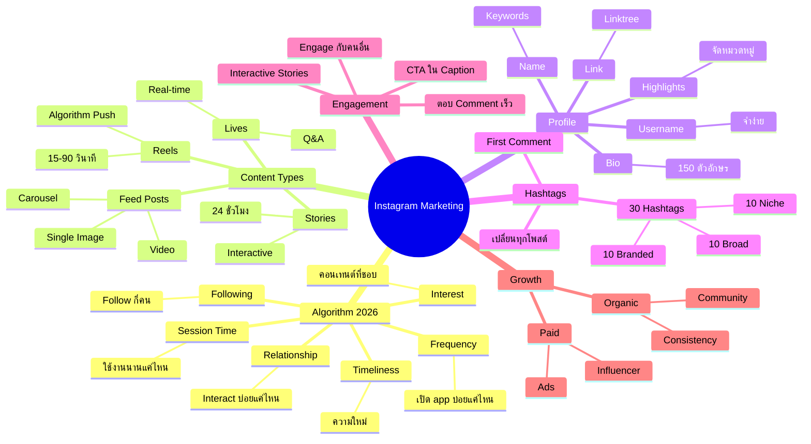
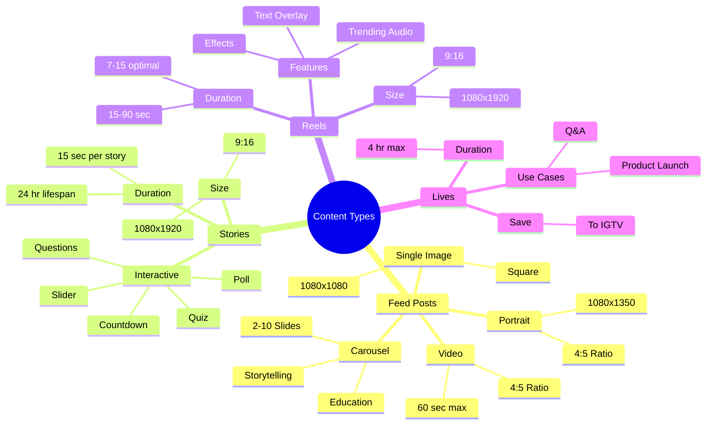
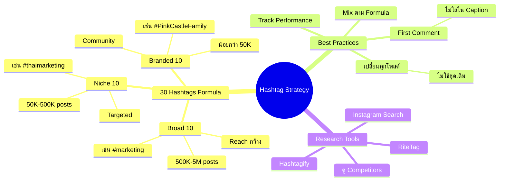
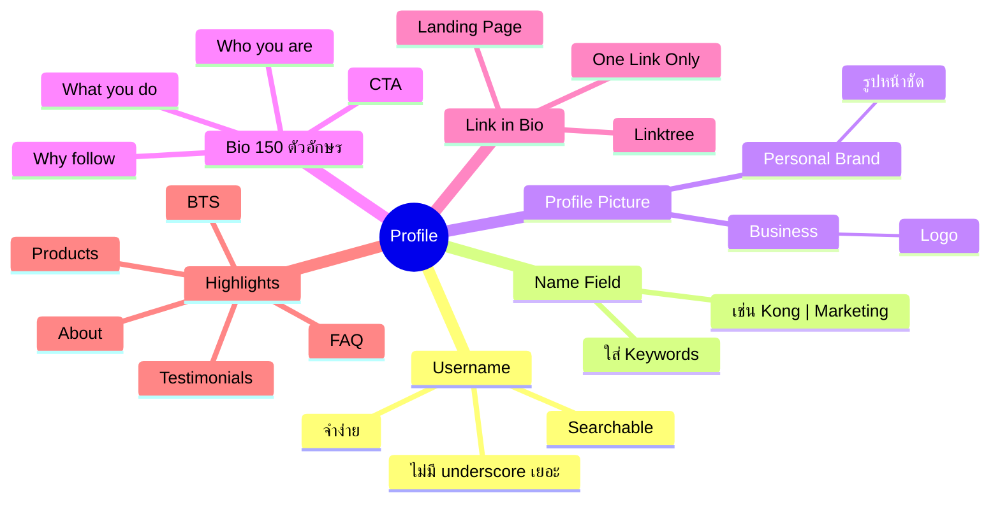
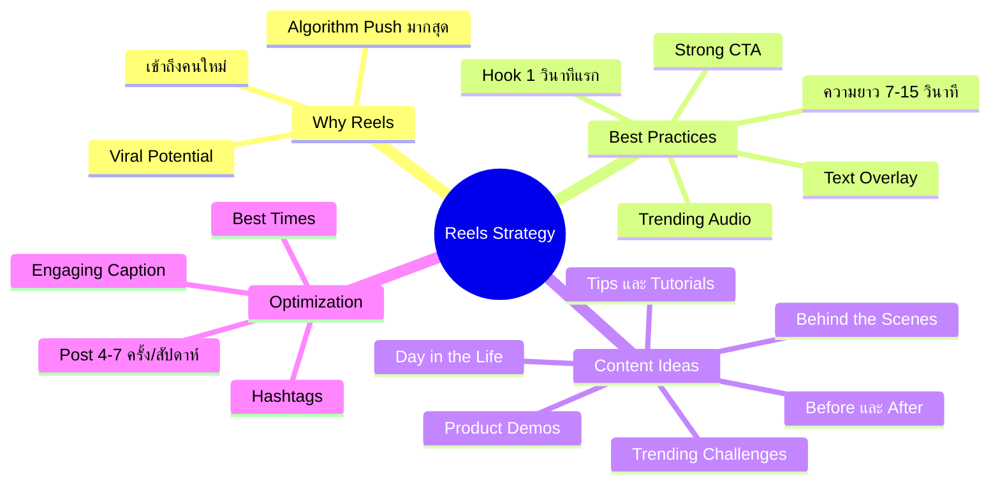
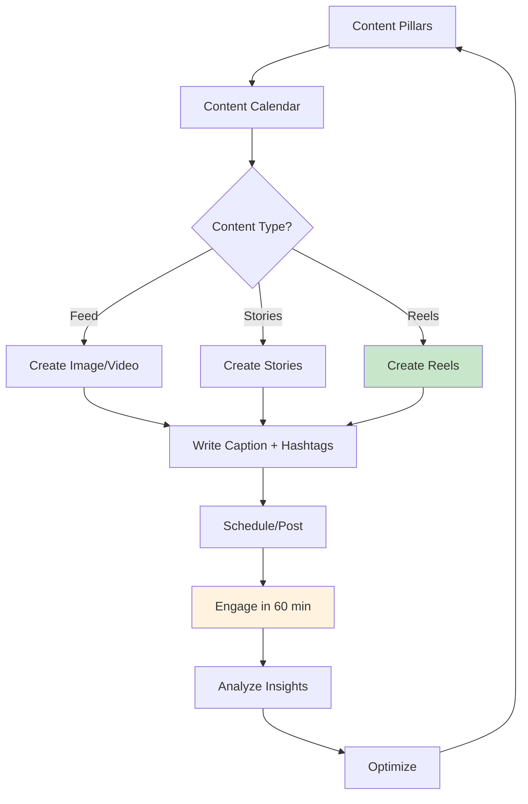
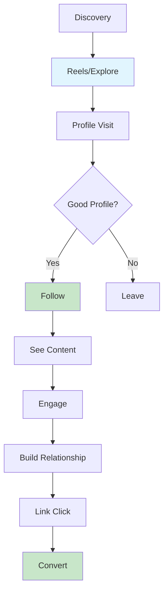
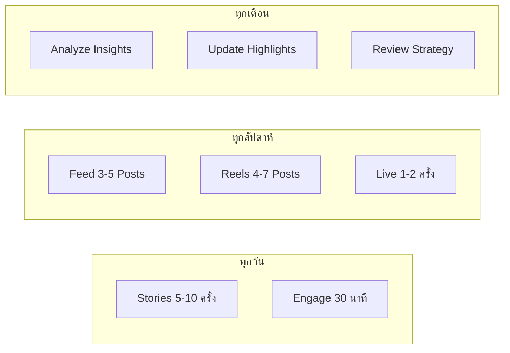
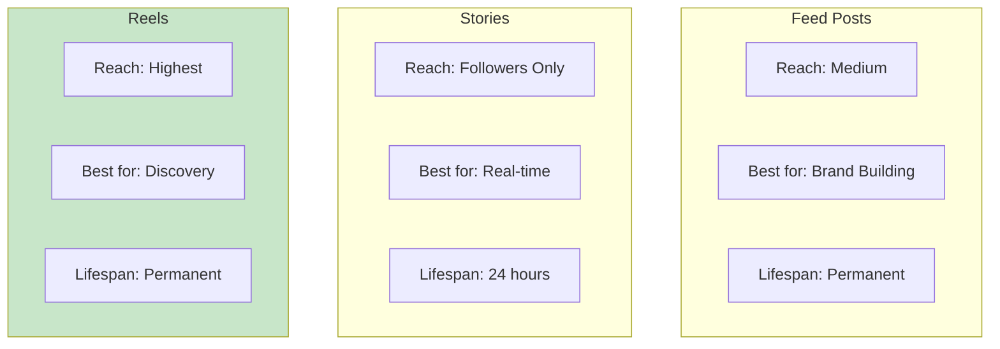

# Mind Map: Instagram Marketing

> **Format:** Mind Map (Mermaid)
> **Source:** SWP3 Chapter 15
> **Nodes:** 65+
> **Production ID:** SWP3-Ch15-001-MIND

---

## Main Mind Map: Instagram Marketing Overview

---

## Sub Mind Map 1: Content Types Deep Dive

---

## Sub Mind Map 2: Hashtag Strategy

---

## Sub Mind Map 3: Profile Optimization

---

## Sub Mind Map 4: Reels Strategy

---

## Process Flow: Content Creation Workflow

---

## Process Flow: Instagram Funnel

---

## Process Flow: Posting Schedule

---

## Comparison: Content Formats

---

## Production Notes

| Field | Value |
|-------|-------|
| Created | 2026-01-28 |
| Producer | จูล่ง |
| Total Nodes | 65+ |
| Diagrams | 7 |
| QC Status | Pending |

---

> *Pink Castle Foundation Kit v1.0*
