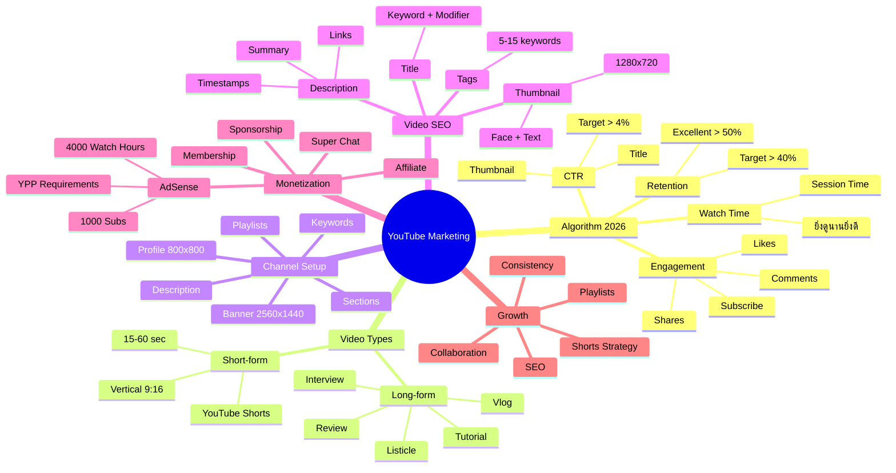
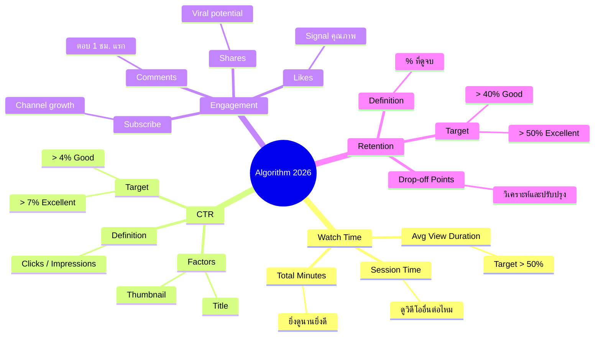
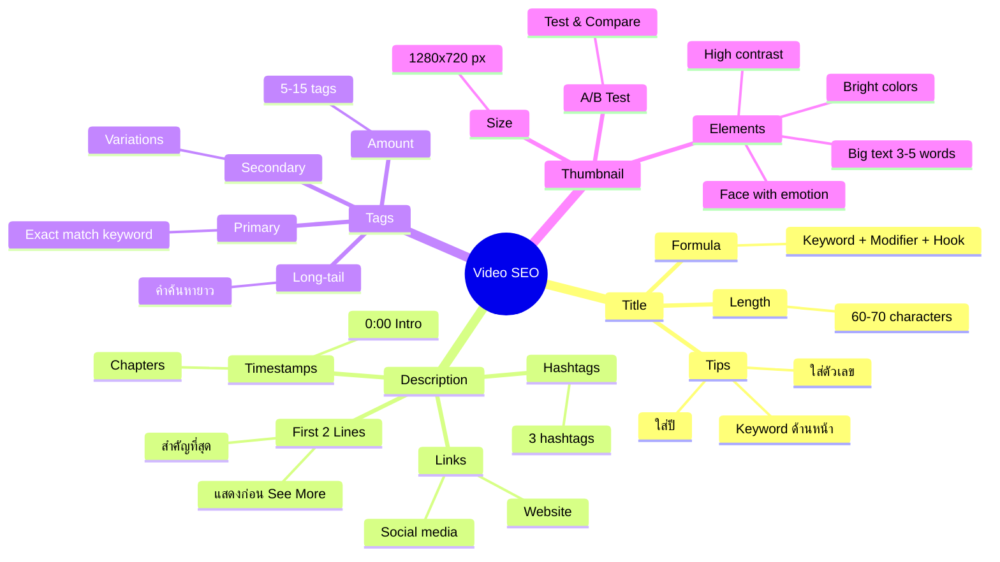
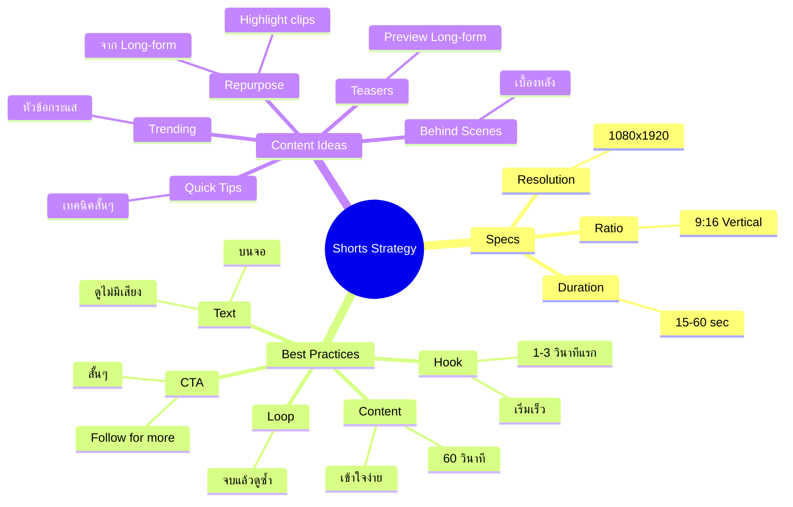
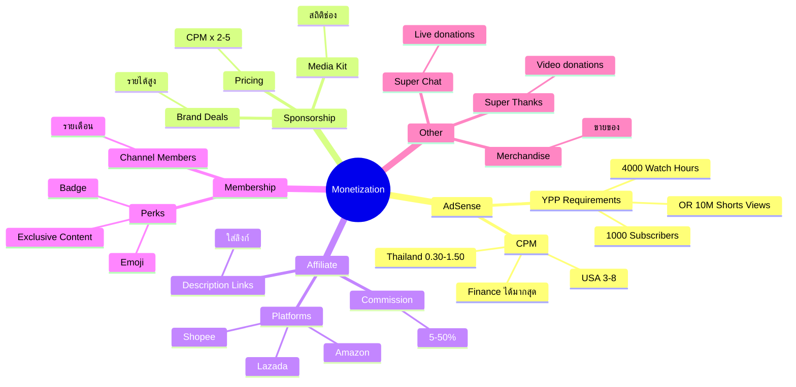
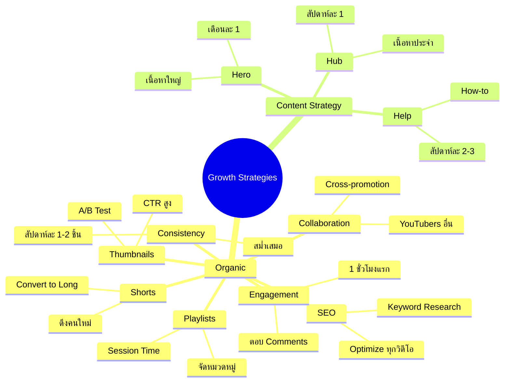
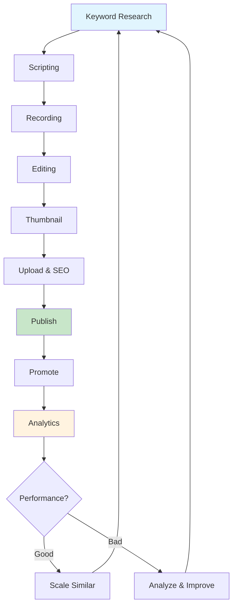
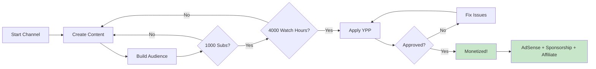
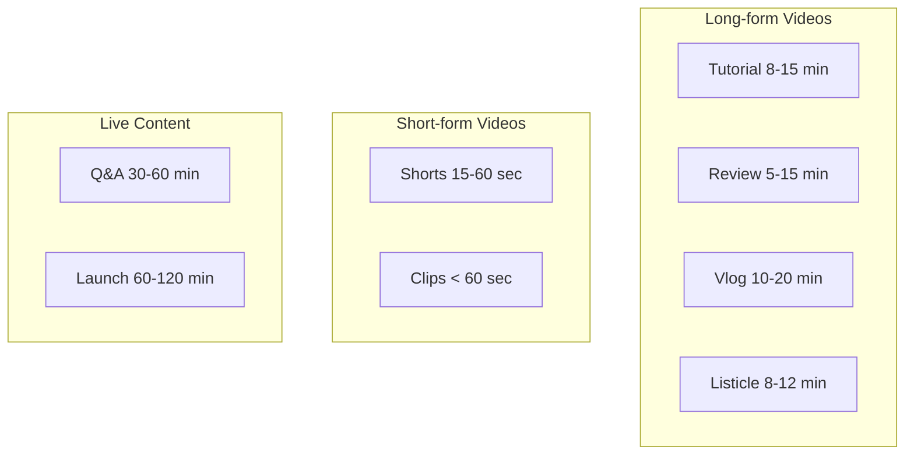

# Mind Map: YouTube Marketing

> **Format:** Mind Map (Mermaid)
> **Source:** SWP3 Chapter 16
> **Nodes:** 70+
> **Production ID:** SWP3-Ch16-001-MIND

---

## Main Mind Map: YouTube Marketing Overview

---

## Sub Mind Map 1: YouTube Algorithm 2026

---

## Sub Mind Map 2: Video SEO

---

## Sub Mind Map 3: YouTube Shorts Strategy

---

## Sub Mind Map 4: Monetization

---

## Sub Mind Map 5: Growth Strategies

---

## Process Flow: YouTube Content Workflow

---

## Process Flow: YouTube Monetization Journey

---

## Comparison: Video Types

---

## Production Notes

| Field | Value |
|-------|-------|
| Created | 2026-01-28 |
| Producer | จูล่ง |
| Total Nodes | 70+ |
| Diagrams | 7 |
| QC Status | Pending |

---

> *Pink Castle Foundation Kit v1.0*
