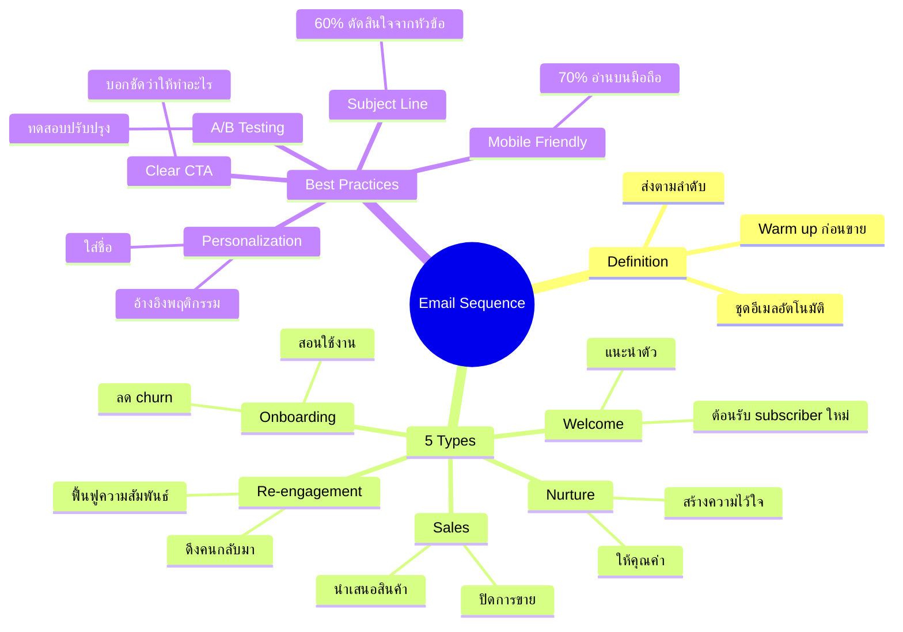

# Mind Map: Email Marketing Mastery ตอนที่ 2

> **Format:** Mind Map (Mermaid Diagram)
> **Source:** Email Marketing Mastery ตอนที่ 2
> **Production ID:** EMAIL-001-MIND

---

## Mind Map Diagram

---

## Key Takeaways

1. **Email Sequence** = ชุดอีเมลอัตโนมัติที่ส่งตามลำดับ
2. **5 ประเภท** = Welcome, Nurture, Sales, Onboarding, Re-engagement
3. **Best Practices** = Subject Line + Personalization + CTA + Mobile + Testing

---

*Production: จูล่ง (Claude Code) | Pink Castle Content Production*
