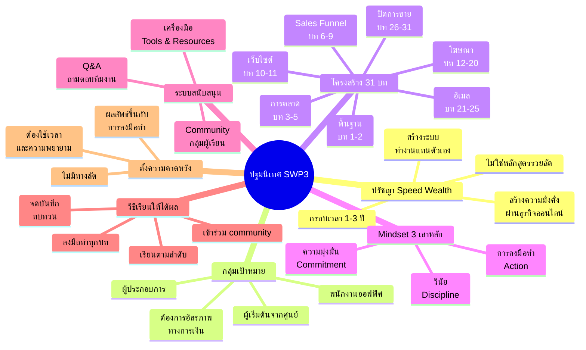

# ปฐมนิเทศ Speed Wealth Project รุ่นที่ 3 — ORIENT-001
> **Format:** Mind Map (Text Structure + Mermaid)
> **Source:** SWP3 Ch1 ปฐมนิเทศ
> **Production:** PinkCastle Academy | จูล่ง CTO
> **Date:** 2026-02-17

---

## Mind Map — โครงสร้างข้อความ (Text Structure)

```
ปฐมนิเทศ SWP3
│
├── 1. ปรัชญา Speed Wealth
│   ├── สร้างความมั่งคั่งผ่านธุรกิจออนไลน์
│   ├── กรอบเวลา 1-3 ปี
│   ├── ไม่ใช่หลักสูตรรวยลัด
│   └── สร้างระบบที่ทำงานแทนตัวเอง
│
├── 2. กลุ่มเป้าหมาย
│   ├── คนที่ต้องการอิสรภาพทางการเงิน
│   ├── พนักงานออฟฟิศอยากมีรายได้เสริม
│   ├── ผู้ประกอบการอยากขยายออนไลน์
│   └── ผู้เริ่มต้นจากศูนย์
│
├── 3. โครงสร้างหลักสูตร (31 บท)
│   ├── พื้นฐาน (บท 1-2)
│   │   ├── ปฐมนิเทศ
│   │   └── ปรัชญา Speed Wealth
│   ├── การตลาด (บท 3-5)
│   │   └── กลยุทธ์การตลาดออนไลน์
│   ├── Sales Funnel (บท 6-9)
│   │   ├── Funnel Design
│   │   ├── Lead Magnet
│   │   └── Trip Wire
│   ├── เว็บไซต์ (บท 10-11)
│   │   └── สร้างเว็บไซต์ธุรกิจ
│   ├── โฆษณา (บท 12-20)
│   │   ├── YouTube Ads
│   │   └── Facebook Ads
│   ├── ระบบอีเมล (บท 21-25)
│   │   └── Email Marketing & Automation
│   └── ปิดการขาย (บท 26-31)
│       └── Live Closing
│
├── 4. Mindset 3 เสาหลัก
│   ├── ความมุ่งมั่น (Commitment)
│   │   └── ตัดสินใจแล้วทำให้สำเร็จ
│   ├── วินัย (Discipline)
│   │   └── เรียนและปฏิบัติสม่ำเสมอ
│   └── การลงมือทำ (Action)
│       └── นำไปปฏิบัติจริง ไม่ใช่แค่ดู
│
├── 5. เรื่องราวผู้สอน
│   ├── จากคนธรรมดา
│   ├── ค้นพบพลังธุรกิจออนไลน์
│   └── สร้างรายได้จากสิ่งที่สอน
│
├── 6. ระบบสนับสนุน
│   ├── Community
│   │   ├── กลุ่มผู้เรียน
│   │   └── แลกเปลี่ยนประสบการณ์
│   ├── Q&A
│   │   ├── ถามตอบกับทีมงาน
│   │   └── แก้ปัญหาเฉพาะจุด
│   └── เครื่องมือ
│       ├── Website Builder
│       ├── Email Platform
│       ├── Ads Platform
│       └── Analytics Tools
│
├── 7. วิธีเรียนให้ได้ผลสูงสุด
│   ├── เรียนตามลำดับ
│   ├── ลงมือทำทุกบท
│   ├── เข้าร่วม community
│   ├── ใช้ Q&A เมื่อติดปัญหา
│   └── จดบันทึกและทบทวน
│
└── 8. การตั้งความคาดหวัง
    ├── ต้องใช้เวลาและความพยายาม
    ├── ไม่มีทางลัด
    ├── ผลลัพธ์ขึ้นกับการลงมือทำ
    └── ความสำเร็จ = ความรู้ + การปฏิบัติ
```

---

## Mind Map — Mermaid Diagram



---

## Mind Map — Mermaid Flowchart (แบบทางเลือก)

```mermaid
graph TB
    CENTER["🎓 ปฐมนิเทศ SWP3<br/>Speed Wealth Project รุ่น 3"]

    CENTER --> P["💡 ปรัชญา Speed Wealth"]
    P --> P1["สร้างความมั่งคั่ง<br/>ผ่านธุรกิจออนไลน์"]
    P --> P2["กรอบเวลา 1-3 ปี"]
    P --> P3["ไม่ใช่รวยลัด"]

    CENTER --> T["👥 กลุ่มเป้าหมาย"]
    T --> T1["ต้องการอิสรภาพทางการเงิน"]
    T --> T2["พนักงาน / ผู้ประกอบการ"]
    T --> T3["ผู้เริ่มต้น"]

    CENTER --> S["📚 โครงสร้าง 31 บท"]
    S --> S1["พื้นฐาน (1-2)"]
    S --> S2["การตลาด (3-5)"]
    S --> S3["Sales Funnel (6-9)"]
    S --> S4["เว็บ + โฆษณา (10-20)"]
    S --> S5["อีเมล + ปิดขาย (21-31)"]

    CENTER --> M["🧠 Mindset"]
    M --> M1["ความมุ่งมั่น"]
    M --> M2["วินัย"]
    M --> M3["ลงมือทำ"]

    CENTER --> SUP["🤝 ระบบสนับสนุน"]
    SUP --> SUP1["Community"]
    SUP --> SUP2["Q&A"]
    SUP --> SUP3["เครื่องมือ"]

    CENTER --> E["⚙️ ตั้งความคาดหวัง"]
    E --> E1["ต้องทำงานหนัก"]
    E --> E2["ผลลัพธ์ = ความรู้ + ปฏิบัติ"]

    style CENTER fill:#FF69B4,stroke:#FF1493,color:#fff,stroke-width:3px
    style P fill:#FFB6C1,stroke:#FF69B4
    style T fill:#FFB6C1,stroke:#FF69B4
    style S fill:#FFB6C1,stroke:#FF69B4
    style M fill:#FFB6C1,stroke:#FF69B4
    style SUP fill:#FFB6C1,stroke:#FF69B4
    style E fill:#FFB6C1,stroke:#FF69B4
```



---

## สรุปโครงสร้าง Mind Map

| กิ่งหลัก | จำนวนกิ่งย่อย | ประเด็นสำคัญ |
|---------|-------------|-------------|
| ปรัชญา Speed Wealth | 4 | กรอบเวลา 1-3 ปี ไม่ใช่รวยลัด |
| กลุ่มเป้าหมาย | 4 | คนที่ต้องการอิสรภาพทางการเงิน |
| โครงสร้าง 31 บท | 7 หมวด | ครบวงจรตั้งแต่พื้นฐานถึงปิดขาย |
| Mindset 3 เสาหลัก | 3 | มุ่งมั่น วินัย ลงมือทำ |
| ระบบสนับสนุน | 3 | Community, Q&A, เครื่องมือ |
| วิธีเรียนให้ได้ผล | 5 | เรียนตามลำดับ ลงมือทำ ร่วม community |
| ตั้งความคาดหวัง | 4 | ต้องทำงาน ไม่มีทางลัด |

---

> **หมายเหตุ:** Mermaid mindmap สามารถ render ได้ใน GitHub, Notion (embed), VS Code (Mermaid Preview extension)
> Flowchart แบบทางเลือกใช้ได้ในกรณีที่ platform ไม่รองรับ mindmap syntax
