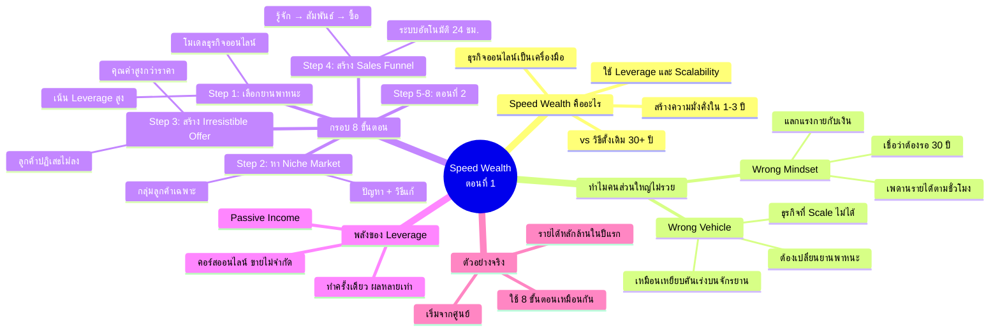

# รวยเร็วคืออะไร? ความลับของ Speed Wealth ตอนที่ 1 — WEALTH-001
> **Format:** Mind Map (Mermaid)
> **Source:** SWP3 Ch2 8 ขั้นตอนสร้างความมั่งคั่ง ตอนที่ 1
> **Production:** PinkCastle Academy | จูล่ง CTO
> **Date:** 2026-02-17

---

---

## Center Node: Speed Wealth ตอนที่ 1

### Branch 1: Speed Wealth คืออะไร
- สร้างความมั่งคั่งภายใน 1-3 ปี
  - ไม่ใช่ "รวยข้ามคืน"
  - ใช้กลยุทธ์ที่ถูกต้อง
- ใช้ Leverage และ Scalability
  - แรงทดทำให้ได้ผลลัพธ์หลายเท่า
  - ขยายตัวได้ไม่จำกัด
- ธุรกิจออนไลน์เป็นเครื่องมือหลัก

### Branch 2: ทำไมคนส่วนใหญ่ไม่รวย
- Wrong Mindset
  - แลกแรงกายกับเงิน
  - เพดานรายได้ตามชั่วโมง
- Wrong Vehicle
  - ทำงานหนักในธุรกิจที่ Scale ไม่ได้

### Branch 3: กรอบ 8 ขั้นตอน (4 ขั้นแรก)
- Step 1: เลือกโมเดลธุรกิจที่มี Leverage สูง
- Step 2: หา Niche Market ที่มีความต้องการสูง
- Step 3: สร้างข้อเสนอที่มีคุณค่าเกินราคา
- Step 4: สร้าง Sales Funnel อัตโนมัติ

### Branch 4: พลังของ Leverage
- ทำครั้งเดียว ได้ผลซ้ำ
- คอร์สออนไลน์ขายไม่จำกัดจำนวน
- Passive Income ทำงานแทนคุณ 24 ชม.

### Branch 5: ตัวอย่างจริง
- คนที่เริ่มจากศูนย์
- รายได้หลักล้านภายในปีแรก
- จุดร่วม: เลือกโมเดลที่มี Leverage สูง

---

**จำนวน Nodes ทั้งหมด: 32 nodes**

| ระดับ | จำนวน |
|-------|-------|
| Center Node | 1 |
| Branch (ระดับ 1) | 5 |
| Sub-branch (ระดับ 2) | 15 |
| Leaf (ระดับ 3) | 11 |
| **รวม** | **32** |
