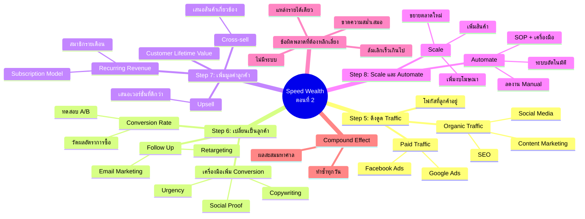

# ความลับของ Speed Wealth ตอนที่ 2 — WEALTH-002
> **Format:** Mind Map (Mermaid)
> **Source:** SWP3 Ch2 8 ขั้นตอนสร้างความมั่งคั่ง ตอนที่ 2
> **Production:** PinkCastle Academy | จูล่ง CTO
> **Date:** 2026-02-17

---

---

## Center Node: Speed Wealth ตอนที่ 2

### Branch 1: ขั้นตอนที่ 5 — ดึงดูด Traffic
- Organic Traffic (ฟรี ใช้เวลาสร้าง)
  - SEO, Content Marketing, Social Media
- Paid Traffic (เร็ว ต้องลงทุน)
  - Google Ads, Facebook Ads
- กุญแจ: รู้ว่าลูกค้าอยู่ที่ไหน แล้วไปหาตรงนั้น

### Branch 2: ขั้นตอนที่ 6 — เปลี่ยนผู้เยี่ยมชมเป็นลูกค้า
- Conversion Rate เป็นตัวชี้วัดหลัก
- Copywriting + Social Proof + Urgency
- Follow Up ผ่าน Email Marketing

### Branch 3: ขั้นตอนที่ 7 — เพิ่มมูลค่าลูกค้า
- Upsell (เวอร์ชั่นดีกว่า)
- Cross-sell (สินค้าเกี่ยวข้อง)
- Recurring Revenue (สมาชิกรายเดือน)
- Customer Lifetime Value (CLV)

### Branch 4: ขั้นตอนที่ 8 — Scale และ Automate
- Scale = เพิ่มปริมาณ (งบ, ตลาด, สินค้า)
- Automate = ลดงาน Manual ด้วยระบบอัตโนมัติ
- เป้าหมาย: ธุรกิจทำงานได้แม้เจ้าของหยุด

### Branch 5: ข้อผิดพลาดที่ต้องหลีกเลี่ยง
- ล้มเลิกเร็วเกินไป
- ไม่สร้างระบบ
- พึ่งพารายได้ทางเดียว
- ขาดความสม่ำเสมอ

### Branch 6: Compound Effect
- ทำซ้ำอย่างสม่ำเสมอทุกวัน
- ผลสะสมกลายเป็นผลลัพธ์มหาศาล

---

**จำนวน Nodes ทั้งหมด: 38 nodes**

| ระดับ | จำนวน |
|-------|-------|
| Center Node | 1 |
| Branch (ระดับ 1) | 6 |
| Sub-branch (ระดับ 2) | 17 |
| Leaf (ระดับ 3) | 14 |
| **รวม** | **38** |
