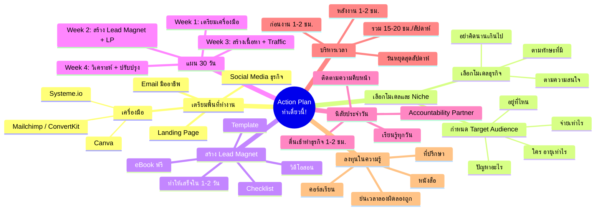

# สิ่งที่จำเป็นต้องทำเดี๋ยวนี้! — WEALTH-003
> **Format:** Mind Map (Mermaid)
> **Source:** SWP3 Ch2 8 ขั้นตอนสร้างความมั่งคั่ง ตอนที่ 3
> **Production:** PinkCastle Academy | จูล่ง CTO
> **Date:** 2026-02-17

---

---

## Center Node: Action Plan — ทำเดี๋ยวนี้!

### Branch 1: เตรียมพื้นที่ทำงานออนไลน์
- Email มืออาชีพ (ไม่ใช่อีเมลส่วนตัว)
- Landing Page หรือเว็บไซต์
- Social Media สำหรับธุรกิจ
- เครื่องมือ: Mailchimp, Systeme.io, Canva

### Branch 2: เลือกโมเดลธุรกิจและกลุ่มเป้าหมาย
- เลือกตามทักษะและความสนใจ
  - อย่า Analysis Paralysis
- กำหนด Target Audience 5 ข้อ
  - ใคร / อายุ / ปัญหา / อยู่ที่ไหน / จ่ายเท่าไร

### Branch 3: สร้าง Lead Magnet ชิ้นแรก
- ตัวอย่าง: eBook, Checklist, วิดีโอ, Template
- ตอบโจทย์ปัญหาเฉพาะของกลุ่มเป้าหมาย
- ทำให้เสร็จภายใน 1-2 วัน

### Branch 4: แผนปฏิบัติการ 30 วัน
- Week 1: เตรียมเครื่องมือ + เลือกโมเดล + Niche
- Week 2: สร้าง Lead Magnet + Landing Page
- Week 3: สร้างเนื้อหา + ดึงดูด Traffic
- Week 4: วิเคราะห์ผล + ปรับปรุง + วางแผนต่อ

### Branch 5: นิสัยประจำวัน
- ตื่นเช้าทำธุรกิจ 1-2 ชม.
- เรียนรู้ทุกวัน (หนังสือ/คอร์ส/Podcast)
- ติดตามและบันทึกความคืบหน้า
- มี Accountability Partner

### Branch 6: การบริหารเวลา (Side Hustlers)
- ก่อนงาน 1-2 ชม. + หลังงาน 1-2 ชม.
- วันหยุดสุดสัปดาห์
- รวม 15-20 ชม./สัปดาห์

### Branch 7: ลงทุนในความรู้
- คอร์สเรียน / หนังสือ / ที่ปรึกษา
- ช่วยย่นระยะเวลาลองผิดลองถูก
- แยก "การลงทุน" จาก "การใช้จ่าย"

---

**จำนวน Nodes ทั้งหมด: 40 nodes**

| ระดับ | จำนวน |
|-------|-------|
| Center Node | 1 |
| Branch (ระดับ 1) | 7 |
| Sub-branch (ระดับ 2) | 19 |
| Leaf (ระดับ 3) | 13 |
| **รวม** | **40** |
