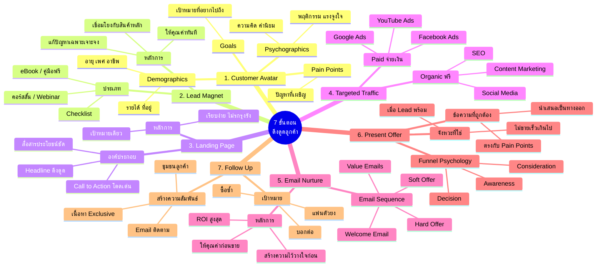

# Mind Map: 7 ขั้นตอนดึงดูดลูกค้าและผู้มุ่งหวัง — MKTG-001
> **Format:** Mind Map (Mermaid)
> **Source:** SWP3 Ch3 วิธีทำการตลาดออนไลน์ที่ทรงพลังที่สุด
> **Production:** PinkCastle Academy | จูล่ง CTO
> **Date:** 2026-02-17

---

## Mermaid Mind Map



---

## Text-based Mind Map

```
                    7 ขั้นตอนดึงดูดลูกค้า
                    และผู้มุ่งหวัง (MKTG-001)
                              |
    ┌─────────┬─────────┬─────┼─────┬─────────┬─────────┐
    |         |         |           |         |         |
 [Step 1]  [Step 2]  [Step 3]  [Step 4]  [Step 5]  [Step 6]  [Step 7]
 Customer  Lead      Landing   Traffic   Email     Present   Follow
 Avatar    Magnet    Page               Nurture   Offer     Up
```

## Center Node: 7 ขั้นตอนดึงดูดลูกค้าและผู้มุ่งหวัง

### Branch 1: Customer Avatar (กำหนดลูกค้าในอุดมคติ)
- Demographics
  - อายุ เพศ อาชีพ รายได้ ที่อยู่
- Psychographics
  - ความคิด ค่านิยม พฤติกรรม แรงจูงใจ
- Pain Points
  - ปัญหาที่ลูกค้าเผชิญอยู่
- Goals
  - เป้าหมายที่ลูกค้าอยากไปถึง

### Branch 2: Lead Magnet (แม่เหล็กดึงดูด)
- ประเภท
  - eBook / คู่มือฟรี
  - Checklist ขั้นตอน
  - คอร์สสั้น / Webinar
- หลักการสำคัญ
  - แก้ปัญหาเฉพาะเจาะจง
  - ให้คุณค่าทันที
  - เชื่อมโยงกับสินค้าหลัก

### Branch 3: Landing Page (หน้ารับข้อมูล)
- องค์ประกอบสำคัญ
  - Headline ที่ดึงดูด
  - สื่อสารประโยชน์ชัดเจน
  - Call to Action โดดเด่น
- หลักการออกแบบ
  - เป้าหมายเดียว (กรอกข้อมูล)
  - เรียบง่าย ไม่มีสิ่งรบกวน

### Branch 4: Targeted Traffic (ดึงผู้เข้าชม)
- Organic (ฟรี)
  - Content Marketing
  - SEO (Search Engine Optimization)
  - Social Media Marketing
- Paid (จ่ายเงิน)
  - Facebook Ads
  - YouTube Ads
  - Google Ads

### Branch 5: Email Nurture (บ่มเพาะผู้มุ่งหวัง)
- Email Sequence
  - Welcome Email (ต้อนรับ)
  - Value Emails (ให้คุณค่า)
  - Soft/Hard Offer (นำเสนอ)
- หลักการ
  - สร้างความไว้วางใจก่อนขาย
  - ROI สูงที่สุดในทุกช่องทาง

### Branch 6: Present Offer (นำเสนอข้อเสนอ)
- องค์ประกอบ
  - จังหวะเวลาที่ถูกต้อง
  - ข้อความที่ตรงใจ
- Funnel Psychology
  - Awareness (รับรู้)
  - Consideration (พิจารณา)
  - Decision (ตัดสินใจ)

### Branch 7: Follow Up (ติดตามสร้างความสัมพันธ์)
- กิจกรรม
  - Email ติดตามหลังซื้อ
  - เนื้อหา Exclusive
  - สร้างชุมชนลูกค้า
- เป้าหมาย
  - ลูกค้าซื้อซ้ำ (Repeat Purchase)
  - ลูกค้าบอกต่อ (Referral)
  - เปลี่ยนเป็นแฟนตัวยง (Loyal Fan)

### รากฐาน: Content Marketing
- เป็นเชื้อเพลิงของทุกขั้นตอน
- เนื้อหาที่มีคุณค่า = ผลลัพธ์ที่ดี

### กลไกขับเคลื่อน: Test & Optimize
- ทดสอบทุกขั้นตอน
- วิเคราะห์ข้อมูล
- ปรับปรุงอย่างต่อเนื่อง

---

**จำนวน Nodes ทั้งหมด: 52 nodes**

| ระดับ | จำนวน |
|-------|-------|
| Center Node | 1 |
| Branch (ระดับ 1) | 9 |
| Sub-branch (ระดับ 2) | 22 |
| Leaf (ระดับ 3) | 20 |
| **รวม** | **52** |
