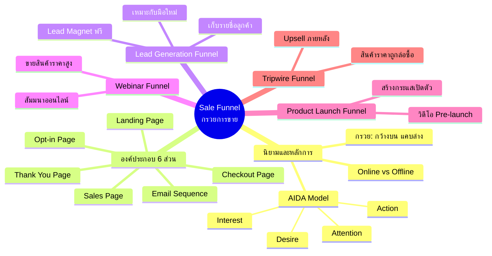

# Mind Map: Sale Funnel คืออะไร — FUNNEL-001
> **Format:** Mind Map (Text-based)
> **Source:** SWP3 Ch6 Sale Funnel Mastery ตอนที่ 1
> **Production:** PinkCastle Academy | จูล่ง CTO
> **Date:** 2026-02-17

---

```
                         Sale Funnel
                       (กรวยการขาย)
                            |
        ┌───────────────────┼───────────────────┐
        |                   |                   |
   [นิยาม/AIDA]     [องค์ประกอบ 6 ส่วน]    [4 ประเภท]
        |                   |                   |
        |                   |          ┌────┬────┬────┐
        |                   |          |    |    |    |
```

## Center Node: Sale Funnel (กรวยการขาย)

### Branch 1: นิยามและหลักการ
- กรวยการขาย
  - กว้างด้านบน (คนจำนวนมาก)
  - แคบด้านล่าง (ลูกค้าจริง)
  - กระบวนการกลั่นกรอง
- AIDA Model
  - A = Attention (ดึงดูดความสนใจ)
  - I = Interest (สร้างความสนใจ)
  - D = Desire (ปลุกความต้องการ)
  - A = Action (กระตุ้นการซื้อ)
- ออนไลน์ vs ออฟไลน์
  - หลักการเดียวกัน
  - เครื่องมือต่างกัน
  - ออนไลน์วัดผลได้ดีกว่า

### Branch 2: องค์ประกอบ 6 ส่วน
- Landing Page
  - หน้าแรกรับ traffic
  - สื่อสารชัดเจน เป้าหมายเดียว
- Opt-in Page
  - เก็บอีเมล/ข้อมูลติดต่อ
  - แลกกับ Lead Magnet ฟรี
- Email Sequence
  - ชุดอีเมลอัตโนมัติ
  - สร้างความสัมพันธ์/ความไว้วางใจ
- Sales Page
  - หน้าขายสินค้า
  - โน้มน้าวใจ/แสดงคุณค่า
- Checkout Page
  - หน้าชำระเงิน
  - ต้องง่ายและรวดเร็ว
- Thank You Page
  - หน้าขอบคุณ
  - โอกาส Upsell/Cross-sell

### Branch 3: Funnel ประเภทที่ 1 -- Lead Generation
- เป้าหมาย
  - เก็บรายชื่อลูกค้าเป้าหมาย
- เครื่องมือ
  - Lead Magnet (ของฟรีมีค่า)
  - Opt-in Form
- เหมาะกับ
  - ผู้เริ่มต้น
  - สร้างฐานลูกค้า

### Branch 4: Funnel ประเภทที่ 2 -- Webinar
- เป้าหมาย
  - ขายสินค้า/บริการราคาสูง
- เครื่องมือ
  - สัมมนาออนไลน์
  - การนำเสนอสด/บันทึก
- เหมาะกับ
  - คอร์สเรียน/ที่ปรึกษา
  - สินค้าต้องอธิบายมาก

### Branch 5: Funnel ประเภทที่ 3 -- Product Launch
- เป้าหมาย
  - สร้างกระแสเปิดตัวสินค้า
- เครื่องมือ
  - วิดีโอชุด Pre-launch
  - Countdown/ความเร่งด่วน
- เหมาะกับ
  - สินค้าใหม่
  - อีเวนต์พิเศษ

### Branch 6: Funnel ประเภทที่ 4 -- Tripwire
- เป้าหมาย
  - เปลี่ยนคนแปลกหน้าเป็นลูกค้า
- เครื่องมือ
  - สินค้าราคาถูก (ล่อซื้อ)
  - Upsell หลังซื้อ
- เหมาะกับ
  - ธุรกิจที่มี Product Ladder
  - ต้องการลูกค้าจ่ายเงินจริง

---



---

**จำนวน Nodes ทั้งหมด: 35 nodes**

| ระดับ | จำนวน |
|-------|-------|
| Center Node | 1 |
| Branch (ระดับ 1) | 6 |
| Sub-branch (ระดับ 2) | 16 |
| Leaf (ระดับ 3) | 12 |
| **รวม** | **35** |
