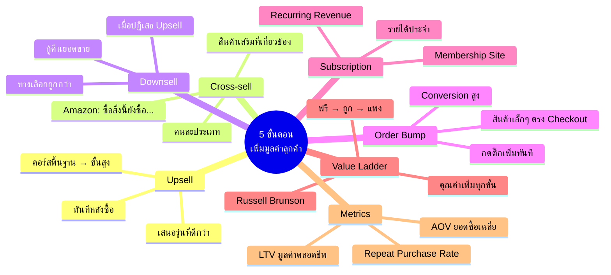

# Mind Map: 5 ขั้นตอนเพิ่มมูลค่าลูกค้า — FUNNEL-002
> **Format:** Mind Map (Text-based)
> **Source:** SWP3 Ch6 Sale Funnel Mastery ตอนที่ 2
> **Production:** PinkCastle Academy | จูล่ง CTO
> **Date:** 2026-02-17

---

```
                  5 ขั้นตอนเพิ่มมูลค่าลูกค้า
                   (Customer Value Optimization)
                              |
        ┌─────────────────────┼─────────────────────┐
        |                     |                     |
   [5 ขั้นตอน]         [Value Ladder]          [Metrics]
        |                     |                     |
   ┌──┬──┬──┬──┐              |              ┌──┬──┐
   |  |  |  |  |              |              |  |  |
```

## Center Node: 5 ขั้นตอนเพิ่มมูลค่าลูกค้า

### Branch 1: ขั้นตอนที่ 1 — Upsell
- นิยาม
  - เสนอรุ่นที่ดีกว่า/แพงกว่า
  - ทันทีหลังลูกค้าตัดสินใจซื้อ
- ตัวอย่าง
  - Hamburger → ชุดใหญ่
  - คอร์สพื้นฐาน → คอร์สขั้นสูง
- จุดสำคัญ
  - เสนอทันที ไม่รอนาน
  - ลูกค้าอยู่ในอารมณ์ซื้อ

### Branch 2: ขั้นตอนที่ 2 — Cross-sell
- นิยาม
  - เสนอสินค้าเสริมที่เกี่ยวข้อง
  - ต่างจาก Upsell: คนละประเภท
- ตัวอย่าง
  - โทรศัพท์ → เคส + ฟิล์ม
  - คอร์สการตลาด → คอร์ส Copywriting
- ตัวอย่างสำเร็จ
  - Amazon: "ลูกค้าที่ซื้อสิ่งนี้ยังซื้อ..."

### Branch 3: ขั้นตอนที่ 3 — Downsell
- นิยาม
  - เสนอทางเลือกถูกกว่า
  - เมื่อลูกค้าปฏิเสธ Upsell
- หลักการ
  - ได้บางส่วน ดีกว่าไม่ได้เลย
  - กู้คืนยอดขายที่เกือบเสียไป
- ตัวอย่าง
  - ปฏิเสธ 5,000 บาท → เสนอ 2,500 บาท

### Branch 4: ขั้นตอนที่ 4 — Order Bump
- นิยาม
  - สินค้าเล็กๆ ราคาถูก
  - เพิ่มตรงหน้า Checkout
- เปรียบเทียบ
  - ขนมข้างเคาน์เตอร์ซูเปอร์
  - แค่กดติ๊กก็เพิ่มเข้าตะกร้า
- ทำไมได้ผล
  - ลูกค้าตัดสินใจซื้อแล้ว
  - ราคาไม่มากจนต้องคิดนาน

### Branch 5: ขั้นตอนที่ 5 — Subscription/Membership
- นิยาม
  - รายได้ประจำ (Recurring Revenue)
  - จ่ายทุกเดือน/ทุกปี
- ตัวอย่าง
  - Netflix, Spotify, ฟิตเนส
  - Membership Site, Subscription Box
- ข้อดี
  - คาดเดารายได้ล่วงหน้า
  - สะสมเพิ่มขึ้นทุกเดือน

### Branch 6: Value Ladder (Russell Brunson)
- แนวคิด
  - บันไดค่า: ถูกไปแพง
  - คุณค่าเพิ่มทุกขั้น
- ขั้นบันได
  - ขั้น 1: ฟรี / Lead Magnet
  - ขั้น 2: Tripwire ราคาถูก
  - ขั้น 3: สินค้าหลัก
  - ขั้น 4: Premium / Coaching
  - ขั้น 5: Subscription

### Branch 7: ตัวชี้วัดสำคัญ (Metrics)
- LTV (Lifetime Value)
  - มูลค่ารวมตลอดช่วงเป็นลูกค้า
- AOV (Average Order Value)
  - ยอดสั่งซื้อเฉลี่ยต่อครั้ง
- Repeat Purchase Rate
  - อัตราการซื้อซ้ำ

---



---

**จำนวน Nodes ทั้งหมด: 38 nodes**

| ระดับ | จำนวน |
|-------|-------|
| Center Node | 1 |
| Branch (ระดับ 1) | 7 |
| Sub-branch (ระดับ 2) | 17 |
| Leaf (ระดับ 3) | 13 |
| **รวม** | **38** |
