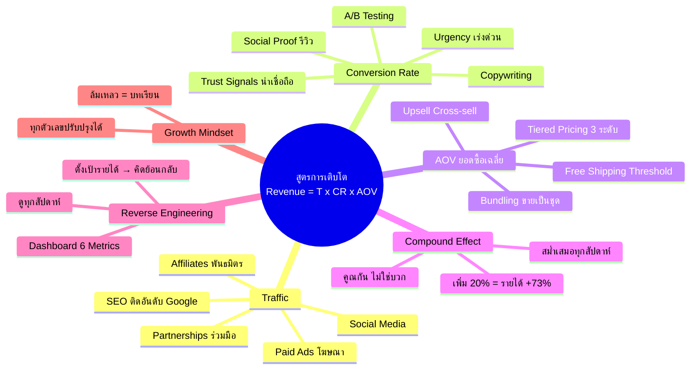

# Mind Map: สูตรแห่งการเติบโตของธุรกิจ — FUNNEL-003
> **Format:** Mind Map (Text-based)
> **Source:** SWP3 Ch6 Sale Funnel Mastery ตอนที่ 3
> **Production:** PinkCastle Academy | จูล่ง CTO
> **Date:** 2026-02-17

---

```
                  สูตรแห่งการเติบโตของธุรกิจ
               Revenue = Traffic x CR x AOV
                            |
        ┌───────────────────┼───────────────────┐
        |                   |                   |
    [Traffic]        [Conversion Rate]        [AOV]
        |                   |                   |
   ┌──┬──┬──┬──┐      ┌──┬──┬──┬──┐      ┌──┬──┬──┐
   |  |  |  |  |      |  |  |  |  |      |  |  |  |
```

## Center Node: สูตรแห่งการเติบโต (Revenue = Traffic x CR x AOV)

### Branch 1: Traffic (จำนวนคนเข้าชม)
- SEO (Search Engine Optimization)
  - ทำเว็บติดอันดับ Google
  - ฟรีแต่ใช้เวลานาน
- Social Media
  - Facebook, Instagram, TikTok
  - YouTube, Twitter/X
- Paid Ads (โฆษณาเสียเงิน)
  - Google Ads, Facebook Ads
  - ได้ผลเร็วแต่ต้องลงทุน
- Affiliates
  - ให้คนอื่นช่วยโปรโมท
  - จ่ายค่าคอมมิชชั่นเมื่อขายได้
- Partnerships
  - ร่วมมือกับธุรกิจอื่น
  - แชร์กลุ่มเป้าหมาย

### Branch 2: Conversion Rate (อัตราเปลี่ยนเป็นลูกค้า)
- A/B Testing
  - ทดสอบ 2 เวอร์ชัน
  - เลือกเวอร์ชันที่ดีกว่า
- Copywriting
  - เขียนข้อความโน้มน้าวใจ
  - Headline สำคัญที่สุด
- Social Proof
  - รีวิวจากลูกค้าจริง
  - Testimonials / จำนวนลูกค้า
- Urgency
  - Countdown Timer
  - Limited Seats / ของมีจำกัด
- Trust Signals
  - โลโก้รับรอง / SSL
  - การันตีคืนเงิน / ข้อมูลติดต่อ

### Branch 3: AOV (ยอดสั่งซื้อเฉลี่ย)
- Upsell / Cross-sell / Downsell
  - เทคนิคจากบทเรียนตอนที่ 2
  - เพิ่มมูลค่าต่อ transaction
- Bundling
  - รวมสินค้าหลายชิ้นขายเป็นชุด
  - ราคาพิเศษกว่าซื้อแยก
- Tiered Pricing
  - Basic / Standard / Premium
  - ให้ลูกค้าเลือกตามงบ
- Free Shipping Threshold
  - ส่งฟรีเมื่อซื้อครบจำนวน
  - ลูกค้าเพิ่มสินค้าเพื่อถึงยอด

### Branch 4: Compound Effect (พลังทบต้น)
- หลักการ
  - สูตรเป็นการคูณ ไม่ใช่บวก
  - ปรับปรุงเล็กน้อย → ผลทวีคูณ
- ตัวอย่าง
  - เพิ่มทุกตัว +20%
  - รายได้เพิ่ม +73%
- กลยุทธ์
  - ปรับทั้ง 3 ตัวพร้อมกัน
  - สม่ำเสมอทุกสัปดาห์

### Branch 5: Reverse Engineering
- วิธีตั้งเป้าหมาย
  - เริ่มจากเป้ารายได้
  - คิดย้อนกลับหาตัวเลข
- Dashboard
  - Traffic / CR / AOV
  - Revenue / LTV / CAC
- ความถี่
  - ดูทุกสัปดาห์
  - ถามว่าปรับปุ่มไหนง่ายสุด

### Branch 6: Growth Mindset
- Growth Mindset
  - ทุกตัวเลขปรับปรุงได้
  - ความล้มเหลว = บทเรียน
- Fixed Mindset (หลีกเลี่ยง)
  - ความสามารถมีจำกัด
  - ทำไม่ได้ก็เปลี่ยนไม่ได้

---



---

**จำนวน Nodes ทั้งหมด: 37 nodes**

| ระดับ | จำนวน |
|-------|-------|
| Center Node | 1 |
| Branch (ระดับ 1) | 6 |
| Sub-branch (ระดับ 2) | 17 |
| Leaf (ระดับ 3) | 13 |
| **รวม** | **37** |
