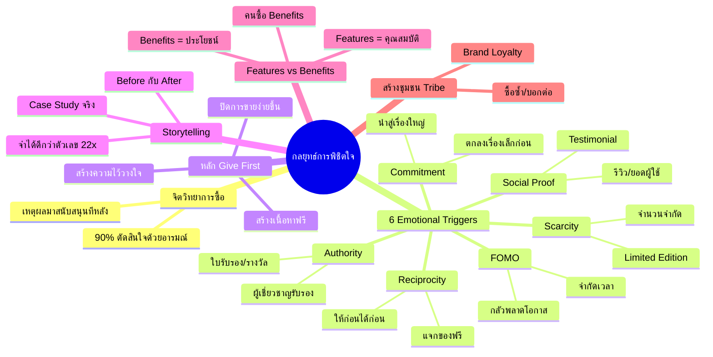

# Mind Map: กลยุทธ์การพิชิตใจ — FUNNEL-004
> **Format:** Mind Map (Text-based + Mermaid)
> **Source:** SWP3 Ch6 Sale Funnel Mastery ตอนที่ 4
> **Production:** PinkCastle Academy | จูล่ง CTO
> **Date:** 2026-02-17

---

## Center Node: กลยุทธ์การพิชิตใจลูกค้า

### Branch 1: จิตวิทยาการซื้อ (Buying Psychology)
- 90% ตัดสินใจด้วยอารมณ์
  - อารมณ์มาก่อน
  - เหตุผลมาสนับสนุนทีหลัง
- Emotional Triggers
  - ตัวกระตุ้นทางอารมณ์ 6 ประการ
  - เครื่องมือสำคัญของนักการตลาด

### Branch 2: FOMO & Scarcity
- FOMO (Fear of Missing Out)
  - กลัวพลาดโอกาส
  - กระตุ้นการตัดสินใจเร็ว
  - ตัวอย่าง: "โปรหมดคืนนี้"
- Scarcity (ความขาดแคลน)
  - จำนวนจำกัด
  - Limited Edition
  - ตัวอย่าง: "ผลิตแค่ 100 ชิ้น"

### Branch 3: Social Proof & Authority
- Social Proof (หลักฐานทางสังคม)
  - รีวิวจากลูกค้าจริง
  - ยอดผู้ใช้งาน
  - Testimonial
- Authority (ความน่าเชื่อถือ)
  - ผู้เชี่ยวชาญรับรอง
  - ใบรับรอง/รางวัล
  - ประสบการณ์ในวงการ

### Branch 4: Reciprocity & Commitment
- Reciprocity (ต่างตอบแทน)
  - ให้ก่อนได้ก่อน
  - แจกของฟรีที่มีคุณค่า
  - เชื่อมโยงกับ Give First
- Commitment & Consistency
  - ตกลงเรื่องเล็กก่อน
  - นำไปสู่เรื่องใหญ่
  - ทดลองฟรี → ซื้อจริง

### Branch 5: หลัก Give First (ให้ก่อนขาย)
- สร้างเนื้อหาฟรี
  - บทความ / Blog
  - วิดีโอ / YouTube
  - Podcast
- สร้างความไว้วางใจ
  - ช่วยแก้ปัญหาจริง
  - ไม่หวังผลตอบแทนทันที
- ผลลัพธ์
  - อัตราปิดการขายสูงขึ้น
  - ลูกค้าเปิดใจมากขึ้น

### Branch 6: Storytelling (การเล่าเรื่อง)
- พลังของเรื่องเล่า
  - จำได้ดีกว่าตัวเลข 22 เท่า
  - เชื่อมต่อทางอารมณ์
- Case Study & Testimonial
  - เรื่องจริงจากลูกค้า
  - Before → After (Transformation)
  - "ถ้าเขาทำได้ เราก็ทำได้"

### Branch 7: Features vs Benefits
- Features (คุณสมบัติ)
  - ข้อมูลทางเทคนิค
  - สเปคสินค้า
  - ตัวอย่าง: "กล้อง 108MP"
- Benefits (ประโยชน์)
  - สิ่งที่ลูกค้าได้รับจริง
  - การเปลี่ยนแปลงชีวิต
  - ตัวอย่าง: "ถ่ายรูปสวยเหมือนมืออาชีพ"
- คนซื้อ Benefits ไม่ใช่ Features

### Branch 8: การสร้างชุมชน (Tribe)
- ลูกค้ารู้สึกเป็นส่วนหนึ่ง
  - Brand Loyalty สูงขึ้น
  - ซื้อซ้ำ / บอกต่อ
- ช่องทาง Community
  - Facebook Group
  - LINE OA
  - Discord

---

## Mermaid Mindmap

---

**จำนวน Nodes ทั้งหมด: 42 nodes**

| ระดับ | จำนวน |
|-------|-------|
| Center Node | 1 |
| Branch (ระดับ 1) | 8 |
| Sub-branch (ระดับ 2) | 18 |
| Leaf (ระดับ 3) | 15 |
| **รวม** | **42** |
