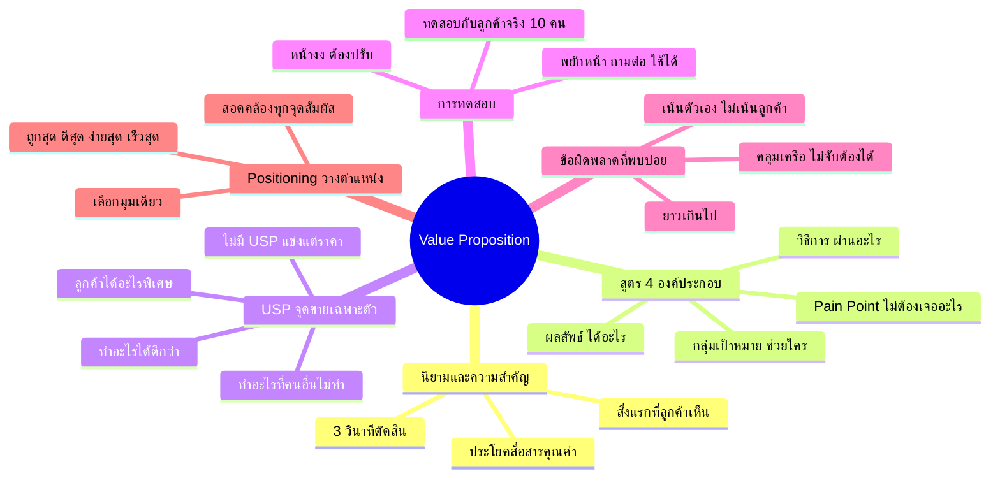

# Mind Map: คำประกาศคุณค่า — FUNNEL-005
> **Format:** Mind Map (Text-based + Mermaid)
> **Source:** SWP3 Ch6 Sale Funnel Mastery ตอนที่ 5
> **Production:** PinkCastle Academy | จูล่ง CTO
> **Date:** 2026-02-17

---

## Center Node: คำประกาศคุณค่า (Value Proposition)

### Branch 1: นิยามและความสำคัญ
- Value Proposition คืออะไร
  - ประโยคสื่อสารคุณค่า
  - ตอบว่าช่วยใคร ได้อะไร ทำไมต้องเลือกเรา
- ทำไมถึงสำคัญ
  - สิ่งแรกที่ลูกค้าเห็น
  - 3 วินาทีตัดสินว่าจะอ่านต่อหรือเลื่อนผ่าน
  - รากฐานของทุกกิจกรรมการตลาด

### Branch 2: สูตร Value Proposition
- "เราช่วย [กลุ่มเป้าหมาย]"
  - ระบุให้ชัดว่าช่วยใคร
  - ยิ่งเจาะจงยิ่งดี
- "ให้ได้ [ผลลัพธ์ที่ต้องการ]"
  - จับต้องได้ วัดได้
  - เช่น "รายได้หลักแสน"
- "ผ่าน [วิธีการ/สินค้า]"
  - วิธีที่แตกต่าง
  - เช่น "ระบบ Funnel อัตโนมัติ"
- "โดยไม่ต้อง [Pain Point]"
  - ขจัดข้อกังวล
  - เช่น "ไม่ต้องมีความรู้เทคนิค"

### Branch 3: USP (Unique Selling Proposition)
- คำถาม 3 ข้อหา USP
  - ทำอะไรได้ดีกว่าคู่แข่ง?
  - ทำอะไรที่คนอื่นไม่ทำ?
  - ลูกค้าได้อะไรที่หาที่อื่นไม่ได้?
- ธุรกิจไม่มี USP
  - แข่งด้านราคาอย่างเดียว
  - ไม่ยั่งยืนในระยะยาว

### Branch 4: การทดสอบ
- ทดสอบกับลูกค้าจริง
  - พูดให้ 10 คนฟัง
  - สังเกตปฏิกิริยา
- เกณฑ์ตัดสิน
  - พยักหน้า + ถามต่อ = ใช้ได้
  - หน้างง = ต้องปรับ
- ปรับปรุงซ้ำจนตรงใจ

### Branch 5: ข้อผิดพลาดที่พบบ่อย
- ยาวเกินไป
  - จำไม่ได้
  - ควร 1-2 ประโยค
- เน้นตัวเอง
  - "เราเป็นบริษัทชั้นนำ"
  - ควรเน้น "ลูกค้าจะได้อะไร"
- คลุมเครือ
  - "บริการที่ดีที่สุด"
  - ควรใช้ตัวเลขจับต้องได้

### Branch 6: Positioning (การวางตำแหน่ง)
- เลือกมุมเดียว
  - ถูกที่สุด
  - ดีที่สุด
  - ง่ายที่สุด
  - เร็วที่สุด
- Value Proposition ต้องสอดคล้อง
  - ทุกจุดสัมผัสสื่อเรื่องเดียวกัน
  - อย่าพยายามเป็นทุกอย่าง

---

## Mermaid Mindmap

---

**จำนวน Nodes ทั้งหมด: 35 nodes**

| ระดับ | จำนวน |
|-------|-------|
| Center Node | 1 |
| Branch (ระดับ 1) | 6 |
| Sub-branch (ระดับ 2) | 16 |
| Leaf (ระดับ 3) | 12 |
| **รวม** | **35** |
