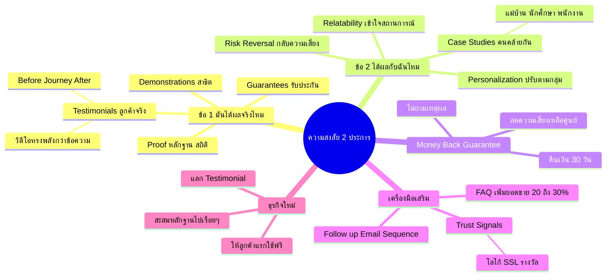

# Mind Map: ความสงสัย 2 ประการของผู้มุ่งหวัง — FUNNEL-006
> **Format:** Mind Map (Text-based + Mermaid)
> **Source:** SWP3 Ch6 Sale Funnel Mastery ตอนที่ 6
> **Production:** PinkCastle Academy | จูล่ง CTO
> **Date:** 2026-02-17

---

## Center Node: ความสงสัย 2 ประการของผู้มุ่งหวัง

### Branch 1: ความสงสัยข้อที่ 1 — "มันได้ผลจริงหรือ?"
- สาเหตุ
  - โดนหลอกมาเยอะ
  - เห็นโฆษณาเกินจริง
  - สมองตั้งการ์ดอัตโนมัติ
- วิธีตอบ
  - Proof (หลักฐาน/สถิติ)
  - Testimonials (ลูกค้าจริง)
  - Guarantees (รับประกัน)
  - Demonstrations (สาธิต)

### Branch 2: ความสงสัยข้อที่ 2 — "มันจะได้ผลกับฉันไหม?"
- สาเหตุ
  - ทุกคนรู้สึกว่าตัวเองเป็นกรณีพิเศษ
  - สถานการณ์ของฉันต่างจากคนอื่น
  - กลัวไม่มีเวลา/ทักษะ/ทุน
- วิธีตอบ
  - Relatability (เข้าใจสถานการณ์)
  - Case Studies (คนคล้ายกัน)
  - Personalization (ปรับตามกลุ่ม)
  - Risk Reversal (กลับความเสี่ยง)

### Branch 3: Money-Back Guarantee
- รูปแบบ
  - คืนเงินเต็มจำนวน 30 วัน
  - คืนเงินไม่ถามเหตุผล
  - Double Your Money Back
- ผลลัพธ์
  - ลดความเสี่ยงเหลือศูนย์
  - ตัดสินใจซื้อง่ายขึ้น
  - เพิ่ม Conversion Rate

### Branch 4: เครื่องมือเสริม
- FAQ Section
  - ตอบข้อสงสัยหลัก 2 ข้อ
  - เพิ่มยอดขาย 20-30%
  - วางใกล้ปุ่มซื้อ
- Trust Signals
  - โลโก้พาร์ทเนอร์
  - ใบรับรอง SSL
  - จำนวนลูกค้า/รางวัล
- Follow-up
  - Email Sequence
  - Case Study เพิ่มเติม
  - เตือนเรื่อง Guarantee

### Branch 5: Testimonials ที่ทรงพลัง
- วิดีโอ > ข้อความ
  - เห็นอารมณ์ สีหน้า น้ำเสียง
  - ยากปลอมแปลง
- โครงสร้างที่ดี
  - Before (ก่อนใช้)
  - Journey (ระหว่างใช้)
  - After (ผลลัพธ์)

### Branch 6: สำหรับธุรกิจใหม่ที่ไม่มี Testimonials
- กลยุทธ์สะสมหลักฐาน
  - ให้ลูกค้ากลุ่มแรกใช้ฟรี
  - แลกกับ Testimonial
  - นำไปใช้ขายกลุ่มถัดไป

---

## Mermaid Mindmap

---

**จำนวน Nodes ทั้งหมด: 38 nodes**

| ระดับ | จำนวน |
|-------|-------|
| Center Node | 1 |
| Branch (ระดับ 1) | 6 |
| Sub-branch (ระดับ 2) | 17 |
| Leaf (ระดับ 3) | 14 |
| **รวม** | **38** |
