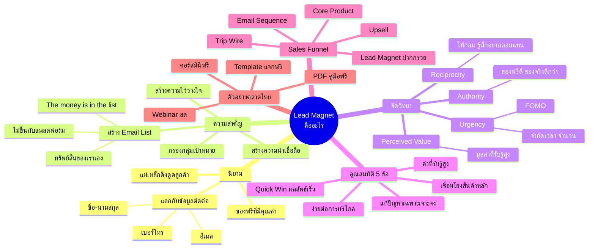
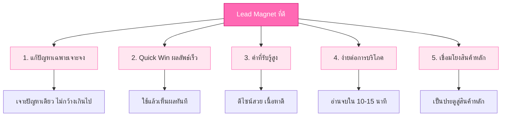
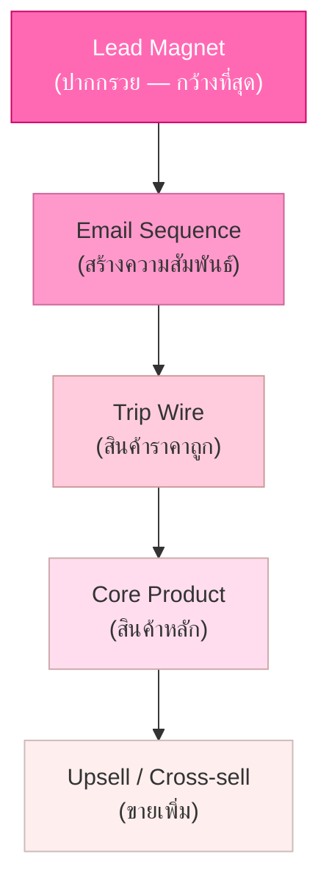

# Lead Magnet คืออะไร — LEAD-001
> **Format:** Mind Map (Mermaid)
> **Source:** SWP3 Ch7 Lead Magnet ตอนที่ 1
> **Production:** PinkCastle Academy | จูล่ง CTO
> **Date:** 2026-02-17

---

## Mind Map หลัก: Lead Magnet คืออะไร



---

## แผนภาพ: Give First, Sell Later

```mermaid
flowchart LR
    A[คนแปลกหน้า] -->|เห็น Lead Magnet| B[สนใจ]
    B -->|ให้ข้อมูลติดต่อ| C[กลายเป็น Lead]
    C -->|ได้รับของฟรีดี| D[ไว้วางใจ]
    D -->|Email Sequence| E[สร้างความสัมพันธ์]
    E -->|เสนอ Trip Wire| F[ทดลองซื้อ]
    F -->|พอใจ| G[ซื้อสินค้าหลัก]

    style A fill:#ff9999,stroke:#cc0000
    style C fill:#ffcc99,stroke:#cc6600
    style D fill:#ffff99,stroke:#cccc00
    style G fill:#99ff99,stroke:#00cc00
```



---

## แผนภาพ: คุณสมบัติ 5 ข้อ



---

## แผนภาพ: Lead Magnet ใน Sales Funnel



---

## แผนภาพ: จิตวิทยา 4 หลักการ

```mermaid
flowchart LR
    subgraph จิตวิทยา Lead Magnet
        R[Reciprocity<br/>การตอบแทน]
        PV[Perceived Value<br/>ค่าที่รับรู้]
        U[Urgency<br/>ความเร่งด่วน]
        AU[Authority<br/>ความน่าเชื่อถือ]
    end

    R --> R1[ให้ฟรี → รู้สึกอยากตอบแทน]
    PV --> PV1[มูลค่าสูง → คุ้มค่าแลก]
    U --> U1[จำกัดเวลา → ตัดสินใจเร็ว]
    AU --> AU1[ของฟรีดี → ของจริงดีกว่า]

    style R fill:#ff6b6b,stroke:#c92a2a,color:#fff
    style PV fill:#ffd43b,stroke:#fab005
    style U fill:#69db7c,stroke:#2b8a3e
    style AU fill:#74c0fc,stroke:#1c7ed6
```

---

> **จำนวนแผนภาพ:** 5 (Mind Map หลัก + 4 แผนภาพเสริม)
> **เครื่องมือ:** Mermaid.js — render ได้ใน GitHub, Notion, VS Code
