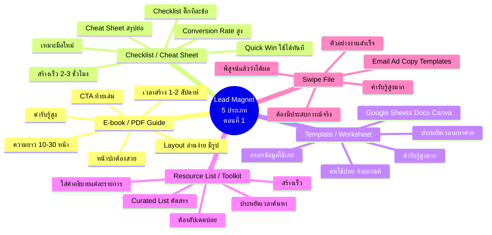
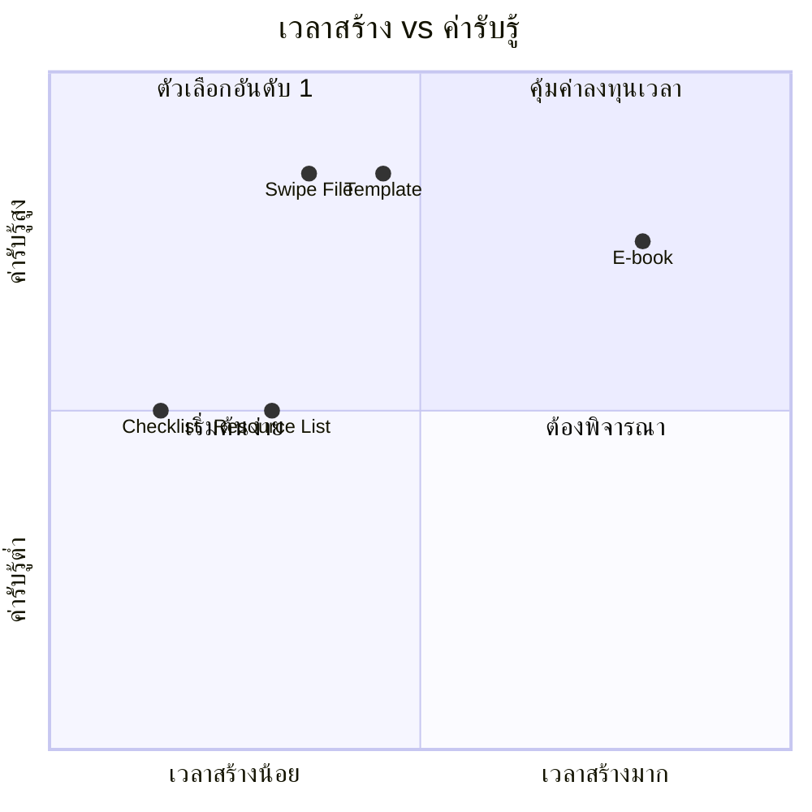
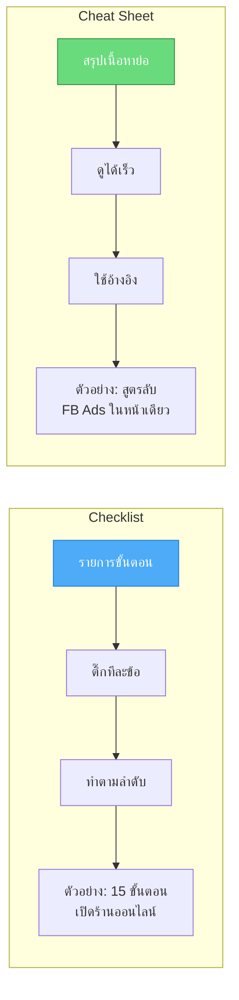
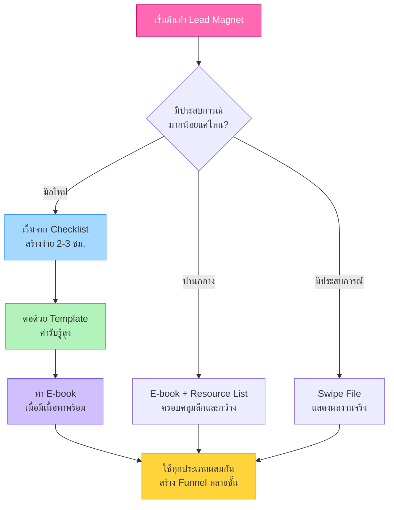
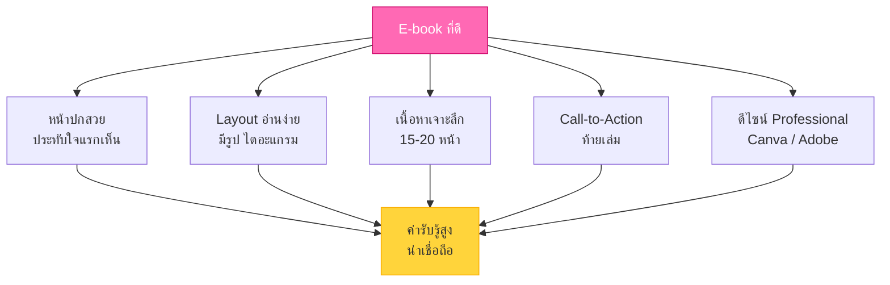

# Lead Magnet แบบต่างๆ ตอนที่ 1 — LEAD-002
> **Format:** Mind Map (Mermaid)
> **Source:** SWP3 Ch7 Lead Magnet ตอนที่ 2
> **Production:** PinkCastle Academy | จูล่ง CTO
> **Date:** 2026-02-17

---

## Mind Map หลัก: Lead Magnet 5 ประเภท (ตอนที่ 1)

---

## แผนภาพ: เปรียบเทียบเวลาสร้าง vs ค่ารับรู้

---

## แผนภาพ: Checklist vs Cheat Sheet

---

## แผนภาพ: ลำดับแนะนำสำหรับมือใหม่

---

## แผนภาพ: องค์ประกอบ E-book ที่ดี

---

> **จำนวนแผนภาพ:** 5 (Mind Map หลัก + 4 แผนภาพเสริม)
> **เครื่องมือ:** Mermaid.js — render ได้ใน GitHub, Notion, VS Code
