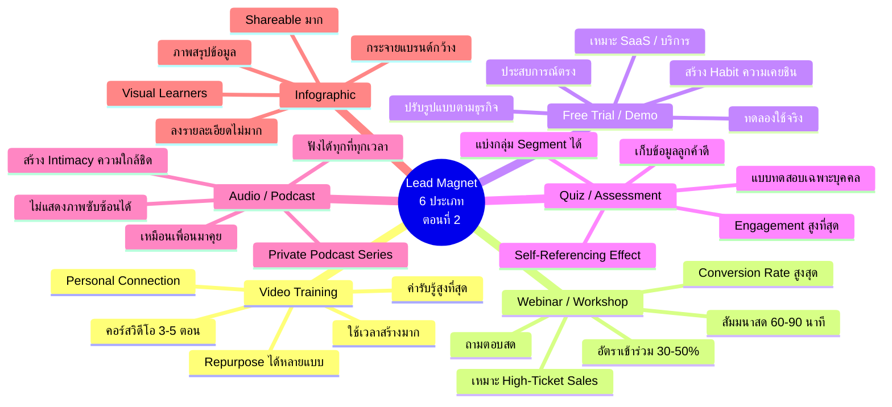
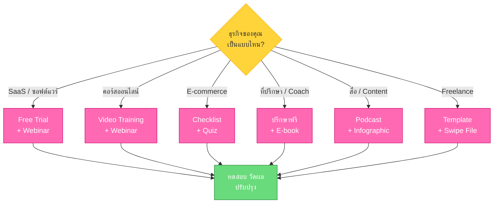
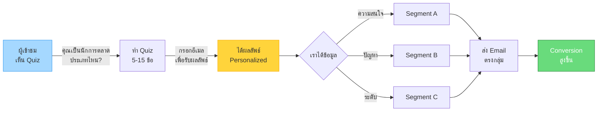
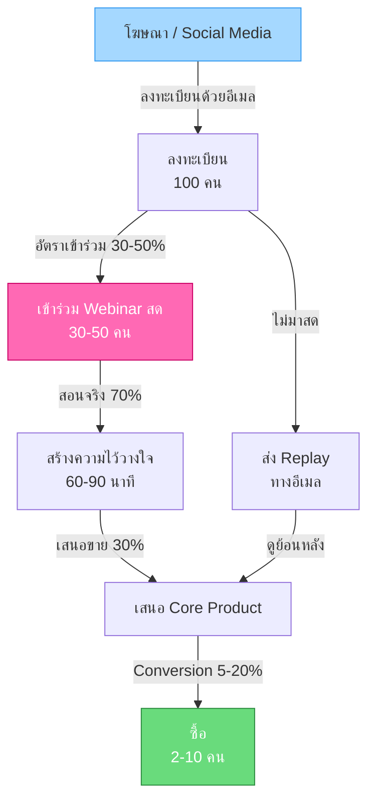
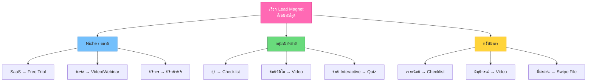

# Lead Magnet แบบต่างๆ ตอนที่ 2 — LEAD-003
> **Format:** Mind Map (Mermaid)
> **Source:** SWP3 Ch7 Lead Magnet ตอนที่ 3
> **Production:** PinkCastle Academy | จูล่ง CTO
> **Date:** 2026-02-17

---

## Mind Map หลัก: Lead Magnet 6 ประเภท (ตอนที่ 2)



---

## แผนภาพ: เปรียบเทียบ Lead Magnet ทั้ง 11 ประเภท

```mermaid
flowchart TD
    subgraph ตอนที่ 1 — สร้างง่าย
        A[E-book / PDF Guide]
        B[Checklist / Cheat Sheet]
        C[Template / Worksheet]
        D[Resource List / Toolkit]
        E[Swipe File]
    end

    subgraph ตอนที่ 2 — ทรงพลังสูง
        F[Video Training]
        G[Webinar / Workshop]
        H[Free Trial / Demo]
        I[Quiz / Assessment]
        J[Audio / Podcast]
        K[Infographic]
    end

    A -.->|ค่ารับรู้สูง| F
    B -.->|Quick Win| I
    C -.->|ใช้งานจริง| H
    D -.->|คัดสรร| K
    E -.->|ผลงานจริง| G

    style A fill:#a5d8ff,stroke:#339af0
    style B fill:#a5d8ff,stroke:#339af0
    style C fill:#a5d8ff,stroke:#339af0
    style D fill:#a5d8ff,stroke:#339af0
    style E fill:#a5d8ff,stroke:#339af0
    style F fill:#ff69b4,stroke:#cc0066,color:#fff
    style G fill:#ff69b4,stroke:#cc0066,color:#fff
    style H fill:#ff69b4,stroke:#cc0066,color:#fff
    style I fill:#ff69b4,stroke:#cc0066,color:#fff
    style J fill:#ff69b4,stroke:#cc0066,color:#fff
    style K fill:#ff69b4,stroke:#cc0066,color:#fff
```

---

## แผนภาพ: เลือก Lead Magnet ตาม Niche



---

## แผนภาพ: Quiz / Assessment Workflow



---

## แผนภาพ: Webinar Funnel



---

## แผนภาพ: 3 ปัจจัยเลือก Lead Magnet



---

> **จำนวนแผนภาพ:** 6 (Mind Map หลัก + 5 แผนภาพเสริม)
> **เครื่องมือ:** Mermaid.js — render ได้ใน GitHub, Notion, VS Code
