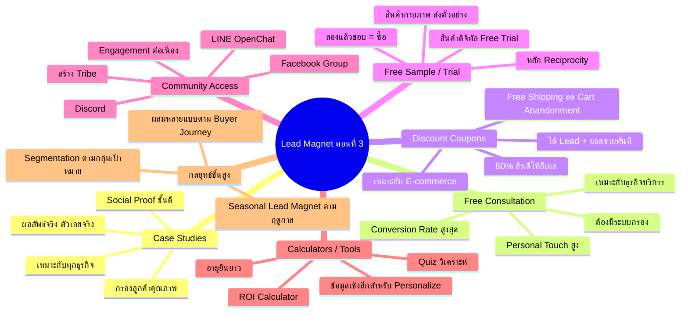

# Mind Map: Lead Magnet แบบต่างๆ ตอนที่ 3 — LEAD-004
> **Format:** Mind Map (Text-based + Mermaid)
> **Source:** SWP3 Ch7 Lead Magnet ตอนที่ 4
> **Production:** PinkCastle Academy | จูล่ง CTO
> **Date:** 2026-02-17

---

## Mermaid Diagram

---

## Center Node: Lead Magnet แบบต่างๆ ตอนที่ 3

### Branch 1: Case Studies และ Success Stories
- นำเสนอผลลัพธ์จากลูกค้าจริง
  - ตัวเลข ข้อมูล ชื่อลูกค้า
  - เช่น "เพิ่มยอดขาย 300% ใน 6 เดือน"
- Social Proof ที่แข็งแกร่ง
  - สร้างความน่าเชื่อถือ
  - "ถ้าคนอื่นทำได้ ฉันก็ทำได้"
- กรองลูกค้าคุณภาพ
  - คนดาวน์โหลด = คนจริงจัง

### Branch 2: Free Consultation / Coaching Call
- Personal Touch สูง
  - คุยตัวต่อตัว 30 นาที
  - แสดงความเชี่ยวชาญโดยตรง
- Conversion Rate สูงที่สุด
  - เหมาะกับธุรกิจบริการ
- ข้อจำกัด
  - ใช้เวลามาก
  - ต้องมีแบบฟอร์มกรอง

### Branch 3: Discount Coupons และ Free Shipping
- คูปองส่วนลด
  - 60% ยินดีให้อีเมลแลก
  - กระตุ้นซื้อทันที
- Free Shipping
  - ลด Cart Abandonment
  - เหตุผลอันดับต้นๆ ที่ทิ้งตะกร้า
- ข้อดีพิเศษ
  - ได้ทั้ง Lead และยอดขาย

### Branch 4: Free Sample / Trial Product
- สินค้ากายภาพ
  - ครีมตัวอย่าง ชาซองทดลอง
  - ลูกค้าจ่ายค่าส่ง
- สินค้าดิจิทัล
  - ซอฟต์แวร์ทดลอง 14 วัน
  - คอร์สบทแรกฟรี
- หลักจิตวิทยา Reciprocity
  - ได้ฟรี → อยากตอบแทน → ซื้อ

### Branch 5: Community Access
- ช่องทาง
  - Facebook Group
  - Discord
  - LINE OpenChat
- ข้อดี
  - สร้าง Tribe / ชุมชน
  - Engagement ต่อเนื่องทุกวัน
  - สมาชิกช่วยกันดูแล
- เหนือกว่าดาวน์โหลดครั้งเดียว

### Branch 6: Calculators และ Interactive Tools
- ประเภท
  - ROI Calculator
  - Budget Planner
  - Quiz วิเคราะห์
- ข้อดี
  - อายุยืนยาว ถูกแชร์ต่อ
  - ผู้ใช้กลับมาซ้ำ
  - ข้อมูลเชิงลึกมีค่าสูง

### Branch 7: กลยุทธ์ขั้นสูง
- ผสม Lead Magnet หลายแบบ
  - Awareness → Checklist
  - Consideration → Case Study
  - Decision → Free Consultation
- Seasonal Lead Magnet
  - ปีใหม่ → แผนเป้าหมาย
  - สงกรานต์ → Checklist เที่ยว
  - เพิ่มลูกค้าใหม่ตลอดปี

---

**จำนวน Nodes ทั้งหมด: 42 nodes**

| ระดับ | จำนวน |
|-------|-------|
| Center Node | 1 |
| Branch (ระดับ 1) | 7 |
| Sub-branch (ระดับ 2) | 19 |
| Leaf (ระดับ 3) | 15 |
| **รวม** | **42** |
