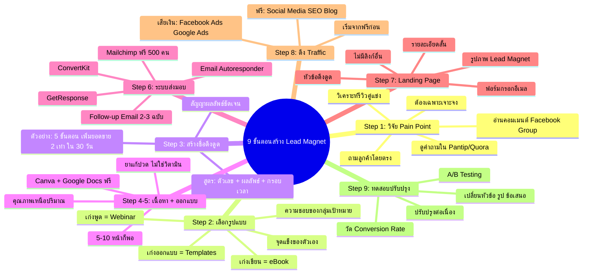

# Mind Map: ขั้นตอนการสร้าง Lead Magnet — LEAD-005
> **Format:** Mind Map (Text-based + Mermaid)
> **Source:** SWP3 Ch7 Lead Magnet ตอนที่ 5
> **Production:** PinkCastle Academy | จูล่ง CTO
> **Date:** 2026-02-17

---

## Mermaid Diagram

---

## Center Node: 9 ขั้นตอนสร้าง Lead Magnet

### Branch 1: Step 1 — วิจัย Pain Point ของกลุ่มเป้าหมาย
- วิธีวิจัย
  - อ่านคอมเมนต์ใน Facebook Group
  - ดูคำถามใน Pantip / Quora
  - วิเคราะห์รีวิวสินค้าคู่แข่ง
  - ถามลูกค้าปัจจุบันโดยตรง
- หลักสำคัญ
  - ต้องเฉพาะเจาะจง ไม่ใช่กว้างๆ
  - "5 วิธีเพิ่มยอดขาย Shopee" ดีกว่า "คู่มือการตลาด"

### Branch 2: Step 2 — เลือกรูปแบบที่เหมาะสม
- จุดแข็งของตัวเอง
  - เก่งเขียน → eBook / Checklist
  - เก่งพูด → Webinar / Podcast
  - เก่งออกแบบ → Infographic / Templates
- ความชอบของกลุ่มเป้าหมาย
  - ผู้บริหาร → Executive Summary / Case Study
  - มือใหม่ → Checklist / Video Tutorial

### Branch 3: Step 3 — สร้างชื่อที่ดึงดูด
- สูตร
  - ตัวเลข + ผลลัพธ์ + กรอบเวลา
- ตัวอย่างดี
  - "5 ขั้นตอน เพิ่มยอดขาย 2 เท่า ใน 30 วัน"
  - "Checklist 10 ข้อ ก่อนเปิดร้านออนไลน์"
- ตัวอย่างไม่ดี
  - "คู่มือการตลาด" (กว้างเกินไป)

### Branch 4: Step 4-5 — พัฒนาเนื้อหาและออกแบบ
- เนื้อหา
  - คุณภาพมากกว่าปริมาณ
  - เหมือนยาแก้ปวด ไม่ใช่วิตามิน
  - 5-10 หน้าที่ Actionable
- การออกแบบ
  - Canva (กราฟิก ฟรี)
  - Google Docs (เอกสาร ฟรี)
  - First Impression สำคัญ

### Branch 5: Step 6 — สร้างระบบส่งมอบ
- Email Autoresponder
  - Mailchimp (ฟรี 500 คนแรก)
  - GetResponse
  - ConvertKit
- ฟังก์ชัน
  - ส่ง Lead Magnet อัตโนมัติ
  - Follow-up Email 2-3 ฉบับ

### Branch 6: Step 7 — สร้าง Landing Page
- องค์ประกอบ
  - หัวข้อดึงดูด
  - รายละเอียดสั้นๆ
  - รูปภาพ Lead Magnet
  - ฟอร์มกรอกอีเมล
- กฎสำคัญ
  - ไม่มีลิงก์อื่น / เมนูนำทาง
  - เป้าหมายเดียว = กรอกอีเมล

### Branch 7: Step 8 — ดึง Traffic
- วิธีฟรี
  - โพสต์ใน Facebook Group
  - แชร์ใน Social Media
  - เขียนบล็อก / SEO
- วิธีเสียเงิน
  - Facebook Ads
  - Google Ads
- แนะนำ: เริ่มจากฟรีก่อน

### Branch 8: Step 9 — ทดสอบและปรับปรุง
- วัดผล
  - Conversion Rate = คนกรอกอีเมล / คนเข้าชม
- A/B Testing
  - เปลี่ยนหัวข้อ
  - เปลี่ยนรูปภาพ
  - เปลี่ยนข้อเสนอ
- ทำต่อเนื่อง ไม่หยุด

### Branch 9: ข้อผิดพลาดที่ควรหลีกเลี่ยง
- เนื้อหากว้างเกินไป
- เนื้อหายาวเกินคนอ่านไม่จบ
- ไม่วัด Conversion Rate
- ไม่มี Follow-up Email
- รอจนสมบูรณ์แบบ

---

**จำนวน Nodes ทั้งหมด: 52 nodes**

| ระดับ | จำนวน |
|-------|-------|
| Center Node | 1 |
| Branch (ระดับ 1) | 9 |
| Sub-branch (ระดับ 2) | 22 |
| Leaf (ระดับ 3) | 20 |
| **รวม** | **52** |
