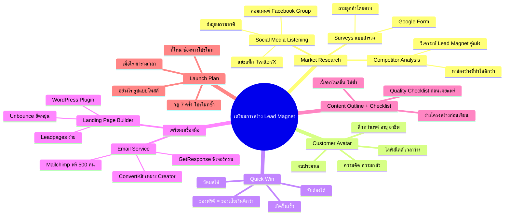

# Mind Map: วิธีเตรียมการสร้าง Lead Magnet — LEAD-006
> **Format:** Mind Map (Text-based + Mermaid)
> **Source:** SWP3 Ch7 Lead Magnet ตอนที่ 6
> **Production:** PinkCastle Academy | จูล่ง CTO
> **Date:** 2026-02-17

---

## Mermaid Diagram

---

## Center Node: เตรียมการสร้าง Lead Magnet

### Branch 1: Market Research (วิจัยตลาด)
- Surveys (แบบสำรวจ)
  - สร้าง Google Form 5-10 คำถาม
  - ถามลูกค้าหรือกลุ่มเป้าหมายโดยตรง
  - คำถาม: ปัญหาที่เจอ อยากรู้เรื่องอะไร
- Social Media Listening
  - ติดตามคอมเมนต์ Facebook Group
  - ดูแฮชแท็กใน Twitter/X
  - ฟัง Pantip / Quora
  - ข้อดี: ข้อมูลเกิดขึ้นตามธรรมชาติ
- Competitor Analysis
  - วิเคราะห์ Lead Magnet ของคู่แข่ง
  - หาจุดแข็ง/จุดอ่อน
  - หาช่องว่างที่เราทำได้ดีกว่า

### Branch 2: Customer Avatar (ภาพจำลองลูกค้า)
- ต้องลึกกว่าข้อมูลพื้นฐาน
  - ไม่ใช่แค่ เพศ อายุ อาชีพ
- ต้องรู้
  - ความคิด / ความเชื่อ
  - ความกลัว / ความกังวล
  - เป้าหมาย / ความฝัน
  - ไลฟ์สไตล์ / เวลาว่าง
  - งบประมาณ / กำลังซื้อ
- ตัวอย่าง: สมศรี 30 ปี แม่บ้าน อยากขายออนไลน์ กลัวเทคโนโลยี

### Branch 3: Quick Win (ชัยชนะเล็กๆ)
- คุณสมบัติ 3 ข้อ
  - จับต้องได้ (Tangible)
  - วัดผลได้ (Measurable)
  - เกิดขึ้นเร็ว (Quick)
- ผลลัพธ์
  - "ถ้าของฟรียังดีขนาดนี้ ของเสียเงินจะดีแค่ไหน"
  - เปลี่ยน Lead เป็นลูกค้า

### Branch 4: เตรียมเครื่องมือ
- Email Service
  - Mailchimp (ฟรี 500 คน)
  - GetResponse (ฟีเจอร์ครบ)
  - ConvertKit (เหมาะ Creator)
- Landing Page Builder
  - Leadpages (ง่ายมาก)
  - Unbounce (ยืดหยุ่น)
  - WordPress Plugins (Elementor, OptimizePress)
- ทดลองใช้ล่วงหน้า

### Branch 5: Content Outline + Quality Checklist
- Content Outline
  - ร่างโครงสร้างก่อนเขียน
  - กำหนดหัวข้อทั้งหมด
  - เนื้อหาไหลลื่น ไม่ซ้ำซ้อน
- Quality Checklist
  - ชื่อดึงดูด?
  - เนื้อหาแก้ปัญหาจริง?
  - ออกแบบดูดี?
  - ลิงก์ใช้ได้?
  - Autoresponder ทำงาน?

### Branch 6: Launch Plan + Promotion Strategy
- ระบุ 3 สิ่ง
  - ที่ไหน (ช่องทางโปรโมท)
  - เมื่อไร (ตารางเวลา)
  - อย่างไร (รูปแบบโพสต์)
- กฎ 7 ครั้ง
  - คนต้องเห็นอย่างน้อย 7 ครั้ง
  - โปรโมทซ้ำหลายครั้ง หลายช่องทาง
- ตัวอย่าง
  - สัปดาห์ 1: Facebook Group 5 กลุ่ม
  - สัปดาห์ 2: Instagram Stories 3 วัน
  - สัปดาห์ 3: บล็อก + SEO

---

**จำนวน Nodes ทั้งหมด: 46 nodes**

| ระดับ | จำนวน |
|-------|-------|
| Center Node | 1 |
| Branch (ระดับ 1) | 6 |
| Sub-branch (ระดับ 2) | 18 |
| Leaf (ระดับ 3) | 21 |
| **รวม** | **46** |
