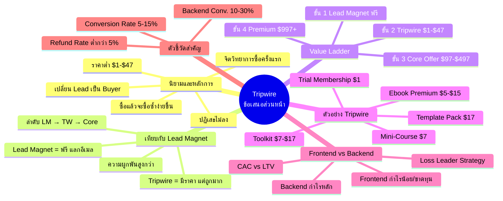
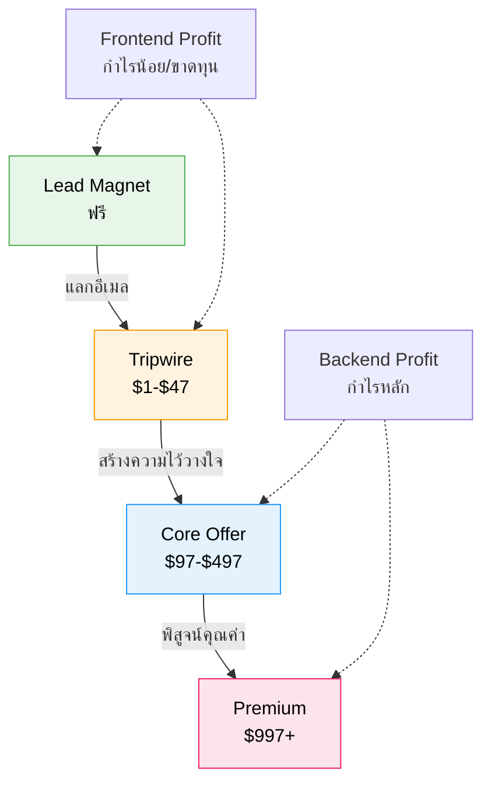

# การปรับแต่งข้อเสนอส่วนหน้า (Tripwire) — TRIP-001
> **Format:** Mind Map
> **Source:** SWP3 Ch8 Trip Wire ตอนที่ 1
> **Production:** PinkCastle Academy | จูล่ง CTO
> **Date:** 2026-02-17

---

## แผนผังความคิด

### ศูนย์กลาง: Tripwire — ข้อเสนอส่วนหน้า

#### กิ่ง 1: นิยามและหลักการ
- Tripwire = ข้อเสนอราคาต่ำที่ปฏิเสธไม่ลง
  - ช่วงราคา: $1-$47
  - เป้าหมาย: เปลี่ยน Lead เป็น Buyer
  - ไม่ใช่เครื่องมือทำกำไร
- หลักจิตวิทยา
  - กำแพงการซื้อครั้งแรก
  - ซื้อครั้งแรกแล้ว → ซื้อซ้ำง่ายขึ้น
  - Commitment and Consistency Principle

#### กิ่ง 2: Tripwire vs Lead Magnet
- Lead Magnet
  - ฟรี
  - แลกอีเมล/ข้อมูลติดต่อ
  - ความผูกพันต่ำ
- Tripwire
  - มีราคา ($1-$47)
  - เปลี่ยนสถานะเป็นลูกค้า
  - ความผูกพันปานกลาง-สูง
- ลำดับ: Lead Magnet → Tripwire → Core Offer

#### กิ่ง 3: Value Ladder (บันไดคุณค่า)
- ขั้น 1: Lead Magnet (ฟรี) → ดึงดูด
- ขั้น 2: Tripwire ($1-$47) → เปลี่ยนเป็นลูกค้า
- ขั้น 3: Core Offer ($97-$497) → สร้างรายได้
- ขั้น 4: Premium ($997+) → กำไรสูงสุด

#### กิ่ง 4: ตัวอย่าง Tripwire
- Mini-Course ($7-$27)
- Template Pack ($17-$37)
- Trial Membership ($1)
- Toolkit/Checklist ($7-$17)
- Ebook Premium ($5-$15)

#### กิ่ง 5: กลยุทธ์ Frontend vs Backend
- Frontend Profit
  - Lead Magnet + Tripwire
  - กำไรน้อย / ขาดทุน
  - เป้าหมาย: สร้างฐานลูกค้า
- Backend Profit
  - Core Offer + Premium
  - กำไรหลักของธุรกิจ
  - เป้าหมาย: สร้างรายได้
- Loss Leader Strategy

#### กิ่ง 6: ตัวชี้วัดสำคัญ
- Tripwire Conversion Rate (5-15%)
- Backend Conversion Rate (10-30%)
- Customer Acquisition Cost (CAC)
- Customer Lifetime Value (LTV)

---

## Mermaid Diagram





```mermaid
graph LR
    subgraph จิตวิทยา Tripwire
        A[ผู้สนใจ<br>Lead] -->|เห็นราคาถูก| B{ตัดสินใจ<br>ซื้อง่าย}
        B -->|จ่ายเงิน| C[กลายเป็น<br>Buyer]
        C -->|ประทับใจ| D[เปิดใจ<br>ซื้อต่อ]
        D -->|ซื้อ Core Offer| E[ลูกค้า<br>ระยะยาว]
    end

    style A fill:#fff9c4,stroke:#fbc02d,color:#000
    style B fill:#ffe0b2,stroke:#f57c00,color:#000
    style C fill:#c8e6c9,stroke:#388e3c,color:#000
    style D fill:#bbdefb,stroke:#1976d2,color:#000
    style E fill:#f8bbd0,stroke:#c2185b,color:#000
```

---

> **จำนวน Mermaid Diagrams:** 3 (Mind Map, Value Ladder Flow, จิตวิทยา Flow)
> **เครื่องมือแนะนำ:** GitHub Preview, Notion Embed, VS Code Mermaid Extension
