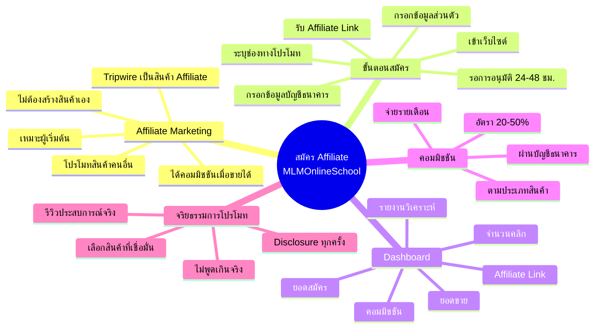
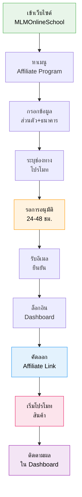

# วิธีสมัคร Affiliate กับ MLMOnlineSchool — TRIP-002
> **Format:** Mind Map
> **Source:** SWP3 Ch8 Trip Wire ตอนที่ 2
> **Production:** PinkCastle Academy | จูล่ง CTO
> **Date:** 2026-02-17

---

## แผนผังความคิด

### ศูนย์กลาง: สมัคร Affiliate กับ MLMOnlineSchool

#### กิ่ง 1: Affiliate Marketing คืออะไร
- การตลาดแบบพันธมิตร
  - ช่วยโปรโมทสินค้าคนอื่น
  - ได้คอมมิชชันเมื่อเกิดการขาย
- ความเชื่อมโยงกับ SWP3
  - Tripwire เป็นสินค้า Affiliate ได้
  - เหมาะสำหรับผู้เริ่มต้น
  - ไม่ต้องสร้างสินค้าเอง

#### กิ่ง 2: ขั้นตอนสมัคร
- เข้าเว็บไซต์ MLMOnlineSchool
- หาเมนู Affiliate Program
- กรอกข้อมูล
  - ชื่อ-นามสกุล อีเมล เบอร์โทร
  - บัญชีธนาคาร
  - ช่องทางโปรโมท
- รอการอนุมัติ (24-48 ชม.)
- รับอีเมลยืนยัน + ล็อกอิน
- เริ่มใช้งาน Affiliate Link

#### กิ่ง 3: Affiliate Dashboard
- Affiliate Link (ลิงก์ tracking)
- จำนวนคลิก
- ยอดสมัคร
- ยอดขาย
- คอมมิชชัน
- รายงาน (วัน/สัปดาห์/เดือน)

#### กิ่ง 4: โครงสร้างคอมมิชชัน
- อัตรา 20-50%
- ขึ้นกับประเภทสินค้า
- ขึ้นกับระดับ Affiliate
- จ่ายผ่านบัญชีธนาคาร
- รอบจ่ายรายเดือน

#### กิ่ง 5: เทคนิคและจริยธรรม
- เลือกสินค้าที่เชื่อมั่น
- รีวิวจากประสบการณ์จริง
- สร้าง Content คุณภาพ
- เปิดเผยสถานะ Affiliate (Disclosure)
- ไม่พูดเกินจริง

---

## Mermaid Diagram





```mermaid
graph LR
    subgraph ระบบ Affiliate
        A[คุณ<br>Affiliate] -->|โปรโมทผ่านลิงก์| B[ลูกค้า<br>คลิกลิงก์]
        B -->|ซื้อสินค้า| C[MLMOnlineSchool<br>แพลตฟอร์ม]
        C -->|จ่ายคอมมิชชัน| A
        C -->|ส่งสินค้า| B
    end

    subgraph ช่องทางโปรโมท
        D[บล็อก] --> A
        E[Facebook] --> A
        F[YouTube] --> A
        G[LINE] --> A
        H[Email] --> A
    end

    style A fill:#fff9c4,stroke:#fbc02d,color:#000
    style B fill:#c8e6c9,stroke:#388e3c,color:#000
    style C fill:#bbdefb,stroke:#1976d2,color:#000
```

---

> **จำนวน Mermaid Diagrams:** 3 (Mind Map, ขั้นตอนสมัคร Flow, ระบบ Affiliate)
> **เครื่องมือแนะนำ:** GitHub Preview, Notion Embed, VS Code Mermaid Extension
