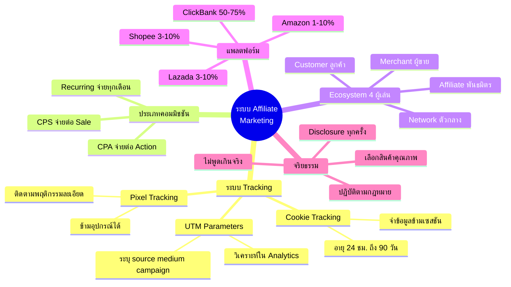
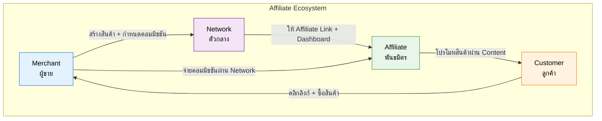

# ทำความรู้จักระบบ Affiliate — TRIP-003
> **Format:** Mind Map
> **Source:** SWP3 Ch8 Trip Wire ตอนที่ 3
> **Production:** PinkCastle Academy | จูล่ง CTO
> **Date:** 2026-02-17

---

## แผนผังความคิด

### ศูนย์กลาง: ระบบ Affiliate Marketing

#### กิ่ง 1: ระบบ Tracking
- Cookie Tracking
  - ฝัง Cookie ในเบราว์เซอร์
  - อายุ 24 ชม. - 90 วัน
  - จำข้อมูลข้ามเซสชัน
- Pixel Tracking
  - โค้ดเล็กๆ ฝังในเว็บ
  - ติดตามพฤติกรรมละเอียด
  - ข้ามอุปกรณ์ได้
- UTM Parameters
  - ส่วนต่อท้าย URL
  - ระบุ source, medium, campaign
  - วิเคราะห์ใน Google Analytics

#### กิ่ง 2: ประเภทคอมมิชชัน
- CPA (Cost Per Action)
  - จ่ายเมื่อทำ action
  - สมัครสมาชิก กรอกฟอร์ม
- CPS (Cost Per Sale)
  - จ่ายเมื่อเกิดการขาย
  - 5-75% ของยอดขาย
- Recurring Commission
  - จ่ายทุกรอบที่ลูกค้าต่ออายุ
  - Passive Income ตัวจริง

#### กิ่ง 3: Affiliate Ecosystem
- Merchant (ผู้ขาย)
  - เจ้าของสินค้า
  - ได้ลูกค้าใหม่
- Network (ตัวกลาง)
  - แพลตฟอร์มเชื่อม
  - ได้ค่าบริการ
- Affiliate (พันธมิตร)
  - โปรโมทสินค้า
  - ได้คอมมิชชัน
- Customer (ลูกค้า)
  - ซื้อสินค้า
  - ได้รีวิวน่าเชื่อถือ

#### กิ่ง 4: แพลตฟอร์ม Affiliate
- ระดับโลก
  - ClickBank (ดิจิทัล 50-75%)
  - Amazon Associates (ทุกประเภท 1-10%)
- ระดับไทย
  - Shopee Affiliate (3-10%)
  - Lazada Affiliate (3-10%)

#### กิ่ง 5: จริยธรรม
- Disclosure ทุกครั้ง
- ไม่พูดเกินจริง
- เลือกสินค้าคุณภาพ
- ปฏิบัติตามกฎหมาย FTC

---

## Mermaid Diagram





```mermaid
graph LR
    subgraph ประเภทคอมมิชชัน
        A[CPA<br>จ่ายต่อ Action] ---|ได้เงินเร็ว| D[ครั้งเดียว]
        B[CPS<br>จ่ายต่อ Sale] ---|ได้เงินเมื่อขาย| D
        C[Recurring<br>จ่ายทุกเดือน] ---|Passive Income| E[ต่อเนื่อง]
    end

    subgraph ตัวอย่าง
        D --> F[สมัครสมาชิก $5]
        D --> G[ขายคอร์ส $100 ได้ 50%]
        E --> H[SaaS $50/เดือน ได้ 30%/เดือน]
    end

    style A fill:#ffcdd2,stroke:#c62828,color:#000
    style B fill:#fff9c4,stroke:#f9a825,color:#000
    style C fill:#c8e6c9,stroke:#2e7d32,color:#000
    style E fill:#c8e6c9,stroke:#2e7d32,color:#000
```

---

> **จำนวน Mermaid Diagrams:** 3 (Mind Map, Ecosystem Flow, ประเภทคอมมิชชัน)
> **เครื่องมือแนะนำ:** GitHub Preview, Notion Embed, VS Code Mermaid Extension
