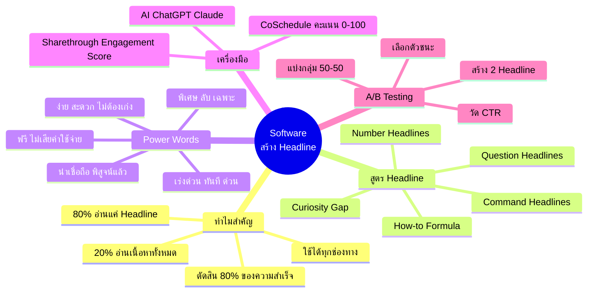
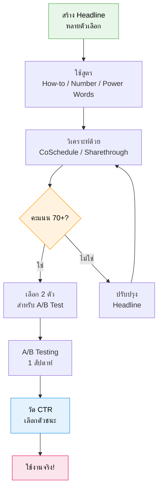

# Software สร้าง Headline — TRIP-004
> **Format:** Mind Map
> **Source:** SWP3 Ch8 Trip Wire ตอนที่ 4
> **Production:** PinkCastle Academy | จูล่ง CTO
> **Date:** 2026-02-17

---

## แผนผังความคิด

### ศูนย์กลาง: Software สร้าง Headline

#### กิ่ง 1: ทำไม Headline ถึงสำคัญ
- สถิติ 80/20
  - 80% อ่านแค่ Headline
  - 20% อ่านเนื้อหาทั้งหมด
- Headline = ประตูของ Content
- ใช้ได้ทุกช่องทาง
  - บทความ อีเมล โฆษณา
  - วิดีโอ Social Media Landing Page

#### กิ่ง 2: สูตร Headline
- How-to Formula
  - "วิธี [ผลลัพธ์] โดยไม่ต้อง [สิ่งที่กลัว]"
- Number Headlines
  - "7 วิธี..." "5 เคล็ดลับ..."
  - สมองชอบตัวเลข
- Question Headlines
  - "คุณ [ปัญหา] หรือเปล่า?"
- Command Headlines
  - "หยุด [สิ่งที่ผิด]"
- Curiosity Gap
  - เปิดประเด็นแต่ไม่บอกคำตอบ

#### กิ่ง 3: Power Words
- ความเร่งด่วน: ทันที ด่วน วันนี้เท่านั้น
- ความพิเศษ: ลับ เฉพาะ ไม่มีใครบอก
- ความง่าย: ง่าย สะดวก ไม่ต้องเก่ง
- ความน่าเชื่อถือ: พิสูจน์แล้ว ผลจริง รับประกัน
- ความฟรี: ฟรี ไม่เสียค่าใช้จ่าย

#### กิ่ง 4: เครื่องมือ
- CoSchedule Headline Analyzer
  - ให้คะแนน 0-100
  - Word Balance + Emotional Impact
- Sharethrough Headline Analyzer
  - Engagement Score
  - Impression Score
- AI Tools
  - ChatGPT, Claude
  - สร้างหลายตัวเลือกรวดเร็ว

#### กิ่ง 5: A/B Testing
- สร้าง 2 Headline
- แบ่งกลุ่ม 50/50
- วัด Click-Through Rate
- ทดลอง 1 สัปดาห์
- เปลี่ยนทีละ 1 ตัวแปร
- ให้ข้อมูลเป็นตัวตัดสิน

---

## Mermaid Diagram





```mermaid
graph LR
    subgraph สูตร Headline
        A[How-to<br>วิธี...โดยไม่ต้อง...] --> F[Headline<br>ที่ดึงดูด]
        B[Number<br>7 วิธี...] --> F
        C[Question<br>คุณ...หรือเปล่า?] --> F
        D[Command<br>หยุด...!] --> F
        E[Curiosity<br>สิ่งที่คนรวยทำ...] --> F
    end

    F --> G[+ Power Words]
    G --> H[CoSchedule<br>70+ คะแนน]
    H --> I[A/B Test]
    I --> J[Headline<br>ที่ชนะ!]

    style F fill:#fff9c4,stroke:#fbc02d,color:#000
    style G fill:#c8e6c9,stroke:#388e3c,color:#000
    style J fill:#f8bbd0,stroke:#c2185b,color:#000
```

---

> **จำนวน Mermaid Diagrams:** 3 (Mind Map, กระบวนการสร้าง Headline, สูตร Headline Flow)
> **เครื่องมือแนะนำ:** GitHub Preview, Notion Embed, VS Code Mermaid Extension
