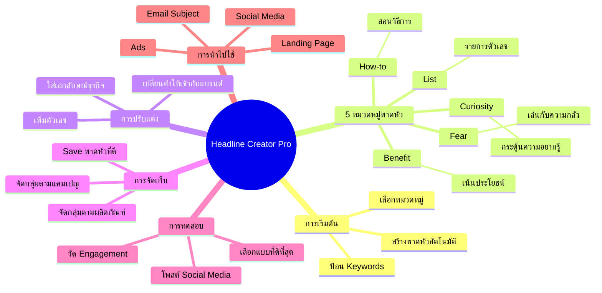

# วิธีใช้ Headline Creator Pro — TRIP-005
> **Format:** Mind Map (Text + Mermaid)
> **Source:** SWP3 Ch8 Trip Wire ตอนที่ 5
> **Production:** PinkCastle Academy | จูล่ง CTO
> **Date:** 2026-02-17

---

## Text-based Mind Map

```
Headline Creator Pro
│
├── 1. การเริ่มต้นใช้งาน
│   ├── เปิดซอฟต์แวร์
│   ├── ป้อน Keywords สินค้า/บริการ
│   ├── ยิ่งเฉพาะเจาะจง ยิ่งตรงกลุ่ม
│   └── สร้างพาดหัวอัตโนมัติหลายสิบแบบ
│
├── 2. หมวดหมู่พาดหัว (5 ประเภท)
│   ├── Curiosity (ความอยากรู้)
│   │   ├── กระตุ้นให้คลิก
│   │   └── ตัวอย่าง: "ความลับที่...ไม่เคยบอก"
│   ├── Benefit (ประโยชน์)
│   │   ├── บอกคุณค่าตรงๆ
│   │   └── ตัวอย่าง: "ประหยัด X บาท ด้วยวิธีนี้"
│   ├── Fear (ความกลัว)
│   │   ├── เล่นกับความกลัวพลาด
│   │   └── ตัวอย่าง: "X ข้อผิดพลาดที่ทำให้..."
│   ├── How-to (วิธีทำ)
│   │   ├── สอนขั้นตอนชัดเจน
│   │   └── ตัวอย่าง: "วิธีทำ...ให้สำเร็จ"
│   └── List (รายการ)
│       ├── ใช้ตัวเลขกำกับ
│       └── ตัวอย่าง: "10 วิธี...", "7 เคล็ดลับ..."
│
├── 3. การปรับแต่ง
│   ├── เปลี่ยนคำให้เข้ากับแบรนด์
│   ├── เพิ่มตัวเลขเฉพาะ
│   └── ใส่คำที่เป็นเอกลักษณ์ของธุรกิจ
│
├── 4. การจัดเก็บ
│   ├── Save พาดหัวที่ดีที่สุด
│   ├── จัดกลุ่มตามแคมเปญ
│   └── จัดกลุ่มตามผลิตภัณฑ์
│
├── 5. การทดสอบ
│   ├── นำ 3-5 พาดหัวไปโพสต์ Social Media
│   ├── วัด Engagement (Like/Comment/Share/Click)
│   └── เลือกแบบที่ดีที่สุดไปใช้จริง
│
└── 6. การนำไปใช้
    ├── Landing Page — พาดหัวหลัก
    ├── Email — Subject Line เพิ่ม Open Rate
    ├── Facebook/Google Ads — เพิ่ม CTR
    └── Social Media — โพสต์ดึงดูดความสนใจ
```

---

## Mermaid Mind Map



---

**จำนวน Nodes:** 32 | **ระดับลึกสุด:** 3 ชั้น
