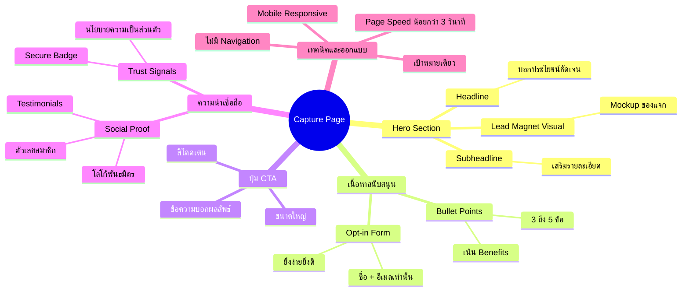

# องค์ประกอบสำคัญของ Capture Page — TRIP-006
> **Format:** Mind Map (Text + Mermaid)
> **Source:** SWP3 Ch8 Trip Wire ตอนที่ 6
> **Production:** PinkCastle Academy | จูล่ง CTO
> **Date:** 2026-02-17

---

## Text-based Mind Map

```
องค์ประกอบสำคัญของ Capture Page
│
├── 1. Hero Section (ส่วนบนสุด)
│   ├── Headline (พาดหัว)
│   │   └── บอกประโยชน์ชัดเจน ดึงดูดทันที
│   ├── Subheadline (พาดหัวรอง)
│   │   └── เสริมรายละเอียดของ Headline
│   └── Lead Magnet Visual
│       ├── Mockup ปก eBook
│       ├── ภาพหน้าจอคอร์ส
│       └── ทำให้คุณค่าจับต้องได้
│
├── 2. เนื้อหาสนับสนุน
│   ├── Bullet Points (3-5 ข้อ)
│   │   ├── เขียนเป็น Benefits ไม่ใช่ Features
│   │   └── ตัวอย่าง: "เพิ่มรายได้ 3 เท่า" แทน "50 หน้า"
│   └── Opt-in Form
│       ├── เรียบง่ายที่สุด
│       ├── ขอแค่ชื่อ + อีเมล
│       └── ทุกช่องที่เพิ่ม = Conversion ลดลง
│
├── 3. ปุ่ม CTA (Call-to-Action)
│   ├── สีโดดเด่นจากพื้นหลัง
│   ├── ขนาดใหญ่พอมองเห็นง่าย
│   └── ข้อความบอกผลลัพธ์
│       ├── ดี: "รับ eBook ฟรีทันที"
│       └── ไม่ดี: "ส่ง" หรือ "Submit"
│
├── 4. ความน่าเชื่อถือ
│   ├── Social Proof
│   │   ├── Testimonials (คำรับรอง)
│   │   ├── ตัวเลข (สมาชิก XX,XXX คน)
│   │   └── โลโก้พันธมิตร
│   └── Trust Signals
│       ├── นโยบายความเป็นส่วนตัว
│       ├── Secure Badge
│       └── SSL Lock
│
└── 5. ปัจจัยด้านเทคนิคและการออกแบบ
    ├── Mobile Responsive
    │   └── รองรับทุกขนาดหน้าจอ
    ├── Page Speed
    │   └── โหลดภายใน 3 วินาที
    └── ไม่มีสิ่งรบกวน
        ├── ไม่มี Navigation Menu
        ├── ไม่มีลิงก์ภายนอก
        └── เป้าหมายเดียว = กรอกฟอร์ม
```

---

## Mermaid Mind Map



---

**จำนวน Nodes:** 34 | **ระดับลึกสุด:** 4 ชั้น
