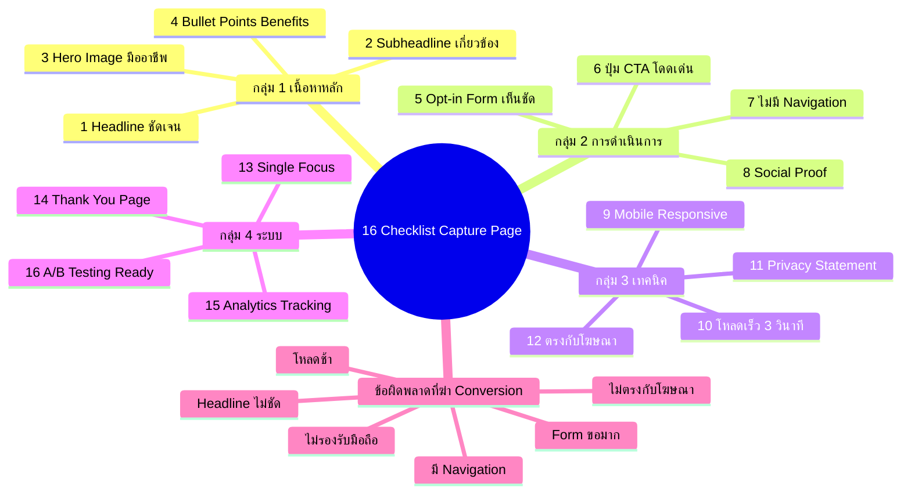

# 16 รายการตรวจสอบ Capture Page — TRIP-007
> **Format:** Mind Map (Text + Mermaid)
> **Source:** SWP3 Ch8 Trip Wire ตอนที่ 7
> **Production:** PinkCastle Academy | จูล่ง CTO
> **Date:** 2026-02-17

---

## Text-based Mind Map

```
16 รายการตรวจสอบ Capture Page
│
├── กลุ่ม 1: เนื้อหาหลัก (ข้อ 1-4)
│   ├── 1. Headline ชัดเจน + บอกประโยชน์
│   │   └── ผู้เข้าชมต้องรู้ทันทีว่าจะได้อะไร
│   ├── 2. Subheadline ที่เกี่ยวข้อง
│   │   └── เสริมรายละเอียดของ Headline
│   ├── 3. Hero Image/Video มืออาชีพ
│   │   └── Lead Magnet Visual คุณภาพสูง
│   └── 4. Bullet Points 3-5 ข้อ (Benefits)
│       └── ประโยชน์ที่ผู้อ่านได้ ไม่ใช่คุณสมบัติ
│
├── กลุ่ม 2: การดำเนินการ + ความน่าเชื่อถือ (ข้อ 5-8)
│   ├── 5. Opt-in Form ที่เห็นชัด
│   │   ├── Above the Fold
│   │   └── ขอแค่ชื่อ + อีเมล
│   ├── 6. ปุ่ม CTA ที่น่าคลิก
│   │   ├── สีโดดเด่น + ขนาดใหญ่
│   │   └── ข้อความบอกผลลัพธ์
│   ├── 7. ไม่มี Navigation Menu
│   │   └── ตัดลิงก์ทั้งหมดที่ไม่ใช่ CTA
│   └── 8. มี Social Proof
│       ├── Testimonials
│       ├── ตัวเลขสมาชิก
│       └── โลโก้พันธมิตร
│
├── กลุ่ม 3: เทคนิค + ความสอดคล้อง (ข้อ 9-12)
│   ├── 9. Mobile Responsive
│   │   └── รองรับทุกอุปกรณ์
│   ├── 10. โหลดเร็ว (<3 วินาที)
│   │   └── ทดสอบด้วย PageSpeed Insights
│   ├── 11. Privacy Statement
│   │   └── ไม่ขาย/แชร์ข้อมูลส่วนตัว
│   └── 12. ข้อความสอดคล้องกับโฆษณา
│       └── Message Match 100%
│
├── กลุ่ม 4: ระบบ + การเพิ่มประสิทธิภาพ (ข้อ 13-16)
│   ├── 13. Single Focus / เป้าหมายเดียว
│   │   └── ทุกองค์ประกอบสนับสนุนการกรอกฟอร์ม
│   ├── 14. Thank You Page
│   │   ├── อธิบายขั้นตอนต่อไป
│   │   └── โอกาส Upsell
│   ├── 15. Analytics Tracking
│   │   ├── Google Analytics
│   │   └── Facebook Pixel
│   └── 16. A/B Testing Ready
│       └── สร้างเวอร์ชันทดสอบเปรียบเทียบ
│
└── ข้อผิดพลาดที่ฆ่า Conversion
    ├── Headline ไม่ชัดเจน
    ├── มี Navigation Menu
    ├── Form ขอข้อมูลมากเกินไป
    ├── หน้าโหลดช้า
    ├── ไม่รองรับมือถือ
    └── ข้อความไม่ตรงกับโฆษณา
```

---

## Mermaid Mind Map



---

**จำนวน Nodes:** 36 | **ระดับลึกสุด:** 3 ชั้น
