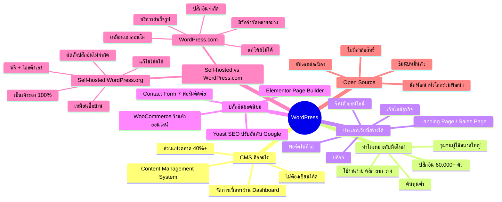

# Mind Map: แนะนำวิธีใช้ Wordpress — WEB1-001
> **Format:** Mind Map (Text-based)
> **Source:** SWP3 Ch10 สร้างเว็บไซต์ Part 1 ตอนที่ 1
> **Production:** PinkCastle Academy | จูล่ง CTO
> **Date:** 2026-02-17

---

---

## Center Node: WordPress

### Branch 1: CMS คืออะไร
- Content Management System
  - ระบบจัดการเนื้อหา
  - มีหน้า Dashboard จัดการง่าย
- ไม่ต้องเขียนโค้ด
  - คลิก ลาก วาง ได้เลย
  - เหมาะกับผู้ไม่มีพื้นฐานเทคนิค
- ส่วนแบ่งตลาดมากกว่า 40%
  - เว็บไซต์เกือบครึ่งโลกใช้ WordPress

### Branch 2: ทำไมเหมาะกับมือใหม่
- ใช้งานง่าย
  - Dashboard เข้าใจได้ทันที
- ยืดหยุ่นสูง
  - ปลั๊กอินกว่า 60,000 ตัว
- ชุมชนผู้ใช้ขนาดใหญ่
  - บทความ วิดีโอสอน ฟอรัมมากมาย
- ต้นทุนต่ำ
  - ตัว WordPress ฟรี
  - จ่ายเฉพาะค่าโฮสติ้ง + โดเมน

### Branch 3: ประเภทเว็บที่สร้างได้
- บล็อก / เว็บเนื้อหา
- เว็บไซต์ธุรกิจ / บริษัท
- ร้านค้าออนไลน์ (WooCommerce)
- Landing Page / Sales Page
- เว็บพอร์ตโฟลิโอ / เว็บข่าว

### Branch 4: ปลั๊กอินยอดนิยม
- WooCommerce — ร้านค้าออนไลน์
- Yoast SEO — ปรับแต่ง SEO
- Elementor — Page Builder
- Contact Form 7 — ฟอร์มติดต่อ

### Branch 5: Self-hosted vs WordPress.com
- Self-hosted (WordPress.org)
  - เป็นเจ้าของ 100% เหมือนซื้อบ้าน
  - ติดตั้งปลั๊กอิน/แก้โค้ดได้ไม่จำกัด
- WordPress.com
  - บริการสำเร็จรูป เหมือนเช่าคอนโด
  - มีข้อจำกัดด้านปลั๊กอินและการปรับแต่ง

### Branch 6: Open Source
- ไม่มีค่าลิขสิทธิ์ ดาวน์โหลดฟรี
- นักพัฒนาทั่วโลกร่วมพัฒนา
- ธีมและปลั๊กอินจำนวนมหาศาล

---

**จำนวน Nodes ทั้งหมด: 35 nodes**

| ระดับ | จำนวน |
|-------|-------|
| Center Node | 1 |
| Branch (ระดับ 1) | 6 |
| Sub-branch (ระดับ 2) | 18 |
| Leaf (ระดับ 3) | 10 |
| **รวม** | **35** |
