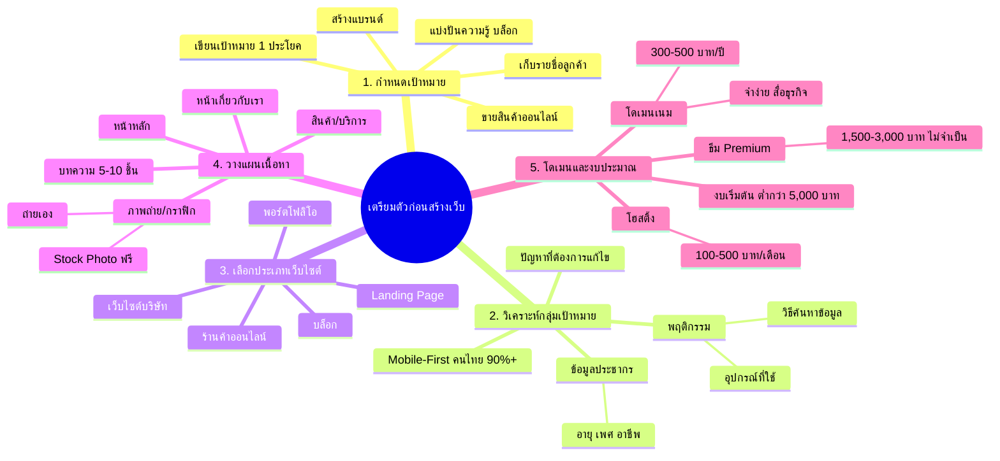

# Mind Map: ก่อนจะเริ่มต้นสร้างเว็บไซต์ — WEB1-002
> **Format:** Mind Map (Text-based)
> **Source:** SWP3 Ch10 สร้างเว็บไซต์ Part 1 ตอนที่ 2
> **Production:** PinkCastle Academy | จูล่ง CTO
> **Date:** 2026-02-17

---

---

## Center Node: เตรียมตัวก่อนสร้างเว็บไซต์

### Branch 1: กำหนดเป้าหมาย
- เป้าหมายคือตัวกำหนดทุกอย่าง
  - ขายสินค้า / สร้างแบรนด์ / เก็บรายชื่อ / แชร์ความรู้
- เขียนเป้าหมาย 1 ประโยค
  - ชัดเจน ครอบคลุม สิ่งที่ทำ + สินค้า + กลุ่มเป้าหมาย

### Branch 2: วิเคราะห์กลุ่มเป้าหมาย
- ข้อมูลประชากร
  - อายุ เพศ อาชีพ รายได้
- พฤติกรรมออนไลน์
  - อุปกรณ์ที่ใช้ (มือถือ 90%+)
  - วิธีค้นหาข้อมูล
- ปัญหาและวิธีตัดสินใจซื้อ

### Branch 3: เลือกประเภทเว็บไซต์
- บล็อก — Content Marketing
- พอร์ตโฟลิโอ — แสดงผลงาน
- ร้านค้าออนไลน์ — WooCommerce
- เว็บบริษัท — สร้างความน่าเชื่อถือ
- Landing Page — ใช้คู่กับโฆษณา

### Branch 4: วางแผนเนื้อหา
- เนื้อหาที่ต้องเตรียม
  - หน้าหลัก / About / สินค้า / บทความ
- อย่างน้อย 5-10 ชิ้นก่อนเปิดตัว
- ภาพถ่าย: ถ่ายเอง หรือ Unsplash / Pexels

### Branch 5: โดเมนและงบประมาณ
- โดเมนเนม (300-500 บาท/ปี)
- โฮสติ้ง (100-500 บาท/เดือน)
- ธีม Premium (1,500-3,000 บาท ไม่จำเป็น)
- งบเริ่มต้นรวม: ต่ำกว่า 5,000 บาท

---

**จำนวน Nodes ทั้งหมด: 38 nodes**

| ระดับ | จำนวน |
|-------|-------|
| Center Node | 1 |
| Branch (ระดับ 1) | 5 |
| Sub-branch (ระดับ 2) | 19 |
| Leaf (ระดับ 3) | 13 |
| **รวม** | **38** |
