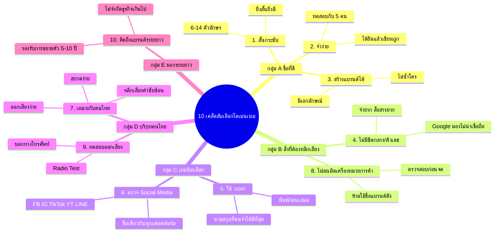

# Mind Map: 10 เคล็ดลับเลือกโดเมนเนม — WEB1-003
> **Format:** Mind Map (Text-based)
> **Source:** SWP3 Ch10 สร้างเว็บไซต์ Part 1 ตอนที่ 3
> **Production:** PinkCastle Academy | จูล่ง CTO
> **Date:** 2026-02-17

---

---

## Center Node: 10 เคล็ดลับเลือกโดเมนเนม

### Branch A: ชื่อที่ดี (ข้อ 1-3)
- สั้นกระชับ
  - 6-14 ตัวอักษร
  - ตัวอย่าง: google.com (6), facebook.com (8)
- จำง่าย
  - ทดสอบให้ 5 คนฟังแล้วเขียน
  - ถ้าทุกคนเขียนถูก = ผ่าน
- สร้างแบรนด์ได้ (Brandable)
  - มีเอกลักษณ์ ไม่ซ้ำใคร
  - ตัวอย่าง: Shopee ไม่ใช่แค่ Shop

### Branch B: สิ่งที่ต้องหลีกเลี่ยง (ข้อ 4, 8)
- ไม่มีขีดกลาง/ตัวเลข
  - จำยาก สื่อสารยาก
  - Google มองว่าไม่น่าเชื่อถือ
- ไม่ละเมิดเครื่องหมายการค้า
  - อาจถูกฟ้องร้อง
  - ตรวจสอบก่อนจดเสมอ

### Branch C: เทคนิคเลือก (ข้อ 5-6)
- ใช้ .com
  - นามสกุลที่คนจดจำดีที่สุด
  - คนพิมพ์ .com ก่อนเสมอ
- ตรวจ Social Media
  - Facebook / Instagram / TikTok / YouTube / LINE
  - ชื่อเดียวกันทุกแพลตฟอร์ม

### Branch D: บริบทคนไทย (ข้อ 7, 9)
- เหมาะกับคนไทย
  - สะกดง่าย ไม่ซับซ้อน
  - หลีกเลี่ยง entrepreneur, sophisticated
- ทดสอบออกเสียง (Radio Test)
  - บอกทางโทรศัพท์ ถ้าเข้าใจทันที = ผ่าน
  - ถ้าต้องสะกดทีละตัว = ไม่ผ่าน

### Branch E: มองระยะยาว (ข้อ 10)
- คิดถึงแบรนด์ระยะยาว
  - ไม่จำกัดธุรกิจเกินไป
  - จินตนาการอีก 5-10 ปี
  - ชื่อต้องยังเหมาะสมอยู่

---

**จำนวน Nodes ทั้งหมด: 36 nodes**

| ระดับ | จำนวน |
|-------|-------|
| Center Node | 1 |
| Branch (ระดับ 1) | 5 |
| Sub-branch (ระดับ 2) | 10 |
| Leaf (ระดับ 3) | 20 |
| **รวม** | **36** |
