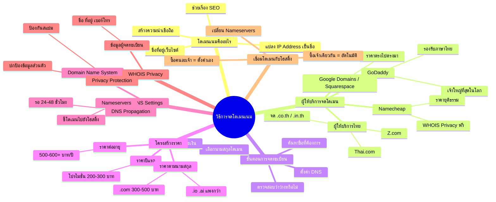

# Mind Map: วิธีการจดโดเมนเนม — WEB1-004
> **Format:** Mind Map (Mermaid)
> **Source:** SWP3 Ch10 สร้างเว็บไซต์ Part 1 ตอนที่ 4
> **Production:** PinkCastle Academy | จูล่ง CTO
> **Date:** 2026-02-17

---

---

## Center Node: วิธีการจดโดเมนเนม

### Branch 1: โดเมนเนมคืออะไร
- ชื่อที่อยู่ของเว็บไซต์บนอินเทอร์เน็ต
  - แปลง IP Address เป็นชื่อที่จดจำง่าย
  - เป็นตัวแทนแบรนด์บนโลกออนไลน์
  - สร้างความน่าเชื่อถือ
  - ช่วยเรื่อง SEO

### Branch 2: ผู้ให้บริการจดโดเมน
- GoDaddy
  - เจ้าใหญ่ที่สุด โดเมนเยอะที่สุด
  - รองรับภาษาไทย
- Namecheap
  - ราคายุติธรรม
  - WHOIS Privacy ฟรี
- Google Domains / Squarespace
  - ราคาตรงไปตรงมา ไม่มีราคาล่อ
- ผู้ให้บริการไทย (Thai.com, Z.com)
  - จดโดเมน .co.th / .in.th

### Branch 3: ขั้นตอนการจดทะเบียน
- ค้นหาชื่อที่ต้องการ
- ตรวจสอบว่าว่างหรือไม่
- เลือกนามสกุลโดเมน
- ชำระเงินและลงทะเบียน
- ตั้งค่า DNS

### Branch 4: โครงสร้างราคา
- ราคาปีแรก (โปรโมชั่น 200-300 บาท)
- ราคาต่ออายุ (500-600+ บาท/ปี)
- ราคาตามนามสกุล
  - .com = 300-500 บาท
  - .io / .ai = แพงกว่า

### Branch 5: DNS Settings
- Domain Name System = สมุดโทรศัพท์อินเทอร์เน็ต
- Nameservers = ตัวชี้ทางไปโฮสติ้ง
- DNS Propagation = รอ 24-48 ชั่วโมง

### Branch 6: WHOIS Privacy
- ฐานข้อมูลสาธารณะเก็บข้อมูลผู้จด
- Privacy Protection ปกป้องข้อมูลส่วนตัว
- ป้องกันสแปมและรักษาความเป็นส่วนตัว

### Branch 7: เชื่อมโดเมนกับโฮสติ้ง
- เปลี่ยน Nameservers ที่แผงควบคุม
- ซื้อเจ้าเดียวกัน = เชื่อมอัตโนมัติ
- ซื้อคนละเจ้า = ตั้งค่าเอง

---

**จำนวน Nodes ทั้งหมด: 35 nodes**

| ระดับ | จำนวน |
|-------|-------|
| Center Node | 1 |
| Branch (ระดับ 1) | 7 |
| Sub-branch (ระดับ 2) | 16 |
| Leaf (ระดับ 3) | 11 |
| **รวม** | **35** |
