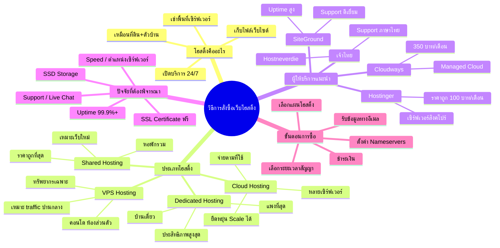

# Mind Map: วิธีการสั่งซื้อเว็บโฮสติ้ง — WEB1-005
> **Format:** Mind Map (Mermaid)
> **Source:** SWP3 Ch10 สร้างเว็บไซต์ Part 1 ตอนที่ 5
> **Production:** PinkCastle Academy | จูล่ง CTO
> **Date:** 2026-02-17

---

---

## Center Node: วิธีการสั่งซื้อเว็บโฮสติ้ง

### Branch 1: โฮสติ้งคืออะไร
- บริการให้เช่าพื้นที่เซิร์ฟเวอร์
  - เก็บไฟล์ทั้งหมดของเว็บไซต์
  - เปิดให้บริการตลอด 24/7
  - เปรียบเสมือนที่ดินและตัวบ้าน

### Branch 2: ประเภทโฮสติ้ง
- Shared Hosting (หอพักรวม)
  - ราคาถูกที่สุด เริ่มต้น 100 บาท/เดือน
  - เหมาะเว็บไซต์ใหม่
- VPS Hosting (คอนโด)
  - ทรัพยากรเฉพาะ ประสิทธิภาพดีกว่า
  - เหมาะเว็บที่มี traffic ปานกลาง
- Dedicated Hosting (บ้านเดี่ยว)
  - ประสิทธิภาพสูงสุด แพงที่สุด
  - เหมาะเว็บขนาดใหญ่
- Cloud Hosting (เซิร์ฟเวอร์หลายตัว)
  - ยืดหยุ่น Scale ได้ จ่ายตามที่ใช้

### Branch 3: ผู้ให้บริการแนะนำ
- Hostinger (ราคาถูก เซิร์ฟเวอร์สิงคโปร์)
- SiteGround (Support ดี Uptime สูง)
- Cloudways (Managed Cloud ไม่ต้องจัดการเอง)
- ผู้ให้บริการไทย (Support ภาษาไทย)

### Branch 4: ปัจจัยที่ต้องพิจารณา
- Uptime 99.9% ขึ้นไป
- Speed / ตำแหน่งเซิร์ฟเวอร์ใกล้กลุ่มเป้าหมาย
- Support ที่ตอบเร็ว / Live Chat
- SSL Certificate ฟรี
- SSD Storage

### Branch 5: ขั้นตอนการซื้อ
- เลือกแผนและระยะเวลาสัญญา
- ชำระเงิน
- รับข้อมูล Nameservers ทางอีเมล
- ตั้งค่า Nameservers ที่ผู้จดโดเมน
- รอ DNS Propagation

---

**จำนวน Nodes ทั้งหมด: 36 nodes**

| ระดับ | จำนวน |
|-------|-------|
| Center Node | 1 |
| Branch (ระดับ 1) | 5 |
| Sub-branch (ระดับ 2) | 17 |
| Leaf (ระดับ 3) | 13 |
| **รวม** | **36** |
