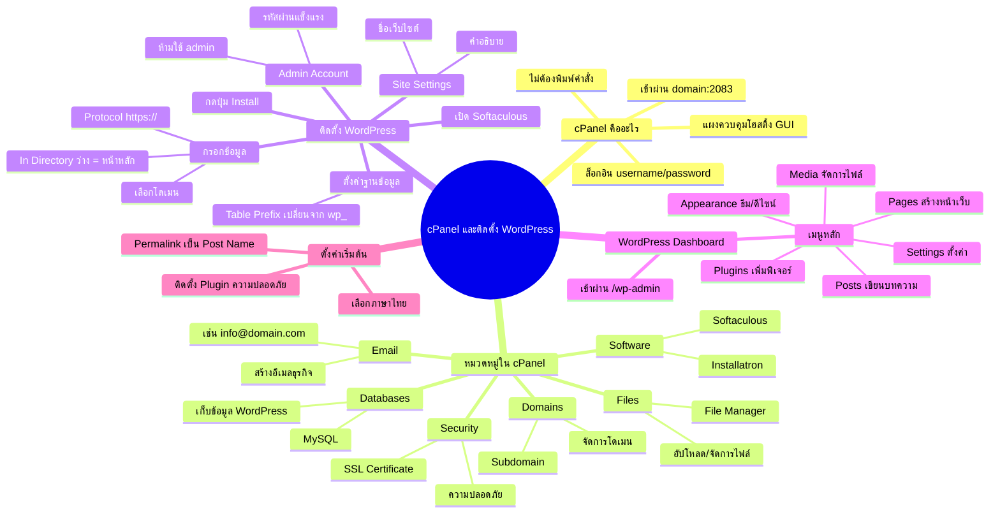

# Mind Map: แนะนำ cPanel และติดตั้ง WordPress — WEB1-006
> **Format:** Mind Map (Mermaid)
> **Source:** SWP3 Ch10 สร้างเว็บไซต์ Part 1 ตอนที่ 6
> **Production:** PinkCastle Academy | จูล่ง CTO
> **Date:** 2026-02-17

---

---

## Center Node: cPanel และติดตั้ง WordPress

### Branch 1: cPanel คืออะไร
- แผงควบคุมโฮสติ้งแบบกราฟิก (GUI)
  - ไม่ต้องพิมพ์คำสั่ง command line
  - เข้าผ่าน domain:2083 หรือลิงก์จากอีเมล
  - ล็อกอินด้วย username/password จากโฮสติ้ง

### Branch 2: หมวดหมู่ใน cPanel
- Files (จัดการไฟล์ผ่าน File Manager)
- Databases (ฐานข้อมูล MySQL สำหรับ WordPress)
- Domains (จัดการโดเมนและ Subdomain)
- Email (สร้างอีเมลธุรกิจ เช่น info@domain.com)
- Security (SSL Certificate และความปลอดภัย)
- Software (Softaculous / Installatron สำหรับติดตั้งแอป)

### Branch 3: ติดตั้ง WordPress
- เปิด Softaculous ในหมวด Software
- กรอกข้อมูล: Protocol, โดเมน, In Directory
- ตั้งค่าฐานข้อมูล: เปลี่ยน Table Prefix จาก wp_
- กรอก Site Settings: ชื่อเว็บ คำอธิบาย
- สร้าง Admin Account: ชื่อไม่ใช่ admin + รหัสผ่านแข็งแรง
- กดปุ่ม Install รอ 1-2 นาที

### Branch 4: WordPress Dashboard
- เข้าผ่าน yourdomain.com/wp-admin
- Posts (เขียนบทความ)
- Pages (สร้างหน้าเว็บ)
- Appearance (ธีมและดีไซน์)
- Plugins (เพิ่มฟีเจอร์)
- Media (จัดการรูปภาพและไฟล์)
- Settings (ตั้งค่าทั่วไป)

### Branch 5: ตั้งค่าเริ่มต้น
- Permalink เป็น Post Name (สำคัญมากสำหรับ SEO)
- เลือกภาษาไทย
- ติดตั้ง Plugin ความปลอดภัย

---

**จำนวน Nodes ทั้งหมด: 40 nodes**

| ระดับ | จำนวน |
|-------|-------|
| Center Node | 1 |
| Branch (ระดับ 1) | 5 |
| Sub-branch (ระดับ 2) | 19 |
| Leaf (ระดับ 3) | 15 |
| **รวม** | **40** |
