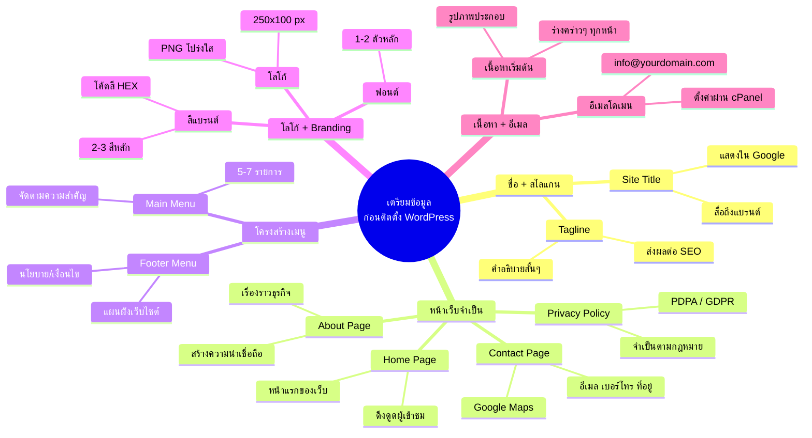

# Mind Map: วิธีการเติมข้อมูลก่อนติดตั้ง WordPress — WEB1-007
> **Format:** Mind Map (Text-based + Mermaid)
> **Source:** SWP3 Ch10 สร้างเว็บไซต์ Part 1 ตอนที่ 7
> **Production:** PinkCastle Academy | จูล่ง CTO
> **Date:** 2026-02-17

---

---

## Center Node: เตรียมข้อมูลก่อนติดตั้ง WordPress

### Branch 1: ชื่อเว็บไซต์ + สโลแกน
- Site Title
  - ชื่อที่สื่อถึงแบรนด์อย่างชัดเจน
  - แสดงผลใน Google Search Results
- Tagline
  - คำอธิบายสั้นๆ ว่าเว็บเกี่ยวกับอะไร
  - ส่งผลต่อ SEO และ Click-Through Rate

### Branch 2: หน้าเว็บจำเป็น 4 หน้า
- Home Page (หน้าแรก)
  - จุดเข้าแรกของผู้เข้าชม
  - ต้องดึงดูดและบอกว่าเว็บเกี่ยวกับอะไร
- About Page (เกี่ยวกับเรา)
  - เรื่องราวธุรกิจ วิสัยทัศน์ พันธกิจ
  - สร้างความน่าเชื่อถือ
- Contact Page (ติดต่อเรา)
  - อีเมล เบอร์โทร ที่อยู่
  - แผนที่ Google Maps
- Privacy Policy (นโยบายความเป็นส่วนตัว)
  - จำเป็นตามกฎหมาย PDPA/GDPR
  - ต้องมีถ้าเก็บข้อมูลผู้ใช้หรือใช้ Cookie

### Branch 3: โครงสร้างเมนู
- Main Menu (เมนูหลัก)
  - ไม่เกิน 5-7 รายการ
  - จัดเรียงตามลำดับความสำคัญ
- Footer Menu (เมนูรอง)
  - นโยบาย เงื่อนไข แผนผังเว็บ
  - หน้าที่ไม่ต้องเข้าถึงบ่อย

### Branch 4: โลโก้ + Branding
- โลโก้
  - ไฟล์ PNG พื้นหลังโปร่งใส
  - ขนาดแนะนำ 250x100 พิกเซล
- สีแบรนด์
  - กำหนดสีหลัก 2-3 สี
  - เก็บโค้ดสี HEX ไว้ใช้งาน
- ฟอนต์
  - เลือก 1-2 ฟอนต์หลัก
  - ใช้สม่ำเสมอทั่วทั้งเว็บ

### Branch 5: เนื้อหาเริ่มต้น + อีเมล
- เนื้อหา
  - ร่างเนื้อหาคร่าวๆ สำหรับทุกหน้า
  - เตรียมรูปภาพประกอบ
- อีเมลโดเมน
  - info@yourdomain.com
  - ตั้งค่าผ่าน cPanel หรือ Google Workspace

---

**จำนวน Nodes ทั้งหมด: 32 nodes**

| ระดับ | จำนวน |
|-------|-------|
| Center Node | 1 |
| Branch (ระดับ 1) | 5 |
| Sub-branch (ระดับ 2) | 12 |
| Leaf (ระดับ 3) | 14 |
| **รวม** | **32** |
