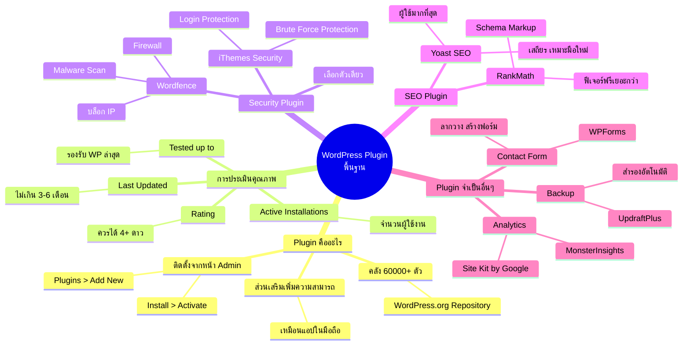

# Mind Map: วิธีการติดตั้ง Plugin ตอนที่ 1 — WEB1-008
> **Format:** Mind Map (Text-based + Mermaid)
> **Source:** SWP3 Ch10 สร้างเว็บไซต์ Part 1 ตอนที่ 8
> **Production:** PinkCastle Academy | จูล่ง CTO
> **Date:** 2026-02-17

---

---

## Center Node: WordPress Plugin พื้นฐาน

### Branch 1: Plugin คืออะไร
- ส่วนเสริมที่เพิ่มความสามารถให้ WordPress
  - เปรียบเสมือนแอปในมือถือ
- คลังมีมากกว่า 60,000 ตัว
  - จาก WordPress.org Repository
- วิธีติดตั้ง
  - เข้าหน้า Admin → Plugins → Add New
  - ค้นหา → Install Now → Activate

### Branch 2: การประเมินคุณภาพ Plugin
- Rating (คะแนนดาว)
  - ควรได้ 4 ดาวขึ้นไปจาก 5
- Active Installations
  - จำนวนผู้ใช้งาน ยิ่งมากยิ่งน่าเชื่อถือ
- Last Updated
  - อัปเดตล่าสุดไม่ควรเกิน 3-6 เดือน
- Tested up to
  - ต้องรองรับ WordPress เวอร์ชันล่าสุด

### Branch 3: Security Plugin
- Wordfence Security
  - Firewall ป้องกันการโจมตี
  - สแกนมัลแวร์
  - บล็อก IP ที่น่าสงสัย
- iThemes Security
  - Brute Force Protection
  - ป้องกันการเดารหัสผ่าน
- หลัก: เลือกเพียง 1 ตัว ห้ามลงซ้ำ

### Branch 4: SEO Plugin
- Yoast SEO
  - ผู้ใช้มากที่สุดในโลก
  - เสถียร เหมาะมือใหม่
- RankMath
  - ฟีเจอร์ฟรีมากกว่า
  - Schema Markup, Keyword Tracking
- ทั้งสองช่วย Title, Meta Description, Sitemap

### Branch 5: Plugin จำเป็นอื่นๆ
- Contact Form → WPForms
  - ลากวางสร้างฟอร์ม
  - เทมเพลตหลากหลาย
- Analytics → MonsterInsights / Site Kit
  - เชื่อม Google Analytics
  - ดูสถิติจาก Dashboard
- Backup → UpdraftPlus
  - สำรองอัตโนมัติ
  - เก็บที่ Google Drive / Dropbox

---

**จำนวน Nodes ทั้งหมด: 35 nodes**

| ระดับ | จำนวน |
|-------|-------|
| Center Node | 1 |
| Branch (ระดับ 1) | 5 |
| Sub-branch (ระดับ 2) | 14 |
| Leaf (ระดับ 3) | 15 |
| **รวม** | **35** |
