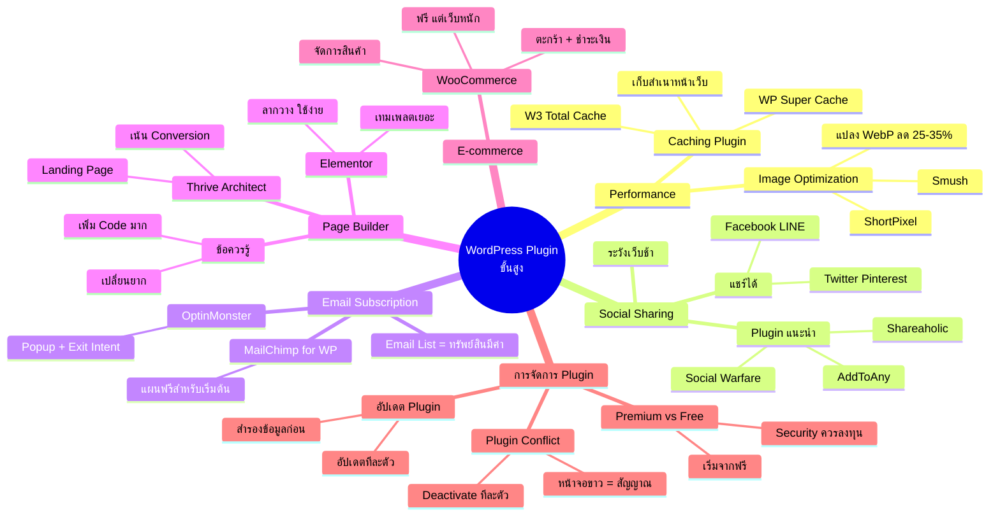

# Mind Map: วิธีการติดตั้ง Plugin ตอนที่ 2 — WEB1-009
> **Format:** Mind Map (Text-based + Mermaid)
> **Source:** SWP3 Ch10 สร้างเว็บไซต์ Part 1 ตอนที่ 9
> **Production:** PinkCastle Academy | จูล่ง CTO
> **Date:** 2026-02-17

---

---

## Center Node: WordPress Plugin ขั้นสูง

### Branch 1: Performance Plugin
- Caching Plugin
  - WP Super Cache — เก็บสำเนาหน้าเว็บ
  - W3 Total Cache — Caching แบบครบวงจร
  - ลดเวลาโหลดจากหลายวินาทีเหลือมิลลิวินาที
- Image Optimization
  - ShortPixel — บีบอัดรูป + แปลง WebP
  - Smush — บีบอัดอัตโนมัติ
  - WebP เล็กกว่า JPG 25-35%

### Branch 2: Social Sharing Plugin
- Plugin แนะนำ
  - Social Warfare, AddToAny, Shareaholic
- แชร์ไปยัง
  - Facebook, LINE, Twitter, Pinterest
- ข้อควรระวัง
  - บาง Plugin โหลด JavaScript หนัก
  - เลือกตัวที่เบาไม่กระทบ Performance

### Branch 3: Email Subscription Plugin
- MailChimp for WordPress
  - แพลตฟอร์มส่งอีเมลมีแผนฟรี
  - เหมาะสำหรับเริ่มต้น
- OptinMonster
  - สร้าง Popup + ฟอร์มขั้นสูง
  - Exit Intent (แสดงเมื่อผู้ใช้จะปิดเว็บ)
- Email List เป็นทรัพย์สินที่มีค่าที่สุด
  - ไม่ต้องพึ่งอัลกอริทึม Social Media

### Branch 4: Page Builder Plugin
- Elementor
  - ลากวาง ใช้ง่าย
  - เทมเพลตสำเร็จรูปจำนวนมาก
- Thrive Architect
  - เน้น Conversion
  - เหมาะ Landing Page, หน้าขาย
- ข้อควรรู้
  - เพิ่ม Code มากลงในเว็บ
  - เปลี่ยน Page Builder ยุ่งยากมาก

### Branch 5: E-commerce Plugin
- WooCommerce
  - ระบบตะกร้า ชำระเงิน จัดการสินค้า
  - ฟรี แต่อาจต้องซื้อ Extension
  - ทำให้เว็บหนักขึ้นมาก

### Branch 6: การจัดการ Plugin
- Plugin Conflict
  - Deactivate ทีละตัวเพื่อหาปัญหา
  - อาการ: หน้าจอขาว ฟีเจอร์ไม่ทำงาน
- อัปเดต Plugin
  - สำรองข้อมูลก่อนอัปเดตเสมอ
  - อัปเดตทีละตัว ตรวจสอบหลังอัปเดต
- Premium vs Free
  - เริ่มจากฟรี พอโตค่อยอัปเกรด
  - Security + Backup ควรลงทุน Premium

---

**จำนวน Nodes ทั้งหมด: 40 nodes**

| ระดับ | จำนวน |
|-------|-------|
| Center Node | 1 |
| Branch (ระดับ 1) | 6 |
| Sub-branch (ระดับ 2) | 16 |
| Leaf (ระดับ 3) | 17 |
| **รวม** | **40** |
