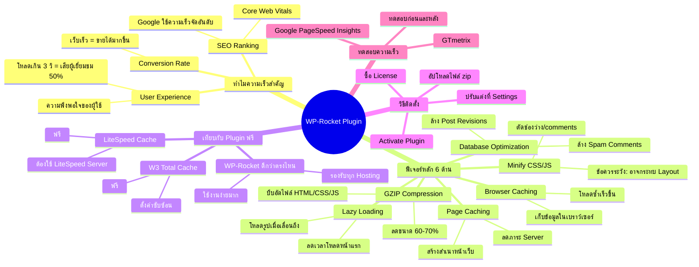

# Mind Map: วิธีติดตั้ง WP-Rocket Plugin — WEB1-010
> **Format:** Mind Map (Text-based)
> **Source:** SWP3 Ch10 สร้างเว็บไซต์ Part 1 ตอนที่ 10
> **Production:** PinkCastle Academy | จูล่ง CTO
> **Date:** 2026-02-17

---

## Center Node: WP-Rocket Plugin

### Branch 1: ทำไมความเร็วเว็บไซต์สำคัญ
- User Experience (ประสบการณ์ผู้ใช้)
  - โหลดเกิน 3 วินาที = เสียผู้เยี่ยมชมกว่า 50%
  - ส่งผลต่อความพึงพอใจโดยตรง
- SEO Ranking (อันดับการค้นหา)
  - Google ใช้ความเร็วเป็น Ranking Factor
  - Core Web Vitals เป็นตัววัดสำคัญ
- Conversion Rate (อัตราการซื้อ)
  - เว็บเร็วขึ้น = โอกาสขายมากขึ้น

### Branch 2: ฟีเจอร์หลัก 6 ด้าน
- Page Caching
  - สร้างสำเนาหน้าเว็บไว้ล่วงหน้า
  - ลดภาระ Server
- Browser Caching
  - เก็บข้อมูลในเบราว์เซอร์ผู้ใช้
  - โหลดซ้ำเร็วขึ้น
- GZIP Compression
  - บีบอัดไฟล์ HTML/CSS/JS
  - ลดขนาดได้ 60-70%
- Lazy Loading
  - โหลดรูปภาพเมื่อเลื่อนถึง
  - ลดเวลาโหลดหน้าแรก
- Minify CSS/JS
  - ตัดช่องว่างและ comments ออก
  - ข้อควรระวัง: อาจกระทบ Layout
- Database Optimization
  - ล้าง Post Revisions
  - ล้าง Spam Comments และ Transients

### Branch 3: เปรียบเทียบกับ Plugin ฟรี
- W3 Total Cache
  - ฟรี แต่ตั้งค่าซับซ้อน
  - ไม่มี Database Optimization ในตัว
- LiteSpeed Cache
  - ฟรี แต่ต้องใช้ LiteSpeed Server
  - ใช้ไม่เต็มฟีเจอร์บน Hosting อื่น
- WP-Rocket จุดเด่น
  - ใช้งานง่ายมาก
  - รองรับทุก Hosting Provider

### Branch 4: วิธีติดตั้ง
- ซื้อ License จาก wp-rocket.me
- อัปโหลดไฟล์ zip ผ่าน WordPress Admin
- Activate Plugin
- ปรับแต่งเพิ่มเติมที่ Settings > WP Rocket

### Branch 5: ทดสอบความเร็ว
- เครื่องมือ
  - Google PageSpeed Insights
  - GTmetrix
- วิธีการ
  - ทดสอบก่อนติดตั้ง (จดคะแนน)
  - ทดสอบหลังติดตั้ง (เปรียบเทียบ)

---

**จำนวน Nodes ทั้งหมด: 35 nodes**

| ระดับ | จำนวน |
|-------|-------|
| Center Node | 1 |
| Branch (ระดับ 1) | 5 |
| Sub-branch (ระดับ 2) | 16 |
| Leaf (ระดับ 3) | 13 |
| **รวม** | **35** |
