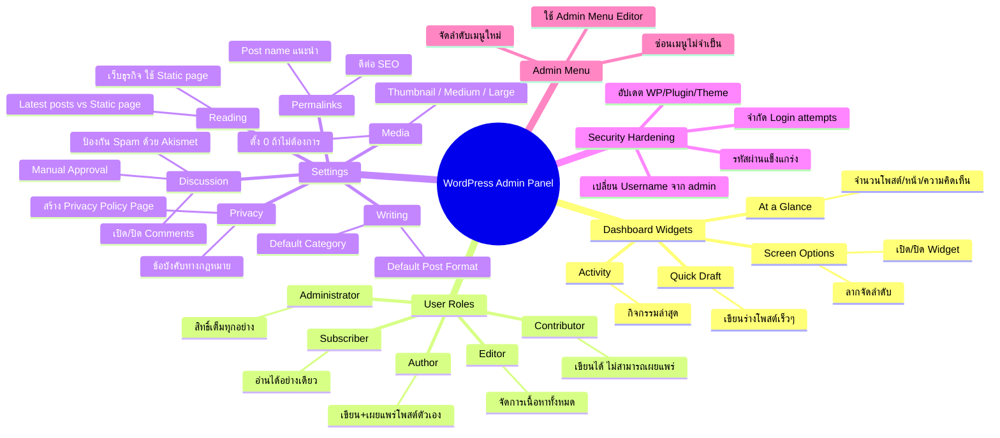

# Mind Map: วิธีปรับแต่ง WordPress Admin Panel — WEB1-011
> **Format:** Mind Map (Text-based)
> **Source:** SWP3 Ch10 สร้างเว็บไซต์ Part 1 ตอนที่ 11
> **Production:** PinkCastle Academy | จูล่ง CTO
> **Date:** 2026-02-17

---

## Center Node: WordPress Admin Panel

### Branch 1: Dashboard Widgets
- At a Glance
  - แสดงจำนวนโพสต์ หน้า และความคิดเห็น
- Quick Draft
  - เขียนร่างโพสต์แบบเร็ว
- Activity
  - แสดงกิจกรรมล่าสุดบนเว็บ
- การจัดการ
  - Screen Options (มุมขวาบน)
  - เลือกเปิด/ปิด Widget
  - ลากเพื่อจัดลำดับ

### Branch 2: User Roles & Permissions
- Administrator
  - สิทธิ์เต็มทุกอย่าง (ลบ Plugin/Theme/เว็บ)
- Editor
  - จัดการเนื้อหาทั้งหมด รวมถึงโพสต์คนอื่น
- Author
  - เขียนและเผยแพร่โพสต์ตัวเองได้
- Contributor
  - เขียนได้แต่ไม่สามารถเผยแพร่เอง
- Subscriber
  - อ่านได้อย่างเดียว
- หลักการ: ให้สิทธิ์เท่าที่จำเป็น

### Branch 3: Settings สำคัญ
- Writing Settings
  - Default Post Category
  - Default Post Format
- Permalinks
  - แนะนำ Post name (yoursite.com/sample-post)
  - ตั้งตั้งแต่วันแรก
- Reading Settings
  - Your latest posts (Blog)
  - A static page (เว็บธุรกิจ)
- Discussion Settings
  - เปิด/ปิด Comments
  - Manual Approval
  - Akismet กรอง Spam
- Media Settings
  - Thumbnail / Medium / Large
  - ตั้ง 0 ถ้าไม่ต้องการ
- Privacy Settings
  - สร้าง Privacy Policy Page
  - ข้อบังคับ GDPR/PDPA

### Branch 4: Security Hardening
- เปลี่ยน Username จาก admin
- รหัสผ่านแข็งแกร่ง (12+ ตัวอักษร)
- จำกัด Login attempts (3-5 ครั้ง)
- อัปเดต WordPress/Plugin/Theme สม่ำเสมอ

### Branch 5: Admin Menu Customization
- ใช้ Plugin เช่น Admin Menu Editor
- ซ่อนเมนูที่ไม่ได้ใช้
- เปลี่ยนชื่อเมนู
- จัดลำดับเมนูใหม่

---

**จำนวน Nodes ทั้งหมด: 40 nodes**

| ระดับ | จำนวน |
|-------|-------|
| Center Node | 1 |
| Branch (ระดับ 1) | 5 |
| Sub-branch (ระดับ 2) | 19 |
| Leaf (ระดับ 3) | 15 |
| **รวม** | **40** |
